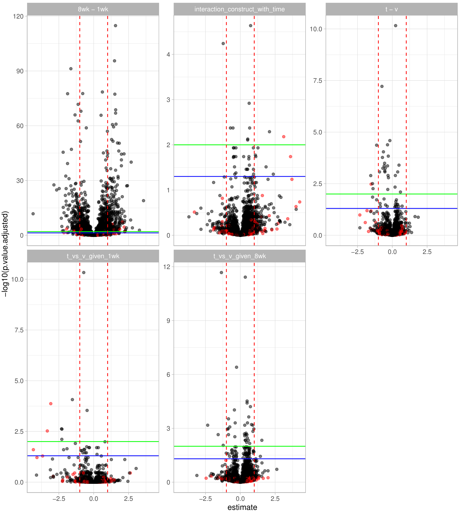
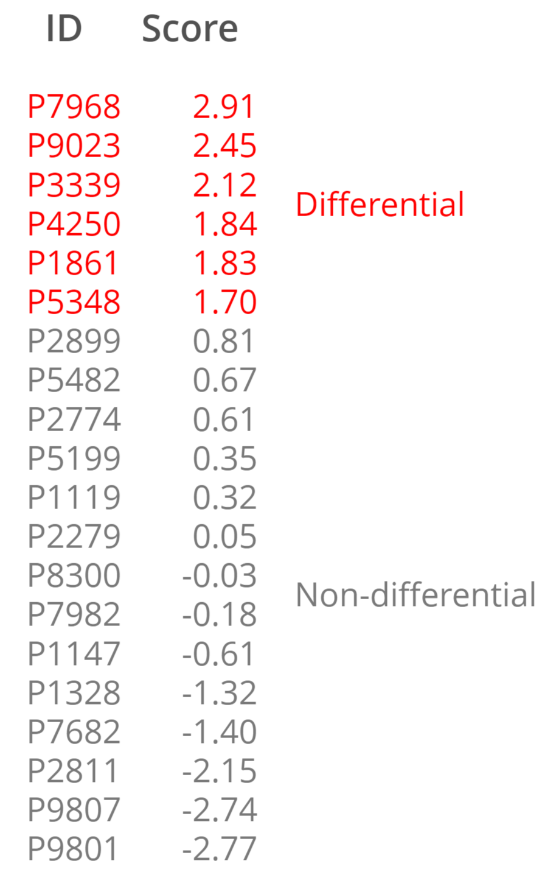
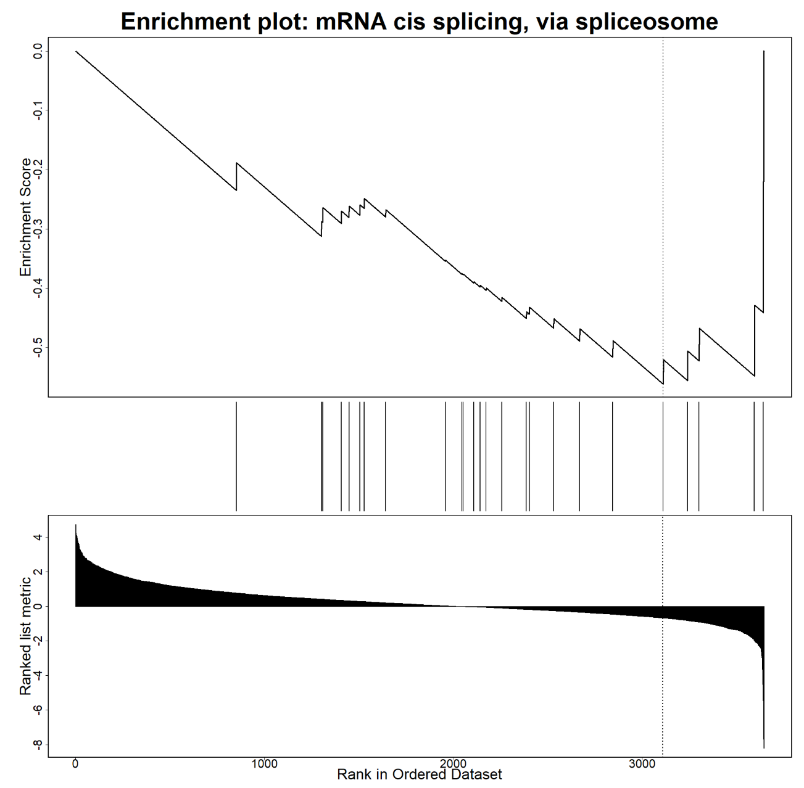
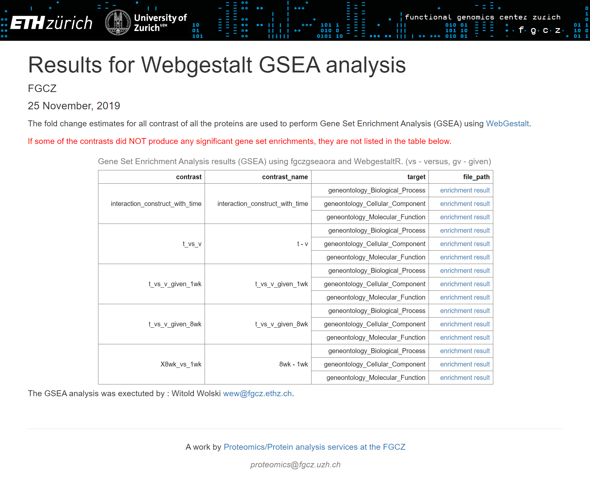
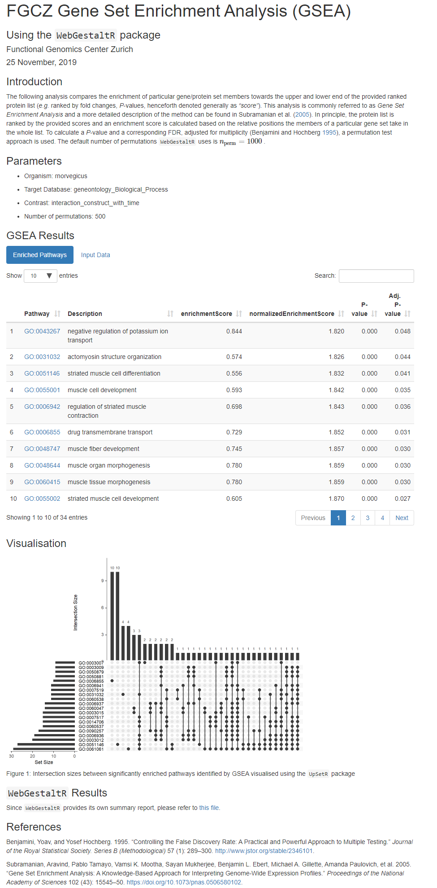
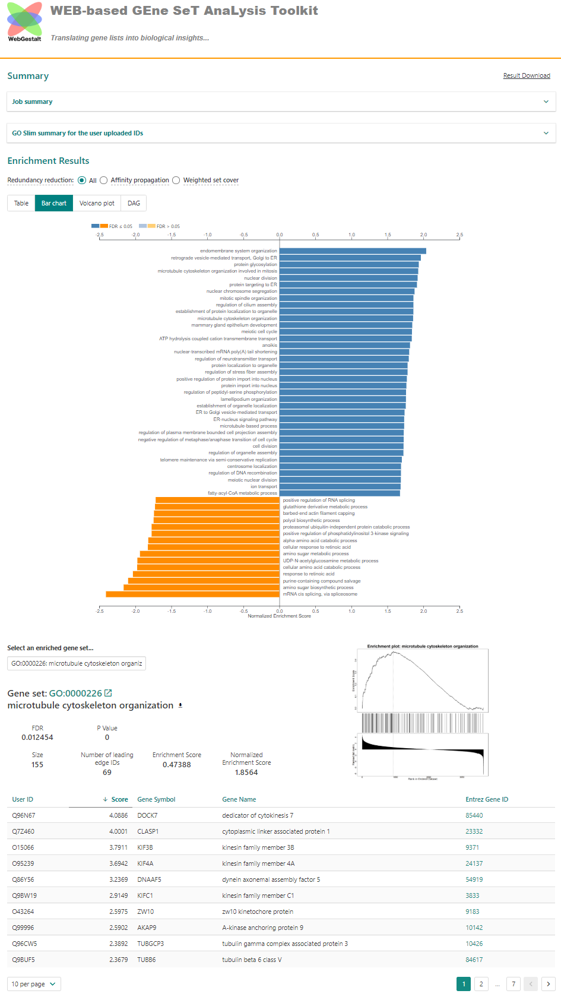

# Overview

- Pathway analysis for proteomics quantification experiments
- fgczgseaora
- Outlook

---


```{r setup, include=FALSE}
library(tidyverse)
library(flextable)
knitr::opts_chunk$set(fig.width=4.25, fig.height=3.5, fig.retina=3,
message=FALSE, warning=FALSE, cache = TRUE,
autodep = TRUE, hiline=TRUE)
knitr::opts_hooks$set(fig.callout = function(options) {
if (options$fig.callout) {
options$echo <- FALSE
options$out.height <- "99%"
options$fig.width <- 16
options$fig.height <- 8
}
options
})
hook_source <- knitr::knit_hooks$get('source')
knitr::knit_hooks$set(source = function(x, options) {
if (!is.null(options$hiline) && options$hiline) {
x <- stringr::str_replace(x, "^ ?(.+)\\s?#<<", "*\\1")
}
hook_source(x, options)
})
options(htmltools.dir.version = FALSE, width = 90)
as_table <- function(...) knitr::kable(..., format='html', digits = 3)
```


background-image: url("../inst/images/fgczgseaora.png")


# Protein quantification experiments

- determine protein foldchanges<br/>
for various contrasts (comparisons of treatments)
- up to thousands of proteins
- only _abundant_ proteins quantifed (detection bias)


.img-right[

]


---

# Pathway analysis

- Over-Represenation Analysis (ORA)
- Gene Set Enrichment Analysis (GSEA)

[Pathway analysis](https://en.wikipedia.org/wiki/Pathway_analysis) uses a priori gene sets that have been grouped together by their involvement in the same biological pathway, or by proximal location on a chromosome. Examples of gene set database are Gene Ontology (GO), KEGG, Reactome and many more.


---

# Over-Representation Analysis (ORA)

- Dychotomize list of proteins </br> (e.g. using a _threshold_
into overexpressed - Yes/No).
- Test if a geneset is _over-represented_ <br/>
in on of the sublists <br/>
(e.g. [Fischers Exact Test](https://en.wikipedia.org/wiki/Fisher%27s_exact_test)).
- how to choose the threshold?

```{r echo=FALSE}
tab <- matrix(c(12, 3, 7, 24), nrow = 2, byrow = TRUE)
dimnames(tab) <- list("GO Term" = c("Contained", "Not Contained"),
                      "Differentially expressed" = c("    Yes    ", "    No    "))

cat("Pathway GO:0003091")
tab
cat("p-value:", round(fisher.test(tab)$p.value, 5))
```
.img-right[

]

---

# Gene Set Enrichment Analysis (GSEA)

- Ranked list (no threshold required)
- locate genes of genesets in ranked list
- compute enrichment score


.footnote[Gene Sets can be highly correlated, because they contain the same proteins.  Multiplicity adjustment assumes indpendence (FDR).]

.img-right[

]

---
# fgczgseaora

- Easily generate reports to be delivered to biologists.
- For ORA we can only use tools which allow to specify detection background.
- Map identifiers - support for _sp_ identifiers
- Ideally run packages locally
- Provide a similar __R__ and command line interface to run ORA GSEA.
  

---

# Many R packages are available

```{r table, echo=FALSE}
benchmark <- list(
  c("WebGestaltR","CRAN","+","-","+","+","+"),
  c("FGNet","Bioc","+","(-)","(-)","-","+"),
  c("HTSanalyzeR","Bioc","-","(-)","-","+","+"),
  c("sigora","CRAN","+","+","(-)","+","-"),
  c("SetRank","CRAN","-","(-)","-","-","+"),
  c("STRINGdb","Bioc","+","-","(-)","+","+"),
  c("enrichR","CRAN","+","-","+","(+)","+"),         
  c("TopGO", "Bioc","...","","","",""))
benchmark <- do.call("rbind",benchmark)
colnames(benchmark) <- c("Package","Repo","Maintenance","offline","ID Mapping","ORA","GSEA")

flextable(data.frame(benchmark)) %>% set_caption("R packages for pathway analysis")
```

- We did integrate:
  - `WebgestaltR` (online only)
  - `sigORA` (offline)

.footnote[WebgesaltR - Various gene set databases, id mapping, allows for downloading html results.
sigORA - uses gene pair signatures. Searches background and pathways for protein pairs unique to a given pathway. By this it decreases the correlation among gene sets.]


---

# Common R interface

.left-code[
```{r eval=FALSE}
runWebGestaltGSEA(
  data = dd,
  fpath = "",
  ID_col = "UniprotID",
  score_col =  "estimate",
  organism =  "hsapiens",
  target = "geneontology_Biological_Process",
  nperm = 500,
  outdir = file.path(odir, "WebGestaltGSEA")
)
```
]
.right-code[
```{r eval=FALSE}
runWebGestaltORA(
  data = dd,
  fpath = "",
  ID_col = "UniprotID",
  score_col =  "estimate",
  organism =  "hsapiens",
  threshold = 1,
  greater = TRUE,
  target = "geneontology_Biological_Process",
  nperm = 500,
  outdir = file.path(odir, "WebGestaltORA")
)
runSIGORA(
  data = dd,
  score_col = "estimate",
  threshold = 1,
  greater = TRUE,
  target = "GO",
  outdir = file.path(odir, "sigORA")
)
```
]

---

# Command line interface

```{bash eval=FALSE}
Rscript lfq_multigroup_gsea.R ./foldchange_estimates.xlsx -o hsapiens
Rscript lfq_multigroup_ora.R ./foldchange_estimates.xlsx -t uniprotswissprot
```

The enrichment methods in this package (ORA, GSEA sigORA) come with a
`docopt` based command line tool to facilitate analysing batches of files.

---

# Command line interface


```{r eval=FALSE}
"WebGestaltR GSEA for multigroup reports

Usage:
  lfq_multigroup_gsea.R <grp2file> [--organism=<organism>] [--outdir=<outdir>] [--idtype=<idtype>] [--ID_col=<ID_col>]  [--nperm=<nperm>] [--score_col=<score_col>] [--contrast=<contrast>]

Options:
  -o --organism=<organism> organism [default: hsapiens]
  -r --outdir=<outdir> output directory [default: results_gsea]
  -t --idtype=<idtype> type of id used for mapping [default: uniprotswissprot]
  -i --ID_col=<ID_col> Column containing the UniprotIDs [default: UniprotID]
  -n --nperm=<nperm> number of permutations to calculate enrichment scores [default: 500]
  -e --score_col=<score_col> column containing fold changes [default: pseudo_estimate]
  -c --contrast=<contrast> column containing fold changes [default: contrast]

Arguments:
  grp2file  input file
" -> doc
library(docopt)
opt <- docopt(doc)
```

---

# HTML outputs - Multiple Contrasts and Targets

- creates folder structure with HTML files<br/> 
visualizing the ORA and GSEA results:
  - For all contrasts<br/>
e.g. t - v, 8wk - 1wk etc.
  - and all selected target<br/> 
e.g. GO Bioprocess, GO Molecular Function
- These files are linked from an `index.html`
- can easily be stored and delivered as part of analysis.


.img-right[


]

---

# HTML output - HTML report with method description
.img-left[

]

.img-right[

]


---

background-image: url("../inst/images/brussels.jpg")

# Outlook

## Outlook

- Standardize R-API interface
- Standardize return values and reports.
- add one or two more packages (`edgeR`, `topGO`, ?)


## THANK YOU!

## Acknowledgments:  
Paolo Nanni, Christian Panse, Ralph Schlapbach, Tobias Kockmann


