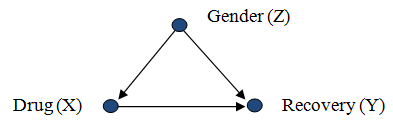

class: fullscreen, inverse, top, center, text-black
background-image: url("chairDesign.jpg")

.font150[**design**]

```{r setup, include=FALSE}
knitr::opts_chunk$set(fig.width=4.25, fig.height=3.5, fig.retina=3,
                      message=FALSE, warning=FALSE, cache = TRUE,
                      autodep = TRUE, hiline=TRUE)
knitr::opts_hooks$set(fig.callout = function(options) {
  if (options$fig.callout) {
    options$echo <- FALSE
    options$out.height <- "99%"
    options$fig.width <- 16
    options$fig.height <- 8
  }
  options
})
hook_source <- knitr::knit_hooks$get('source')
knitr::knit_hooks$set(source = function(x, options) {
  if (!is.null(options$hiline) && options$hiline) {
    x <- stringr::str_replace(x, "^ ?(.+)\\s?#<<", "*\\1")
  }
  hook_source(x, options)
})
options(htmltools.dir.version = FALSE, width = 90)
as_table <- function(...) knitr::kable(..., format='html', digits = 3)
```

---

# Scientific Method

1. Question
2. Hypothesis
3. Experiment <br/> ordered investigation that attempts to prove or disprove a hypothesis
  - must show if hypothesis is supported or not.
  - results must be measurable
  - experiment must be repeatable
4. Observation <br/> make observations about results of experiment
5. Analysis <br/> run test
6. Conclusion <br/> significant result


---

# Question - Causality


Assess whether a particular agent 

(e.g. a medication or drug or treatment regime or exposure to an environmental factor)

caused or influenced a particular outcome 

(e.g. cure of disease, reduction in pain, medical condition, change in protein expression etc.)

---

# Question - Causality - Bradford-Hill Criteria


1.  Strength of association – (effect size) the greater the effect compared with those not
exposed to the agent the more plausible is the association
2. Consistency – (reproducibility) does it happen in other groups of people – both men and
women, different countries
3. Specificity – no other likely explanations - Causation is likely if there is a very specific population at a specific site and disease with no other likely explanation.
4. Temporality – effect follows cause, and if expected delay, effect must occur after that delay
5.  Biological gradient – the stronger the agent the greater the effect – 
response follow dose but also inverse effects possible
6.  Plausibility – is there a possible biological mechanism that could explain
the effect
7. Coherence – do different types of study result in similar conclusions – con-
trolled trials and observational studies
9. Analogous results found elsewhere – do similar agents have similar results?


---

# Question - Causality - Bradford-Hill Criteria

- Are there other scientifically relevant questions than causality?
- Does establishing all B-H criteria prove cause and effect?
--

- What is __your__ research question?
- Which B-H criteria do you aim to establish?

---

# Question - Causality

- Can we infer causal models directly from data?


https://github.com/annennenne/causalDisco/blob/master/slides/causaldisco_ahp_user2019.pdf


---

# Study Types 

.pull-left[
## Observational study
- subjects are observed in order to determine both their exposure and their outcome (e.g. healthy cancer)
- not randomized to the exposed or unexposed groups
- The exposure status is not determined by the researcher
]

.pull-right[
## Experiment
- experiment must be repeatable
- subjects are randomized to the exposed and unexposed groups
]

---

# Study Types 

.pull-left[
## Observational study
- Case-control study -  only individuals with a specific characteristic (disease and similar individuals without disease)
- Cross-sectional study - aim to provide data on the entire population under study
- Longitudinal study - repeated observations of the same variables (e.g., people) over short or long periods of time
]

.pull-right[
## Experiment
- randomized controlled trials
]


---

# Randomized controlled trials

This year’s Laureates have introduced<br/>
a new approach to obtaining reliable answers</br>
about the best ways to fight global poverty. 

In brief, it involves __dividing this issue into</br>
smaller, more manageable, questions__ – for example,</br>
the most effective interventions for improving educational</br>
outcomes or child health. 

They have shown that these smaller, more precise,</br>
questions are often best answered via carefully</br>
__designed experiments__<br/>
among the people who are most affected.


.img-right[

]


---
layout: false

# Randomized controlled trial

Aims to reduce certain sources of __bias__

Bias is an inclination towards something, or a predisposition,<br/> partiality, prejudice, preference, or predilection.

--

- Confirmation bias,<br/> tendency to favor information that confirm hypothesis
.img-right[

]
--

- Funding bias,<br/> bias relative to the commercial interests of a study's <br/> financial sponsor
.img-right[

]
--

- Publication bias,<br/> bias towards publication of certain experimental results
.img-right[

]


---

# Randomized controlled trial

Aims to reduce certain sources of __bias__

- Randomly allocate subjects to two or more groups
 - _selection_ and _allocation_ bias
- Blinding
 - Information which may influence the participants is withheld until after the experiment is completed
 - A blind can be imposed on any participant of an experiment, including<br/> __subjects, researchers, technicians, data analysts, and evaluators__


---

# Bias

What is __selection bias__?

--

sample obtained is _not representative_ of the population intended to be analyzed

--

What is __allocation bias__?

--

_systematic difference_ in how participants are assigned to treatment groups and comparison groups

---

# Bias

Examples


- more care when processing treated samples than controls
- _adjusting_ thresholds till obtaining significant results
- ?

--

How could you improve you experiment by _blinding_ ?
--

- Do not transfer information unnecessary to perform a task,<br/>
   e.g. use uninformative sample labels and group lables
- Perform analysis per protocol. 

--

In clinical Trials double blind trials should be used where possible
  - Single blind – either patient or evaluator blind.
  - Double blind – both patient and evaluator blind

---

# Confounders

Correlation does not imply causation but causation may imply correlation

__Reichenbach's common cause principle:__ <br/>
A correlation occurs due to one of the three possible mechanisms
.img-small[

]

__Confounder__ - is a variable that influences both the dependent variable and independent variable, causing a spurious association.

<!--
.img-right[

]
-->

---
layout: false

# Confounders

- Avoid batch effects:
    - process all samples in parallel

- Randomize over biological and<br/>  technical co-variates. <br/> 
  e.g. run Id, age.

- If randomization is not possible, choose a<br/>
_complete block design_, i.e.,<br/> 
all batch groups are present in each treatment<br/>
group in equal numbers.

.img-right[

]


---

# Confounders

Document any possible co-variate, e.g.,

.pull-left[


- Human subjects:
  - age, 
  - bmi, 
  - gender, 
  - ethnicity, 
  - tissue, 
  - medical center
]

.pull-right[
-  Biochemical/Technical: 
   - batch, 
   - run Id
   - reagent lot no,
   - chromatographic column,
   - name of technician,
   - instrument,
]


---

# Ethical considerations (Clinical Trial)

- It is agreed that it is __unethical__ _to conduct research which is badly planned or
executed_.
-  It is unethical to perform a trial which has many more subjects than are needed to
reach a conclusion.
- It is also unethical to
perform a trial which has little prospect of reaching any conclusion, e.g. because
of insufficient numbers of subjects (or some other aspect of poor design)


- The local ethics committee has discretion on how it will supervise __noninterventional__ studies
  -  US - Institutional Review Board (IRB)
  -  EU - ethics committees

(Declaration of Helsinki (1964+amendments))
https://www.wma.net/policies-post/wma-declaration-of-helsinki-ethical-principles-for-medical-research-involving-human-subjects/

---


# Types of error


A _type I error_ (false positive) occurs when the null hypothesis (H0) is true, but is rejected.<br/> 
The _type I error rate_ or __significance level__ (p-Value) is the probability of rejecting the<br/> 
null hypothesis given that it is true.


A _type II error_ (false negetive) occurs when the null hypothesis<br/>
is false, but erroneously fails to be rejected. <br/>
The _the type II error rate_ is denoted by the Greek letter $\beta$<br/>
and related to the __power of a test__ (which equals $1−\beta$).

For a given test, the only way to reduce both error rates<br/> 
is to __increase the sample size__, and this may not be feasible.

.img-right[

]

---

# Sample size calculation

.pull-left[
- Biological variance >> biochemical+technical variance <br/>
Only provide biological replicates

- biochemical+technical variance >> biological variance<br/>
  - technical replicates
  - choose different technology
  - buy better instrument
]

.pull-right[

Run pilot experiment and measure the CV, $\sigma^2$ of replicates

- technical
- biochemical
- biological
]

---

# Sample size calculations 

.pull-left[
For each statistical test,<br/> 
there exists a unique relation between:

- desired smallest detectable effect size $\mu$
- sample variance $\sigma^2$
- sample size $N$
- critical p-value $p_0$
- statistical power
]

.img-right[
```{r echo=FALSE}

sd <- seq(0.5, 2, by =.001)

dd <- power.t.test(delta = 2, sd = 1, sig.level = 0.05, power = 0.8)

powersd <- function(sd, delta = 1, sig.level = 0.05, power = 0.8){
  ceiling(power.t.test(delta = 2, sd = sd, sig.level = sig.level, power = power)$n)
}


ressd <- sapply(sd, powersd)

power_delta <- function( delta, sd = 1, sig.level = 0.05, power = 0.8){
  ceiling(power.t.test(delta = delta, sd = sd, sig.level = sig.level, power = power)$n)
}

delta <- seq(0.5,6, by = 0.001)
resdelta <- sapply(delta, power_delta)
#par(mfrow=c(2,1))
plot(sd, ressd, ylab="N", type="l", main = "mu=1, p=0.05, power = 0.8")
plot(delta, resdelta, xlab = "mu", ylab="N", type="l", log="xy", main = "sd=1, p=0.05, power = 0.8")


```
]

---

# Design

The key technical issue is whether comparions are made ‘between’ or ‘within’ patients.


.pull-left[
Between

- Paralel Group Design <br/> k - groups, $n_i$ patients in group $i$ receive treatemnt $i$
- Factorial Design <br/>  combining treatments, e.g. A and B to same patient.
]

.pull-right[
Within

- In series design <br/> each patient all $k$ treatments in same order
- crossover design <br/> each patient  all $k$ treatements in different order
]

Are combinations of both possible?

---

# Factorial Design vs Parallel group

40 patients, Placebo Treatment A and B.

How would you allocate these patients?

--
.pull-left[
Factorial

- AB 10
- B 10
- A 10
- Placebo 10
]

.pull-right[
Parallel

- A 13
- B 13
- Placebo 14
]


---

# Interactions

.plot-my[]

--

.plot-my[]

--

.plot-my[]

