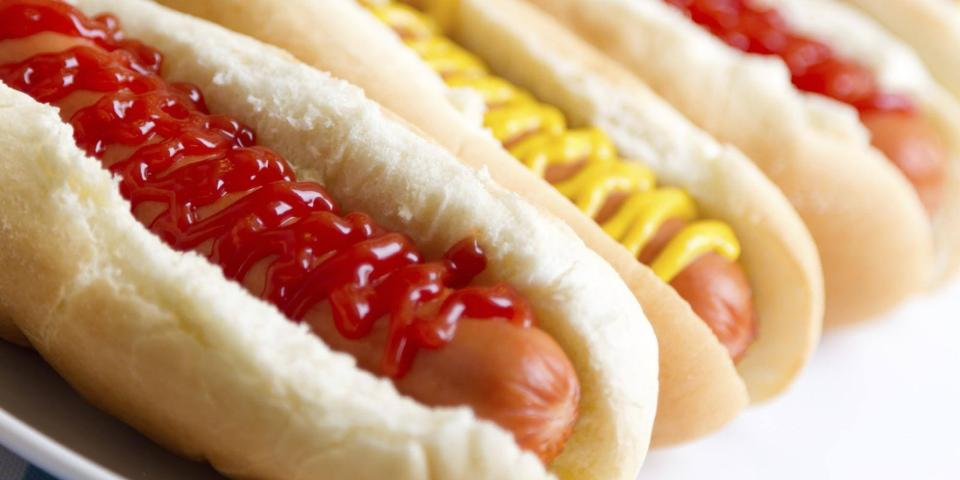
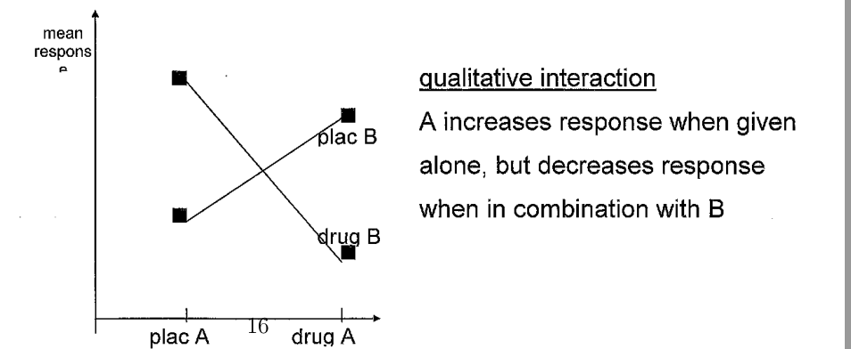
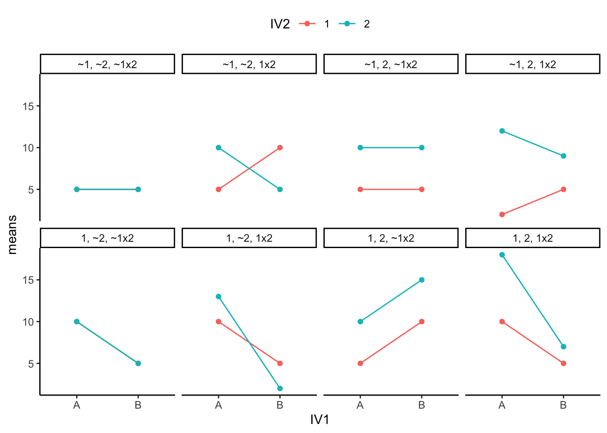

class: fullscreen, inverse, top, center, text-black
background-image: url("../inst/images/Linear_chair.jpg")

.font150[**design**]

```{r setup, include=FALSE}
knitr::opts_chunk$set(fig.width = 4.25,
                      fig.height = 3.5,
                      fig.retina = 3,
                      message = FALSE,
                      warning = FALSE,
                      cache = TRUE,
                      autodep = TRUE,
                      hiline = TRUE)

knitr::opts_hooks$set(fig.callout = function(options) {
  if (options$fig.callout) {
    options$echo <- FALSE
    options$out.height <- "99%"
    options$fig.width <- 16
    options$fig.height <- 8
  }
  options
})
hook_source <- knitr::knit_hooks$get('source')
knitr::knit_hooks$set(source = function(x, options) {
  if (!is.null(options$hiline) && options$hiline) {
    x <- stringr::str_replace(x, "^ ?(.+)\\s?#<<", "*\\1")
  }
  hook_source(x, options)
})
options(htmltools.dir.version = FALSE, width = 90)
as_table <- function(...) knitr::kable(..., format='html', digits = 3)
```


---

exclude: true

# LFQ a success story


--
exclude: true

- Novel aquisition methods (DIA vs DDA)

.img-right[

]

--
exclude: true

- improvements in feature detection and extraction

.img-right[

]

--
exclude: true

- a zoo of data <br/> transformation, pretreatment, imputation methods

.img-right[

]


--
exclude: true

- improvements in fold change estimation

.img-right[

]


.footnote[
[Extending the Limits of Quantitative Proteome](https://www.mcponline.org/content/14/5/1400);
[Ionstar](https://www.pnas.org/content/115/21/E4767);
[Simultaneous Improvement in the Precision...](https://www.mcponline.org/content/18/8/1683);
[Ropeca](https://www.nature.com/articles/s41598-017-05949-y)
]

---

# Overview

- Question of Causality
- Judgement under uncertainty
- Scientific method
- Causality and Bradford Hill criteria
- Study Types
- Confounders
- Exp. Design
- Sample Size

---

# Question of Causality

.pull-left[
Assess whether a particular __agent__ 
caused or influenced a particular __outcome__ 

- What is the probablity (P) that A belongs to class B?
- What is P that A originates from B?
- What is P that B generates A?
]

.right-plot[

]


---

# Judgement under uncertainty - Heuristics and biases

In answering these question people typically rely on;

__representativeness__ heuristic, i.e. when A is highly representative of B, the probability that A originates form B is judged to be high.

But people are insensitive to:
- to prior probability of outcome
- to sample size
- to predictability (predict future based on observations made now).
- illusion of validity (caused by consistency  $^{\star}$)
- misconception of regression (confounding)


.footnote[
$^{\star}$ but consistent patterns are most often observed when input variables are highly redundant or correlated. Hence people ten dto have great confidence in predictions based on redundant input variables.<br/>
[Judgment under Uncertainty: Heuristics and Biases by Tversky A. and Kahneman D. Science 1974](https://www.science.org/doi/10.1126/science.185.4157.1124),
]

---

# Judgement under uncertainty - Heuristics and biases


- __availability__ heuristic
  - bias due to of retrievable (how easily information can be brought to mind)
  - biases of imaginably (how easy is it to explain outcomes)
  - bias due to illusory correlations (frequency of co-occurrence)
- __anchoring__ heuristic
  - insufficient adjustment
  - assessment of uncertainty (typically under-estimated)

---

# Judgement under uncertainty - Heuristics and biases

Imagine an urn filled with balls, of which 2/3 are of one color and 1/3 of another.

- One individual (__A__) has drawn $5$ balls from the urn, and found that $4$ were red and $1$ was white. 
- Another (__B__) has drawn $20$ balls and found that $12$ were red and $8$ were white. 

Which of the two individuals should feel more confident that the urn contains $2/3$ red balls and $1/3$ white balls, rather than the opposite? What odds should each individual give?


- Odds for __A__:
- Odss for __B__:

.footnote[Odds : $$\frac{\textrm{Probability of urn with 2/3 RED balls}}{\textrm{Probability or urn with 2/3 WHITE balls}}$$ ]


---
# Scientific Method

1. __Question__
2. __Hypothesis__
3. __Experiment__ <br/> ordered investigation that attempts to prove or disprove a hypothesis
  - must show if hypothesis is supported or not.
  - results must be measurable
  - experiment must be repeatable
4. __Observation__ <br/> make observations about results of experiment
5. __Analysis__ <br/> run NHST (frequentist) or derive posterior distribution (Bayesian.)
6. __Conclusion__ <br/> significant result

.footnote[NHST - null hypotheses significance test]

---
exclude: true

# Causality - How to prove cause and effect?

.right-plot[

]

.footnote[[Peter Buehlmann "Invariance, Causality and Robustness"](https://arxiv.org/pdf/1812.08233.pdf)]

---

# Causality - Bradford-Hill Criteria


1.  __Strength of association__ – (effect size) the greater the effect compared with those not
exposed to the agent the more plausible is the association
2. __Consistency__ – (reproducibility) does it happen in other groups of people – both men and
women, different countries
3. __Specificity__ – no other likely explanations
4. __Temporality__ – effect follows cause, and if expected delay, effect must occur after that delay
5.  __Biological gradient__ – the stronger the agent the greater the effect
6.  __Plausibility__ – is there a possible biological mechanism that could explain the effect
7. __Coherence__ – do different types of study result in similar conclusions – e.g., controlled trials and observational studies
8. __Experiment__ "Occasionally it is possible to appeal to experimental evidence".
<!-- 9. Analogous results found elsewhere – do similar agents have similar results?-->

.footnote[
Sir Austin Bradford Hill CBE FRS was an English epidemiologist and statistician, pioneered the randomized clinical trial (use of streptomycin in treating tuberculosis) and, together with Richard Doll, demonstrated the connection between cigarette smoking and lung cancer (case-control study).
]

---

# Causality - Bradford-Hill Criteria

.pull-left[Plausibility<br/>
]

.pull-right[Specificity<br/>
]

.footnote[[Explaining Hill Criteria using xkcd](https://www.kdnuggets.com/2017/02/hill-data-scientist-xkcd-story.html)<br/>
[The Bradford Hill Criteria Don't Hold Up](https://lesslikely.com/statistics/bradford-hill-criteria-dont-hold/)
]


---

# Causality - Bradford-Hill Criteria

- Protein Quantification 
  - Strength of association : Control, Treatment $5 \mu g$, Treatment $10 \mu g$
  - Consistency : Treatment effect does not depend on Genetic Background (__it depends__)
  - Temporality : Time course data
  - Specificity : Effect only caused by this treatment

- Does establishing all Bradford-Hill criteria prove cause and effect?
- Which Bradford-Hill criteria do you aim to meet in your study?


---
exclude: true

# Causality

.pull-left[
- Can we infer causal models directly from data?
- Would you prefer?
  - to have dataset with $4000$ proteins and $2$ conditions
  - a dataset with $400$ proteins and more than $>100$ conditions?
]

.right-plot[


]
.footnote[[CausalDisco](https://github.com/annennenne/causalDisco/blob/master/slides/causaldisco_ahp_user2019.pdf)
an overview of methods (implemented in R) to infer causal networks from data <br/>

Judea Pearl "The Book of Why: The New Science of Cause and Effect"<br/>

]


---

# Study Types 

.pull-left[
## Observational study
- Case-control study -  individuals with a specific characteristic (disease and similar individuals without disease)
- Cross-sectional study - aim to provide data on the entire population under study.
- Longitudinal study - repeated observations of the same variables (e.g., people) over short or long periods of time. They can also be structured as longitudinal __randomized experiments__, e.g. Mice aging.
]

.pull-right[
## Experimental Intervention
- __randomized controlled trials__  <br/>
(randomize subjects into two groups, placebo and treatment group)
]

---

# Study Types

.pull-left[
## Observational study
pros:
- May require less resources
- Less ethical considerations (e.g. smokers)
- Good if outcome of interest is rare

cons:
- difficult to determine causality
- no randomization or blinding
- The exposure status is not determined by the researcher
]

.pull-right[
## Experimental Intervention
pros:
- More validity
- Can determine causality
- Randomized and blinded


cons:
- may require more resources
- Ethical concerns for certain exposures
- Difficult if outcome studied is rare<br/> (e.g. Vaccination)
]

---

# Study Types - Case control study
.image-70[

]


---

# Study Types - 530 B.C.

“Test your servants for ten days:<br/> Give us nothing but vegetables to eat and water to drink.<br/> Then compare our appearance with that<br/> of the young men who eat the royal food, <br/>and decide what to do with us based on how we look.”

Bible (see Daniel 1:1–16).<br/>


.img-right[

]

.footnote[Bregman, Rutger. Utopia for Realists (p. 206). Bloomsbury Publishing. Kindle Edition. ]

---

exclude: true

# Study Types - Randomized controlled trial (RCT)

"This year’s (2019) Laureates have introduced<br/>
a new approach to obtaining reliable answers<br/>
about the best ways to fight global poverty. 

In brief, it involves __dividing this issue into<br/>
smaller, more manageable, questions__ – for example,<br/>
the most effective interventions for improving educational<br/>
outcomes or child health. 

They have shown that these smaller, more precise,<br/>
questions are often best answered via carefully<br/>
__designed experiments__<br/>
among the people who are most affected."


.img-right[

]


---
layout: false

# Study Types - RCT : __Randomization__

A randomized controlled trial is a type of scientific experiment that aims to reduce certain sources of __bias__ when testing the effectiveness of new treatments.

- __selection bias__ 
    - sample obtained is _not representative_ of the population intended to be analyzed.
- __allocation bias__ 
    - _systematic difference_ in how participants are assigned to treatment groups and comparison groups
    - __Randomly allocate subjects to two or more groups__


.footnote[

https://en.wikipedia.org/wiki/Randomized_controlled_trial<br/>
https://en.wikipedia.org/wiki/Bias]

---

# Study Types -  __Blinding__

 - Information which may influence the participants<br/>
 is withheld until after the experiment is completed
 - A blind can be imposed on any participant<br/>
 of an experiment, including<br/> 
 __subjects, researchers, technicians,<br> data analysts, and evaluators__

- In clinical Trials double blind trials should <br/>
be used where possible
  - __Single blind__ – either patient or evaluator blind.
  - __Double blind__ – both patient and evaluator blind

- To prevent __ascertainment__ and __performance__ __bias__.

.img-right[]

.footnote[[Blinding: Who, what, when, why, how?](https://www.ncbi.nlm.nih.gov/pmc/articles/PMC2947122/)]

---


# Bias - Other types of

- Confirmation bias,<br/> tendency to favor information that confirm hypothesis $^{\star}$

.img-right[

]


--

- Funding bias,<br/> bias relative to the commercial interests of a study's <br/> financial sponsor
.img-right[

]
--

- Publication bias,<br/> Publishing only results that show a significant finding,</br> and inserts bias in favor of positive results.  $^{\star\star}$
  
.img-right[

]

.footnote[
$^\star$ Do you examine an experiment for a technical problem which <br/>
fits your hypothesis? </br>
$^{\star\star}$ Over-interpretation of improvements of new methods. Wrong expectations about a method e.g. Plasma Proteomics.</br>
[Meta-assessment of bias in science](https://www.pnas.org/content/114/14/3714)</br>
[catalogofbias.org](https://catalogofbias.org/)
]


---

# Confounders


Correlation does not imply causation but causation may imply correlation.

__Confounder__ - is a variable that influences both the dependent variable and independent variable, causing a spurious association.

__Reichenbach's common cause principle:__ <br/>
A correlation occurs due to one of the three possible mechanisms
.img-small[

]

.footnote[[Mediators, confounders, colliders – a crash course in causal inference](https://theoreticalecology.wordpress.com/2019/04/14/mediators-confounders-colliders-a-crash-course-in-causal-inference/)]

<!--
.img-right[

]
-->

---

# Confounders - Example

- Flight Training Experienced instructors noted: 
  - that praise for an exceptionally smooth landing is typically followed by a poorer landing on the next try.
  - harsh criticism after a rough landing is usually followed by an improvement on the next try.
The instructors concluded that verbal rewards are detrimental to learning while punishments are beneficial, contrary to accepted psychological doctrine.

.footnote[[Judgment under Uncertainty: Heuristics and Biases by Tversky A. and Kahneman D. Science 1974](https://www.science.org/doi/10.1126/science.185.4157.1124)]

--
Correct explanation would: regression to the mean.

---
layout: false

# Confounders - Controlling for 

- Randomize over biological and <br/>  technical co-variates. <br/> 
  e.g. run Id, age.
- Avoid batch effects:
    - process all samples in parallel
- block confounders <br/> 
_complete block design_, i.e.,<br/> 
all treatments are present in each batch<br/>
in equal numbers.

.img-right[

How to avoid confounding by batch
]


.footnote[
[Statistical Design of Quantitative Mass Spectrometry-Based Proteomic Experiments](https://doi.org/10.1021/pr8010099)<br/>
[Importance of Block Randomization When Designing Proteomics Experiments](https://doi.org/10.1021/acs.jproteome.0c00536)
]

---

# Confounders - Controlling for 

## Queue Generator

Use block random queue when processing samples to _block_ for changes in the chromatographic column over time.

__Example:__

\# of samples in each condition 3 x A, 3 x B, 2 x C, 2 x D. <br/>
Blocks :  ABCD, BCDA, BA <br/>


.footnote[http://fgcz-ms-shiny.uzh.ch:8080/queue_generator10/]

---

# Confounders - Reporting

Document possible co-variates, e.g.,

.pull-left[

- Human subjects:
  - age
  - bmi 
  - gender 
  - ...
]

.pull-right[
-  Biochemical/Technical: 
   - batch 
   - run Id
   - instrument
   - ...
]

- Report your research so that it can be reviewed, reproduced and analysed.


.footnote[
[Over-interpretation and misreporting of prognostic factor
studies in oncology: a systematic review](https://www.nature.com/articles/s41416-018-0305-5.pdf)<br/>
http://www.equator-network.org/<br/>
https://www.ncbi.nlm.nih.gov/pubmed/29873743
]


---


# Exp. Design

The key technical issue is whether comparisons are made __between__ or __within__ subjects.


.pull-left[
Between

- Parallel Group Design <br/> k - groups, $n_i$ patients in group $i$ receive treatment $i$
- Factorial Design <br/>  - more than one factor. combining treatments, e.g. A and B to same patient.
]

.pull-right[
Within (repeated/paired)

- In series design <br/> each patient all $k$ treatments in same order
- crossover design <br/> each patient  all $k$ treatments in different order
]

Are combinations of both possible?

.footnote[Ronald Fisher (1890 - 1962) "The Arrangement of Field Experiments" (1926) and "The Design of Experiments" (1935).]

---

layout: false

# Exp. Design - Interactions

.footnote[[Understanding Interaction Effects in Statistics](https://statisticsbyjim.com/regression/interaction-effects/)]


Q : "Do you prefer ketchup or chocolate <br/> sauce on your food?"

--

A : "__It depends__ on the type of food!" <br/>

.img-right[

]

--

Think of interaction effects as an __"it depends"__ effect. <br/>

You cannot answer the question without __more__ information <br/>
about the other variable in the interaction term.<br/>

Factorial Designs are efficient at evaluating 
the effects and possible interactions of
several factors (independent variables).


---

# Exp. Design - Factorial vs parallel group

.pull-left[
Parallel (one factor)

- drug A
- drug B
- plac
]

.pull-right[
Factorial (2 or more factors)

- Factor A
  - drug A
  - plac A
- Factor B
  - drug B
  - plac B
]

40 patients, Placebo, drug A and drug B.
How would you allocate these patients?


.footnote[Ronald Fisher pioneered the use of factorial experiments instead of the one-factor-at-a-time method.]

---

# Exp. Design - Factorial vs parallel group

.pull-left[
Parallel (one factor)

- drug A (13)
- drug B (13)
- plac (14)

Compare:
- 13 drug A vs 14 plac
- 13 drug B vs 14 plac
]

.pull-right[
Factorial (2 or more factors)

- drug A + drug B (10)
- plac A + drug B (10)
- drug A + plac B (10)
- plac A + plac B (10)

Compare:
- 20 drug A vs 20 plac A
- 20 drug B vs 20 plac B 
]


---
layout: false

# Exp. Design - Interactions

Factorial Designs are efficient at evaluating<br/>
the effects and possible interactions of<br/> 
several factors (independent variables).


.footnote[https://en.wikipedia.org/wiki/Design_of_experiments]

--

- No interaction
.img-right[


[Medical Statistics - University of Sheffield]
]


--

- Quantitative interaction

.img-right[

]


--

- Qualitative interaction

.img-right[

]


---
exclude: true

# All possible interactions


- 1 = there was a main effect for IV1.
- ~1 = there was not a main effect for IV1
- 2 = there was a main effect for IV2
- ~2 = there was not a main effect of IV2
- 1x2 = there was an interaction 
- ~1x2 = there was not an interaction

.img-right[

]

.footnote[https://crumplab.github.io/statistics/more-on-factorial-designs.html]

---


# Sample Size - Ethical considerations

- It is agreed that it is __unethical__ _to conduct research which is badly planned or
executed_.

-  It is unethical to perform a trial which:
  - has _many more subjects_ than are needed to reach a conclusion.
  - has little prospect of reaching any conclusion, <br/> e.g. because 
  of _insufficient numbers of subjects_ (or some other aspect of poor design)

- The local ethics committee has discretion on how it will supervise __non-interventional__ studies
  -  US - Institutional Review Board (IRB)
  -  EU - ethics committees

[Declaration of Helsinki (1964+amendments))](https://www.wma.net/policies-post/wma-declaration-of-helsinki-ethical-principles-for-medical-research-involving-human-subjects/)

---

# Sample Size - Types of error


A __type I error__ (false positive) occurs when<br/> the null hypothesis (H0) is true, but is rejected.<br/> 
The _type I error rate_ or __significance level__ (p-Value)<br/> is the probability of rejecting the<br/> 
null hypothesis given that it is true.


A __type II error__ (false negative) occurs when<br/> 
the null hypothesis is false,<br/>
but erroneously fails to be rejected. <br/>
The _the type II error rate_ is denoted by the Greek letter $\beta$<br/>
and is related to the __power of a test__ (which equals $1−\beta$).

For a given test, the only way to reduce both error rates<br/> 
is to __increase the sample size__, and this may not be feasible.

.img-right[

]


---

# Sample Size - Sample size calculation


.pull-left[

Run pilot experiment and measure the coefficient of variation (CV) or <br>
$\sigma^2$ of replicates:

- technical
- _biochemical_
- __biological__
]


.pull-right[
- _biological variance >> bio-chem+tech variance_<br/> 
  - Only provide biological replicates
- _bio-chem+tech variance >> biological variance_<br/>
  - __improve sample handling and preparation__
  - choose different technology
  - buy better instrument
]

.footnote[measure 3 tech replicates, 3 tech+bio-chem replicates, 3 tech+bio-chem+biological replicates]

---

# Sample Size - Sample size calculation

.footnote[Top - greater standard deviation requires larger sample sizes, Bottom - smaller effect size requires larger sample sizes]

.pull-left[
For each statistical test,<br/> 
there exists a unique relation between:

- desired smallest detectable effect size $\mu$
- sample variance $\sigma^2$
- sample size $N$
- critical p-value $p_0$
- statistical power

]

.right-plot[
```{r echo=FALSE}
sd <- seq(0.5, 2, by = .001)
dd <- power.t.test(delta = 2, sd = 1, sig.level = 0.05, power = 0.8)
powersd <- function(sd, delta = 1, sig.level = 0.05, power = 0.8){
  ceiling(power.t.test(delta = 2, sd = sd, sig.level = sig.level, power = power)$n)
}

ressd <- sapply(sd, powersd)
power_delta <- function(delta, sd = 1, sig.level = 0.05, power = 0.8){
  ceiling(power.t.test(delta = delta, sd = sd, sig.level = sig.level, power = power)$n)
}

delta <- seq(0.5,6, by = 0.001)
resdelta <- sapply(delta, power_delta)
plot(sd, ressd, ylab = "N", type = "l", main = "mu=1, p=0.05, power = 0.8")
plot(delta, resdelta, xlab = "mu", ylab = "N", type = "l", log = "xy", main = "sd=1, p = 0.05, power = 0.8")

```
]

---


# Conclusion

- Overall goal: effective, reproducible and error free (not biased) research
- Understand Causality 
- Understand what heuristics people use and what errors they make
- The scientific method, randomization, blinding, sample size estimation are helping to prevent biases.

__Thank you__

