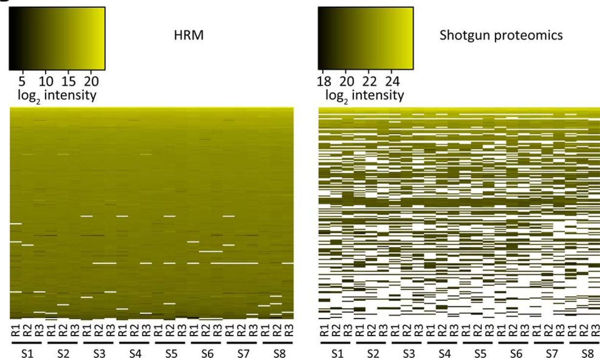
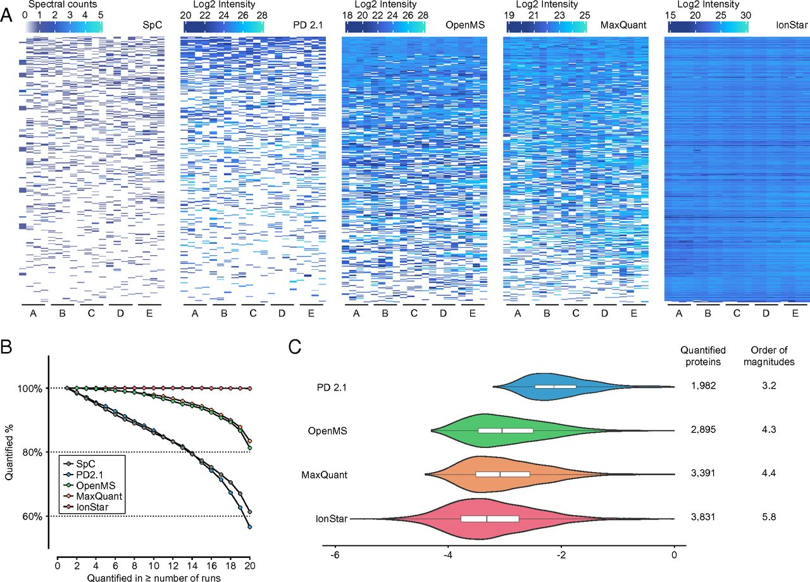
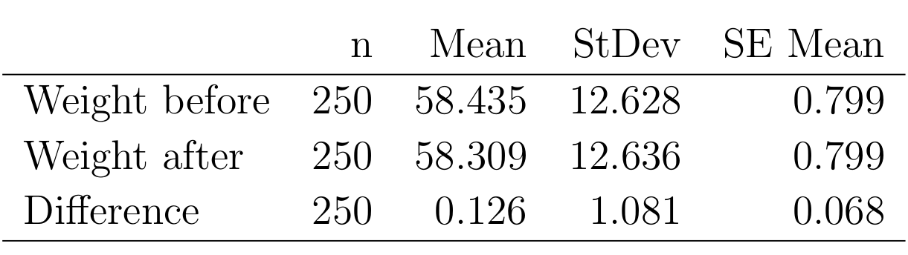

class: fullscreen, inverse, top, center, text-black
background-image: url("../inst/images/many-black-chair-backs.jpg")

.font150[**design**]

```{r setup, include=FALSE}
knitr::opts_chunk$set(fig.width = 4.25,
                      fig.height = 3.5,
                      fig.retina = 3,
                      message = FALSE,
                      warning = FALSE,
                      cache = TRUE,
                      autodep = TRUE,
                      hiline = TRUE)

knitr::opts_hooks$set(fig.callout = function(options) {
  if (options$fig.callout) {
    options$echo <- FALSE
    options$out.height <- "99%"
    options$fig.width <- 16
    options$fig.height <- 8
  }
  options
})
hook_source <- knitr::knit_hooks$get('source')
knitr::knit_hooks$set(source = function(x, options) {
  if (!is.null(options$hiline) && options$hiline) {
    x <- stringr::str_replace(x, "^ ?(.+)\\s?#<<", "*\\1")
  }
  hook_source(x, options)
})
options(htmltools.dir.version = FALSE, width = 90)
as_table <- function(...) knitr::kable(..., format='html', digits = 3)
```


---
# Overview


- label free qunatification LFQ
- Data Normalization
- Multiplicity

---
# LFQ a success story


--

- Novel aquisition methods (DIA vs DDA) <br/> [Extending the Limits of Quantitative Proteome](https://www.mcponline.org/content/14/5/1400)

.img-right[

]

--

- improvements in feature detection and extraction <br/> [Ionstar](https://www.pnas.org/content/115/21/E4767)

.img-right[

]

--

- zoo of data transformation and imputation methods <br/> [Simultaneous Improvement in the Precision...](https://www.mcponline.org/content/18/8/1683)

.img-right[

]


--

- improvements in fold change estimation <br/> [Ropeca](https://www.nature.com/articles/s41598-017-05949-y)


.img-right[

]

---

# LFQ data analysis

- Filter for 2 peptides per proteins
- summarize peptide intensities
- Normalize data 
  - to remove systematic differences between samples
  - ensure that observations are independent and identically distributed (iid)
- Descriptive, exploratory and inferential data analysis.

---

# Normalization

.img-left[

]


.img-right[

]

.footnote[Left - Intensity distributions before (Left) and after normalization (Right).]
---

# Normalization

Assumptions to be met when normalizing data to remove systematic differences

- Bulk of proteins quantified does not change
- only small fraction of proteins changes

Only than we are removing only systematic changes among samples.


---

# Normalization


.img-left[

]

.img-right[

]

.footnote[Left : Heatmap : columns - samples, rows - proteins, black - missing protein quantifications. Right : # quantified proteins per sample.]


---

# How does it affect results

- If the set of proteins strongly differs among conditions
  - the intensity distribution among samples will be looking similar after normalization
  - However, Intensity estimates of proteins will be biased
    - almost all proteins will be reported as differentially expressed


---
# How does it affect results


.img-left[

]

.img-right[

]


.footnote[Heatmap: column, sample, row - protein. Each row is scaled.
The protein intensities in the KO samples are very different than in the other conditions. Right - Proteins with a significant result in the ANOVA analysis.
]

---
# How does it affect results


.img-left[

]


.img-right[

]

.footnote[Same samples except KO. Right - Proteins with a significant result in the ANOVA analysis.]
---

# Conclusions

- If samples are very different 
  - the fold changes and FDR estimates will be biased because of normalization.
  - gene set enrichment analysis or over-representation analysis might still be possible.

- To model missing data count models can be used
  - However, they have lower statistical power (larger sample sizes are required).
  - log odds ratios not fold changes are estimated
  
- If correct fold change estimates are of importance samples in various conditions should be similar
  - e.g. no visible differences in cell culture samples


---

# Multiple Testing

"Concerning data analysis and statistics, we would like to ask whether there is any limitation to the number of comparisons we can propose.
According to the experimental setting, a **maximum of 28 pairwise comparisons** are possible, and we prefer to have all of them **to decide afterwards about the aspects to highlight**. Otherwise, if there are limitations, we have selected ten most relevant comparisons."


---

# Weight loss example

Experiment:
- 250 subjects chosen "randomly".
- Diet for 1 week.
- Repeated Measurement (Data in kg.):
   - Weight at the start of the week
   - Weight at the end of week. 

Average weight loss is $0.13$kg. Paired t-test for weight <br/>
loss gives a t-statistic of $t=0.126/0.068=1.84$,</br>
giving a p-value of $0.067$ (using a two-sided test).</br>
Not quite significant at the $5%$ level!


.img-right[

]

.footnote[Example from  Andersen (1990) ]

---

# Weight loss example

.left-code[

```{r computingPvals}
2*(1 - pt(1.84, df = 250 - 1))

2*(1 - pnorm(1.84, 0,1)) #<<
# Asymptotic test
(1 - pt(1.84, df = 250 - 1)) #<<
# one sided tests
```
]


.right-plot[

]

.footnote[
Assymptotic test - does not "help" (and is biased); smaller sample size larger bias.<br/>
]


---
layout: false

# Weight loss example

## Why is the 1-sided test not acceptable?

You use a one-tailed test to improve the test's ability to learn whether the new diet is better. 

However, that's unethical because the test cannot determine whether it is less effective. You risk missing valuable information by testing in only one direction.

---

# Weight loss example

Can anything be done to get a significant result<br/>
out of this study?<br/>
--

- Look at subgroups of the data <br/> by their sign of the zodiac. <br/> (additional factor)
- *12* instead of *1* test
--


.img-right[

]

--

- Conclusion: Those born under the sign of Aries<br/> are particularly suited to this new dietary control.

---

# Weight loss example

What is the problem of this approach?

--

- Hypothesis that Arieans are good dieters was suggested by the fact that it gave an *apparently* significant result.
- By increasing the number of tests you increase the chance of false positive results (type I error).


- Data vs. Hypothesis driven research. 
  - Data driven use exploratory and descriptive tools to generate hypothesis.
  - Hypothesis driven uses tests.
  - Large differences how you would report those results.

---

# Thank you

More in the Proteome Informatics course <br/>
"Introduction to Proteomics Data Analysis and Beyond"<br/>
https://fgcz.ch/education/bioinformaticsTraining/bioinfProteomics.html

.img-right[

]

.footnote[https://xkcd.com/882/]


