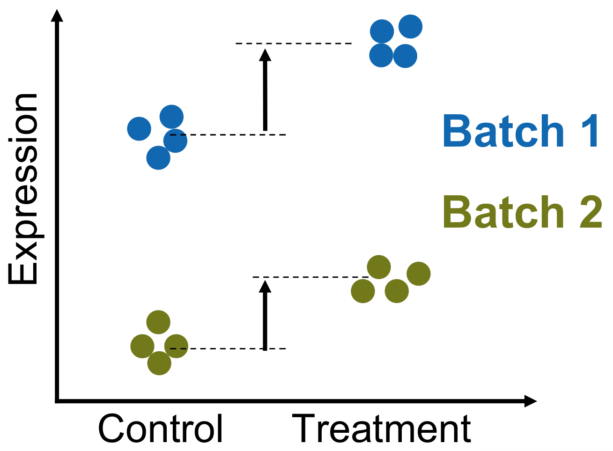
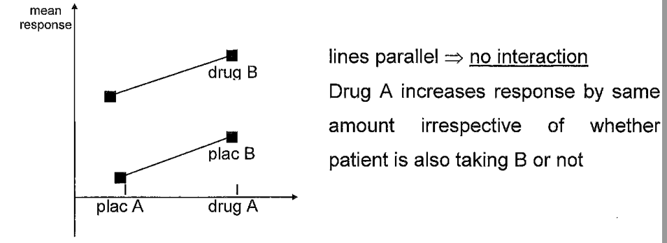
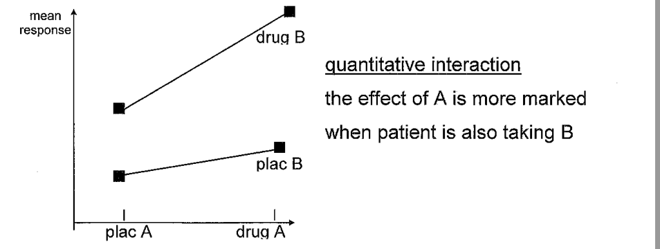
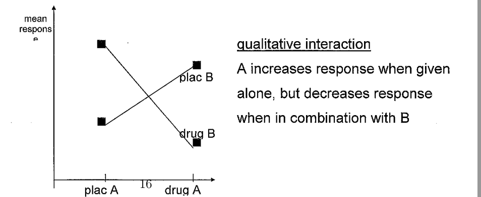
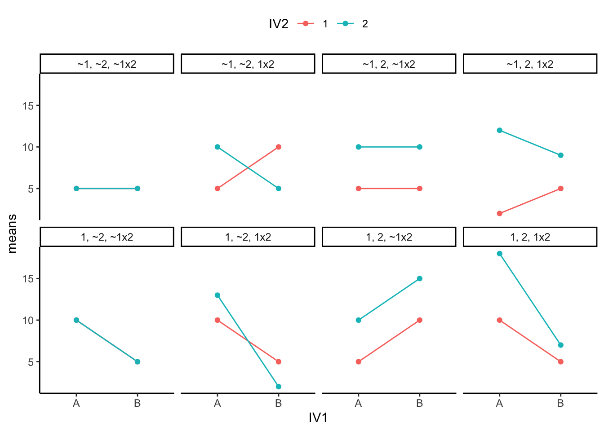
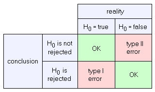
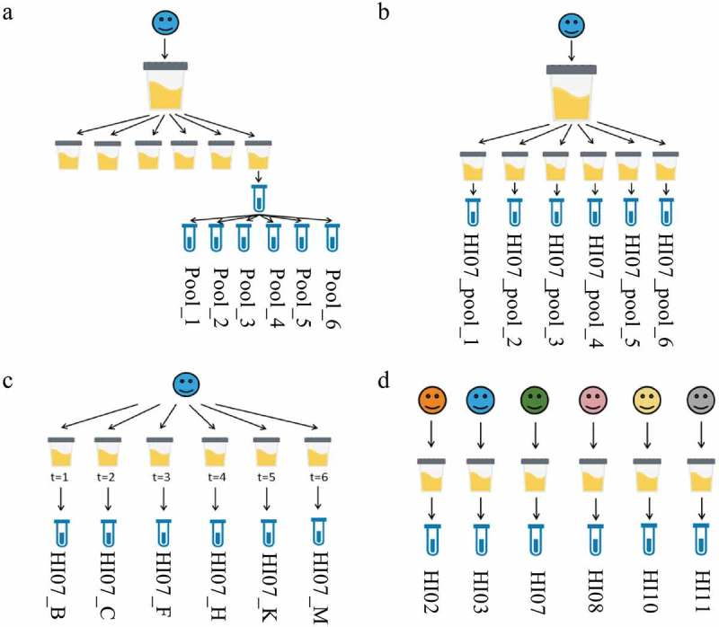
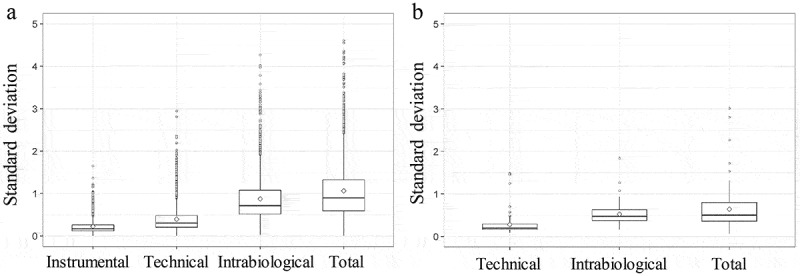

```{r setup, include=FALSE}
knitr::opts_chunk$set(fig.width = 4.25,
                      fig.height = 3.5,
                      fig.retina = 3,
                      message = FALSE,
                      warning = FALSE,
                      cache = TRUE,
                      autodep = TRUE,
                      hiline = TRUE)

knitr::opts_hooks$set(fig.callout = function(options) {
  if (options$fig.callout) {
    options$echo <- FALSE
    options$out.height <- "99%"
    options$fig.width <- 16
    options$fig.height <- 8
  }
  options
})
hook_source <- knitr::knit_hooks$get('source')
knitr::knit_hooks$set(source = function(x, options) {
  if (!is.null(options$hiline) && options$hiline) {
    x <- stringr::str_replace(x, "^ ?(.+)\\s?#<<", "*\\1")
  }
  hook_source(x, options)
})
options(htmltools.dir.version = FALSE, width = 90)
as_table <- function(...) knitr::kable(..., format='html', digits = 3)
```

---

class: fullscreen, inverse, top, center, text-black
background-image: url("../inst/images/Linear_chair.jpg")

.font150[**Experimental Design - Short Version**]

---

# Overview

This presentation covers key aspects of experimental design for proteomics research:

- **Confounders**
  - What are confounders and why do they matter?
  - Types of confounders
  - How to control for confounders
  - Reporting confounders

- **Experimental Design**
  - Between vs within subjects designs
  - Factorial designs and interactions
  - Parallel group vs factorial designs

- **Sample Size Estimation**
  - Ethical considerations
  - Type I and Type II errors
  - Using power.t.test for sample size calculations

---

# Confounders

__Confounder__ - a variable that influences both the independent and dependent variable, creating a spurious association.

__Example:__ You compare protein expression between __treated__ and __control__ mice.

- __Independent variable__ (what you manipulate): Treatment (drug vs placebo)
- __Dependent variable__ (what you measure): Protein expression levels
- __Confounder__: You processed all treated samples on Monday and all controls on Friday

You observe differences in protein expression - but is it the drug effect or a batch effect?

The confounder (processing day) affects both:
- which group the sample belongs to (independent variable)
- the measured protein levels (dependent variable)


---
layout: false

# Controlling for Confounders

Three strategies to prevent confounding:

1. **Randomize** sample assignment<br/>
   over co-variates (age, sex, run order)

2. **Process in parallel**<br/>
   handle all samples together to avoid batch effects

3. **Complete block design**<br/>
   ensure all treatment groups are represented <br/>
   in each batch

.img-right[

]

__Bad:__ All treated in Batch 1, all controls in Batch 2<br/>
__Good:__ Each batch contains treated AND control samples

.footnote[
[Statistical Design of Quantitative Mass Spectrometry-Based Proteomic Experiments](https://doi.org/10.1021/pr8010099)<br/>
[Importance of Block Randomization When Designing Proteomics Experiments](https://doi.org/10.1021/acs.jproteome.0c00536)
]

---

# Queue Generator

Randomize the order in which samples are measured to prevent confounding by instrument drift or column degradation.

__Problem:__ Running all samples of one condition first, then another, confounds treatment with time.

__Solution:__ Create __blocks__ where each condition appears once, then randomize within blocks.

__Example:__ 3 x A, 3 x B, 2 x C, 2 x D (10 samples total)

| Block 1 | Block 2 | Block 3 |
|---------|---------|---------|
| A B C D | B C D A | B A     |

Each block contains one sample per condition (as available), run order randomized within block.

.footnote[http://fgcz-ms-shiny.uzh.ch:8080/queue_generator10/]

---

# Documenting Co-variates

Record variables that could confound your results - <br/>
even if you controlled for them, others may need this for re-analysis.

.pull-left[
**Biological:**
- age
- sex / gender
- BMI
- disease stage
]

.pull-right[
**Technical:**
- batch / run date
- instrument
- operator
- sample preparation date
]

__Why?__ Enables statistical correction and reproducibility.

.footnote[
EQUATOR Network - reporting guidelines: http://www.equator-network.org/
]


---

# Experimental Design - Introduction

Experimental design is the planning of experiments to ensure that <br/>
the data collected can answer the research question.

__Key decisions:__

- **Between vs within subjects** - who gets compared?
- **Factorial designs** - how to study multiple factors?
- **Interactions** - does the effect of one factor depend on another?

__Goal:__ Maximize statistical power while minimizing <br/>
resources (samples, time, cost).

---


# Experimental Design

Are comparisons made __between__ or __within__ subjects?

.pull-left[
**Between subjects**

Different individuals in each group

- __Parallel groups:__ treated vs control mice
- __Factorial:__ combine treatment + genotype
]

.pull-right[
**Within subjects** (paired/repeated)

Same individual measured multiple times

- __Time series:__ before and after treatment
- __Crossover:__ each subject gets all treatments
]

__Within-subject designs are more powerful__ - <br/>
individual variability is controlled.

.footnote[Ronald Fisher (1890 - 1962) "The Design of Experiments" (1935)]

---

layout: false

# Interactions

An __interaction__ occurs when the effect of one factor <br/>
depends on the level of another factor.

__Example:__ Does a drug work differently in WT vs knockout mice?

.pull-left[
**No interaction**

Drug effect is the same <br/>
regardless of genotype
]

.pull-right[
**Interaction**

Drug works in WT mice <br/>
but not in knockouts
]

Think of interactions as __"it depends"__ effects - <br/>
you need to know both factors to predict the outcome.

.footnote[[Understanding Interaction Effects in Statistics](https://statisticsbyjim.com/regression/interaction-effects/)]


---

# Factorial Design

A __factorial design__ tests multiple __factors__ simultaneously.

__Factor:__ A variable you manipulate (e.g., treatment, genotype)

__Example:__ Study drug effect in wild-type and knockout mice

| | WT | Knockout |
|---|---|---|
| **Placebo** | WT + placebo | KO + placebo |
| **Drug** | WT + drug | KO + drug |

This 2x2 factorial design lets you answer:

1. Does the drug have an effect? (main effect of drug)
2. Does genotype matter? (main effect of genotype)
3. Does the drug work differently in WT vs KO? (interaction)

__One experiment, three questions!__

---

# Factorial vs Parallel Design

A parallel design can often be __restructured__ as a factorial design!

__Question:__ 40 subjects to test drug A and drug B. How to allocate?

.pull-left[
**Parallel design**

| Group | n |
|-------|---|
| drug A | 13 |
| drug B | 13 |
| placebo | 14 |

Compare: 13 vs 14 per test
]

.pull-right[
**Factorial design (2x2)**

| Group | n |
|-------|---|
| drug A + drug B | 10 |
| drug A + plac B | 10 |
| plac A + drug B | 10 |
| plac A + plac B | 10 |

Compare:<br/>
20 drug A vs 20 plac A<br/>
20 drug B vs 20 plac B
]

__Factorial wins:__ Same 40 subjects, but larger effective sample size!<br/>
__Bonus:__ Can also test for drug A × drug B interaction.

.footnote[Ronald Fisher pioneered factorial experiments over one-factor-at-a-time.]


---
layout: false

# Types of Interactions

.pull-left[
**No interaction**<br/>
Lines are parallel - effect of one factor<br/>
is constant across levels of the other.

**Quantitative interaction**<br/>
Lines not parallel but don't cross -<br/>
effect size differs but direction is same.

**Qualitative interaction**<br/>
Lines cross - effect reverses<br/>
depending on the other factor!
]

.pull-right[
.image-70[]
.image-70[]
.image-70[]
]

.footnote[Medical Statistics - University of Sheffield]


---
exclude: true

# All possible interactions


- 1 = there was a main effect for IV1.
- ~1 = there was not a main effect for IV1
- 2 = there was a main effect for IV2
- ~2 = there was not a main effect of IV2
- 1x2 = there was an interaction
- ~1x2 = there was not an interaction

.img-right[

]

.footnote[https://crumplab.github.io/statistics/more-on-factorial-designs.html]

---

# Sample Size Estimation - Introduction

How many samples do you need for your experiment?

__Topics:__

- **Why it matters** - ethical and scientific reasons
- **Type I and Type II errors** - false positives vs false negatives
- **Sources of variation** - what drives your sample size?
- **power.t.test in R** - practical calculations

__Goal:__ Plan experiments that have sufficient power <br/>
to detect biologically meaningful effects.

---


# Why Sample Size Matters

.pull-left[
**Too few samples:**
- Inconclusive results
- Wasted resources (samples, time, money)
- Cannot detect real effects

**Too many samples:**
- Unnecessary use of animals/human subjects
- Wasted resources
- Delays other research
]

.pull-right[
**Ethical obligation:**

It is __unethical__ to conduct research<br/>
that is badly planned.

Both underpowered and overpowered<br/>
studies waste resources and may<br/>
harm subjects unnecessarily.
]

.footnote[Declaration of Helsinki (1964) - [link](https://www.wma.net/policies-post/wma-declaration-of-helsinki-ethical-principles-for-medical-research-involving-human-subjects/)]

---

# Type I and Type II Errors

.pull-left[
**Type I error** (false positive, α)

You conclude there IS an effect<br/>
when there is NONE.

Controlled by significance level (p < 0.05)

**Type II error** (false negative, β)

You conclude there is NO effect<br/>
when there IS one.

**Power = 1 - β** (typically aim for 0.8)
]

.img-right[

]

__Key insight:__ To reduce both errors → increase sample size


---

# Sources of Variation

Run a pilot to estimate variance at each level:

.pull-left[
**(a) Instrumental** - same sample, repeated injections

**(b) Technical** - same sample, repeated preparation

**(c) Intra-biological** - same subject, different timepoints

**(d) Inter-biological** - different subjects

__Biological variance usually dominates!__<br/>
→ Focus on biological replicates
]

.img-right[


]

.footnote[https://www.ncbi.nlm.nih.gov/pmc/articles/PMC6807909/]


---

# The power.t.test Function

.pull-left[
**Five related variables:**

- **n** - sample size per group
- **delta** - effect size (difference to detect)
- **sd** - standard deviation
- **sig.level** - Type I error rate (α, default 0.05)
- **power** - 1 - Type II error rate (1-β)

Provide any 4, R calculates the 5th!
]

.pull-right[
```{r, eval = FALSE}
power.t.test(
  n = NULL,
  delta = NULL,
  sd = 1,
  sig.level = 0.05,
  power = NULL
)
```
]

__Recall t-statistic:__ $T = \frac{\bar{X} - \mu}{\sigma/\sqrt{n}}$ — larger n → more power

---

# Example: Required Sample Size

**Question:** How many samples per group to detect a 50% difference (FC=1.5)<br/>
with power=0.8 and sd=0.5?

.remark-code[
```{r}
res <- power.t.test(delta = 0.59, sd = 0.5, sig.level = 0.05, power = 0.8)
res$n
ceiling(res$n)
```
]

__Result:__ Need 13 samples per group (26 total)

This is the most common use case: <br/>
"How many samples do I need for my experiment?"


---

# Summary: Sample Size Depends on σ and δ

.pull-left[
**Top plot: N vs standard deviation (σ)**

Higher variance in your data<br/>
→ need more samples to detect effect

**Bottom plot: N vs effect size (δ)**

Smaller effect you want to detect<br/>
→ need more samples

__Practical advice:__<br/>
- Reduce variance (better protocols)<br/>
- Accept larger minimum detectable effect<br/>
- Or: get more samples!
]

.right-plot[
```{r echo=FALSE}
sd <- seq(0.5, 2, by = .001)
dd <- power.t.test(delta = 2, sd = 1, sig.level = 0.05, power = 0.8)
powersd <- function(sd, delta = 1, sig.level = 0.05, power = 0.8){
  ceiling(power.t.test(delta = 2, sd = sd, sig.level = sig.level, power = power)$n)
}

ressd <- sapply(sd, powersd)
power_delta <- function(delta, sd = 1, sig.level = 0.05, power = 0.8){
  ceiling(power.t.test(delta = delta, sd = sd, sig.level = sig.level, power = power)$n)
}

delta <- seq(0.5,6, by = 0.001)
resdelta <- sapply(delta, power_delta)
plot(sd, ressd, ylab = "N", type = "l", main = "N vs sd (delta=2, power=0.8)")
plot(delta, resdelta, xlab = "delta", ylab = "N", type = "l", log = "xy", main = "N vs delta (sd=1, power=0.8)")

```
]
