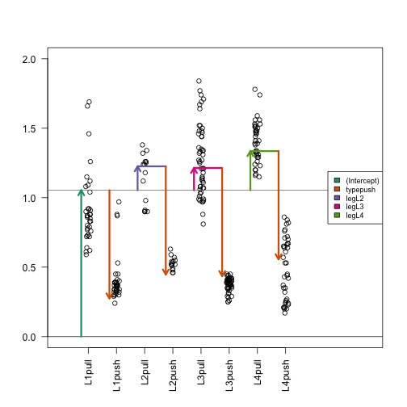
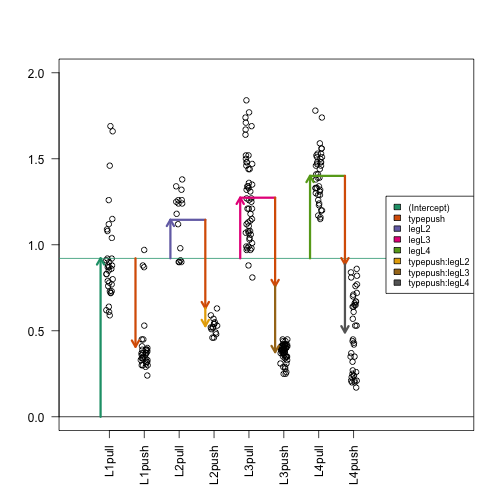

class: fullscreen, inverse, top, center, text-black
background-image: url("../inst/images/Linear_chair.jpg")

.font150[**linear models (lm)**]

```{r setup, include=FALSE}
rm(list = ls())
knitr::opts_chunk$set(
  fig.width = 4.25,
  fig.height = 3.5,
  fig.retina = 3,
  message = FALSE,
  warning = FALSE,
  cache = TRUE,
  autodep = TRUE,
  hiline = TRUE
)
knitr::opts_hooks$set(fig.callout = function(options) {
  if (options$fig.callout) {
    options$echo <- FALSE
    options$out.height <- "99%"
    options$fig.width <- 16
    options$fig.height <- 8
  }
  options
})
hook_source <- knitr::knit_hooks$get('source')
knitr::knit_hooks$set(source = function(x, options) {
  if (!is.null(options$hiline) && options$hiline) {
    x <- stringr::str_replace(x, "^ ?(.+)\\s?#<<", "*\\1")
  }
  hook_source(x, options)
})
options(htmltools.dir.version = FALSE, width = 90)
as_table <- function(...) knitr::kable(..., format = 'html', digits = 3)

library(tidyverse)
```


---
# Overview

- What is a linear model
- How to estimate coefficients
- What are contrasts
- How to determine the error of the coefficients, test statistics and p-values
- What are interactions in linear models
- Example: Yeast data with batches
- Protein level vs peptide level modelling

---
# lm intro

.left-code[
```{r loadData}
dat <- read.csv("femaleMiceWeights.csv")
head(dat)
table(dat$Diet)
```

```{r stripchart1, echo=TRUE, eval=FALSE}
stripchart(Bodyweight ~ Diet, # < formula interface
           data= dat, 
           vertical=TRUE, 
           method="jitter",
           main="Bodyweight over Diet")
```
]

.right-plot[
```{r stripchart1-out, ref.label="stripchart1", echo=FALSE, fig.width=6, fig.height=6}
```
]

---
# lm intro

.left-code[
```{r lmintroleft}
# summarize data
meansum <- 
  dat %>%
  group_by(Diet) %>%
  summarise(mean = mean(Bodyweight))
# linear model
lm1 <- lm(Bodyweight ~ Diet, #<<
          data = dat) #<< 
coefs <- coef(lm1)
```

$$y = b_0X_0 + b_1 X_1 + \epsilon$$

```{r, fig.height=2, fig.width=4, echo=FALSE}
par(mar = c(2,4,1,2))
plot(model.matrix(lm1), col=c("black","white"))
```
]

.pull-right[
```{r lmintroright,  results='asis', echo=FALSE}
knitr::kable(meansum, format ="html", caption = "group means")
knitr::kable(coefs, format ="html", caption = "coefficients")
```
]

---

# lm intro - examin the coefficients

.left-code[
```{r parameterEstimates, echo=TRUE , eval=FALSE}
stripchart(Bodyweight ~ Diet, #<<
           data = dat , vertical=TRUE,
           method="jitter",
           main="Bodyweight over Diet",
           ylim=c(0,40), xlim=c(0,3))
a <- -0.25; lgth <- .1
abline(h=0)
arrows(1+a,0,1+a,coefs[1],lwd=3,
       col="green",length=lgth)
abline(h=coefs[1],col="green")
arrows(2+a,coefs[1],2+a,coefs[1]+coefs[2],
       lwd=3,col="orange",length=lgth)
abline(h=coefs[1]+coefs[2],col="orange")
legend("right",names(coefs),
       fill=c("green","orange"),
       cex=.75,bg="white")
```
]

.right-plot[
```{r parameterEstimates-out, ref.label="parameterEstimates", echo=FALSE, fig.width=6, fig.height=6}
```
]

---

# lm intro - determining the coefficients


.left-code[
```{r echo=FALSE}
pmar <- par()$mar
library('plot.matrix')
```
```{r, fig.width=3, fig.height=2}
Y <- dat$Bodyweight
X <- model.matrix(lm1)
par(mar = c(2,2,1,1))
plot(X, col=c("black", "white"), main="")
beta <- solve(t(X) %*% X) %*% (t(X) %*% Y)
epsilon <- Y - t(beta) %*% t(X)
beta


```

```{r echo=FALSE}
par(mar = pmar)
```

]

.pull-right[
$$
\beta= (X^TX)^{−1} (X^TY)
$$

$\beta$ minimizes $$\sum(Y - \beta X)^2 = (Y-\beta X)(Y-\beta X)^T$$. 

predicting Y
$$\hat{Y} = X \beta = b_0X_0 + b_1X_1$$

residues
$$e = Y - X\beta$$ 

]

---

# lm intro - contrasts

.left-code[
```{r}
linfct <- rbind(
  chow = c(1, 0),
  hf = c(1, 1 )
  )
linfct %*% coef(lm1)
```
$$
\begin{aligned}
Y_{chow} = b_0\cdot1 + b_1\cdot0\\
Y_{hf} = b_0\cdot1 + b_1\cdot1\\
\end{aligned}
$$
]

.right-plot[
```{r parameterEstimates2-out, ref.label="parameterEstimates", echo=FALSE, fig.width=6, fig.height=6}
```
]


---

# lm intro - contrasts

A contrast is a linear combination of variables (parameters or statistics) whose coefficients add up to zero, allowing comparison of different treatments.

.left-code[

$$
Y_{chow - hf} = (1) \cdot Y_c + (-1) \cdot Y_h
$$


```{r}
contrasts <- rbind(
  "chow - hf" = 
    1 * linfct["chow",] + -1 * linfct["hf",] #<<
)
contrasts
contrasts %*% coef(lm1)

```


]

.right-plot[
```{r parameterEstimates3-out, ref.label="parameterEstimates", echo=FALSE, fig.width=6, fig.height=6}
```
]

.footnote

---

# lm intro -  LSE standard error

.left-code[

```{r}
epsilon  <- resid(lm1)
sigma <- 
  sqrt(sum(epsilon ^2)/
         (length(epsilon ) -
            length(coef(lm1))) )

X <- model.matrix(lm1)
solve(t(X) %*% X) * sigma^2 #<<
vcov(lm1) #<<
```
]
.footnote[LSE = least square estimate]

.pull-left[
$$
\begin{aligned}
var(\hat{\beta}) &= var((X^\top X)^{-1}X^\top Y)\\
&= \cdots\\
&= \sigma^2 (X^\top X)^{-1}\\
with~~~ \sigma^2 &= \sum e^2 / (n-p)
\end{aligned}
$$
]

---

# lm intro - computing the test statistic

.left-code[
```{r}
std.error <- sqrt(diag(
  linfct %*% #<<
  vcov(lm1) %*% #<<
  t(linfct))) #<<
t.statistic <- 
  linfct%*%coef(lm1)/std.error #<<
t.statistic

std.error <- sqrt(diag(
  contrasts %*%
    vcov(lm1) %*%
    t(contrasts)))
t.statistic <- 
  contrasts %*% coef(lm1) / std.error
t.statistic

```
]

.pull-right[
```{r}
head(linfct)
head(contrasts)
```

$$
t_i = \frac{\beta_i}{se(\beta_i)}
$$
]

---

# lm intro - getting the p-values

.left-code[
```{r lmintropValleft}
lfq <- 
  prolfqua::my_contrast( lm1, #<<
  rbind(linfct, contrasts)) %>% #<<
  dplyr::select(lhs, estimate,
                std.error, 
                statistic, p.value) %>%
  mutate(p.value =
           round(p.value,digits=3))

```
]


.pull-left[
```{r lmintropValright, results="asis", echo=FALSE}
knitr::kable(lfq, format = "html" , caption ="prolfqua",digits = 2)
```
]

---

# lm intro - getting the p-values (adjusted)

.left-code[
```{r}
library(multcomp)
multcomp <- summary(
  glht(lm1, rbind(linfct, contrasts))) %>% #<<
  broom::tidy() %>%
  dplyr::select(contrast, estimate,
                std.error, statistic ,
                adj.p.value)
```
]
  
  
.pull-left[
```{r results="asis", echo=FALSE}
knitr::kable(multcomp,
             format = "html",
             caption = "multcomp",
             digits = 2 )
```
]

---

# lm intro - interactions


.left-code[
## Model without interaction
```{r lminteractionleft, eval=TRUE}
spider <- read.csv("spider_wolff_gorb_2013.csv"
                   , skip = 1)
table(spider$leg, spider$type)
noI <- lm(friction ~ type + leg, data = spider)
coef(noI)
```
]

.img-right[

]

.footnote[[genomicsclass interactions](http://genomicsclass.github.io/book/pages/interactions_and_contrasts.html)]

---

# lm intro - interactions


.left-code[
## Model with interaction
```{r eval = TRUE}
withI <- lm(friction ~ type + leg + type:leg,
            data = spider)
an <- anova(withI)
broom::tidy(an)[1:3,c("term", "p.value")]
coef(withI)

```
]

.img-right[

]


---

# Yeast analysis - batches

- Condition : enthanol and glucose
- Batch: p2691 (CC 12 to 16 March 2018) and p2370 (March 2017)

linear model:

$$
\begin{aligned}
y_{ijkl} &= \alpha_i + \beta_j + \gamma_{ij} + \epsilon_{ijk}
\end{aligned}
$$

with  $i \in \{ethanol, glucose\}$, $j \in \{p2370, p2691\}$,<br/>
$\gamma_{ij}$ i.e. $ij = \{$ ethanol:p2370, ethanol:p2691, glucose:p2370, glucose:p2691 $\}$ ,
$k \in {1:t}$ (replicate).

and where: 
$$\epsilon_{ijk} \propto N(0, s_e)$$
R formula `lm(normalizedIntensity ~ Condition + Batch + Condition:Batch, data = proteinData)`

---

# Yeast analysis - both batches - model 1

We are going to compute the following protein fold changes:

$$
\begin{aligned}
\textrm{fc}_{glucose - ethanol}\\
\textrm{fc}_{p2370- p2691}\\
\textrm{fc}_{glucose:p2370 - ethanol:p2370}\\
\textrm{fc}_{glucose:p2691 - ethanol:p2691}\\
\textrm{fc}_{interaction} &= \textrm{fc}_{glucose:p2370 - ethanol:p2370} - \textrm{fc}_{glucose:p2691 - ethanol:p2691}\\
\end{aligned}
$$


---

# Yeast analysis - both batches - mixed linear model

mixed effects linear model
- fixed effects : Condition 
- random effects : Batch


$$y_{ijkl} = \alpha_i +  a_j + \epsilon_{ijk}$$
where  $i \in \{ethanol, glucose\}$,  $j \in \{p2370, p2691\}$ and $k \in {1:t}$ (replicate)

$$a_j \propto N(0, s_a);  ~ \epsilon_{ijk} \propto N(0, s_e)$$


The protein fold change can be estmated from:

$$\textrm{fc}_{glucose - ethanol} = \alpha_{glucose} - \alpha_{ethanol}$$
R formula `lmer(normalizedIntensity ~ Condition + (1|Batch), data = proteinData)`

---

# Conclusions

- Linear models allow for
  - calculation of fold changes using contrasts
  - and of differences between fold changes (interactions).
- If you model more than two conditions:
  - Problems with missing data become more prominent.
  - No observations in one of the conditions.

---

# Other Software

Other software for modelling fold changes used in Proteomics:

Using linear models
- __limma__ - Ritchie, Smyth at al. 2015 PMID: 25605792
- __MSStats__ https://www.bioconductor.org/packages/release/bioc/html/MSstats.html 
- __ROPECA__ Suomi and Elo 2017 PMID: 28724900
- __MSqRob__ - Geomine, Gevaert and Clement 2016 PMID: 26566788

Other models
- __mapDIA__ - Teo, Kim et al. 2016 PMID: PMID: 26381204
- __tirqler__ - https://github.com/statisticalbiotechnology/triqler


---

exclude: true

# Yeast Dataset 2 batches analysis - peptide level models

Linear Mixed Effect Models

$$
y = X\beta + Zu + \epsilon
$$

Where $y$ is a column vector, the outcome variable; $X$ the matrix of predictor variables (design matrix); $b$ is a column vector of the fixed-effects regression coefficients,
$Z$ is the design matrix for the random effects (describes the covariance structure of the data) and $u$ is a column vector of the random effect coefficients, $\epsilon$ is the column vector of the residuals.

.footnote[For more details see e.g.: [UCLA IDRE](https://stats.idre.ucla.edu/other/mult-pkg/introduction-to-linear-mixed-models/)]

---
exclude: true

# Yeast analysis - peptide level models

mixed effects linear model for batch $p2370$ and $p2691$
- fixed effects : condition
- random effects : peptides

$$y_{ijk} = \alpha_i + a_j + \epsilon_{ijk}$$
with  $i \in \{ethanol, glucose\}$,  $k \in {1:t}$ (nr replicates),  and $j$ iterates over all peptides of a protein.

and where: $$a_j \propto N(0, s_a); ~ \epsilon_{ijk} \propto N(0, s_e)$$

The protein fold change can be computed by:

$$\textrm{fc}_{glucose - ethanol} = \alpha_{glucose} - \alpha_{ethanol}$$

.footnote[model specification adapted from Geomine, Gevaert and Clement 2016 PMID: 26566788]

---

