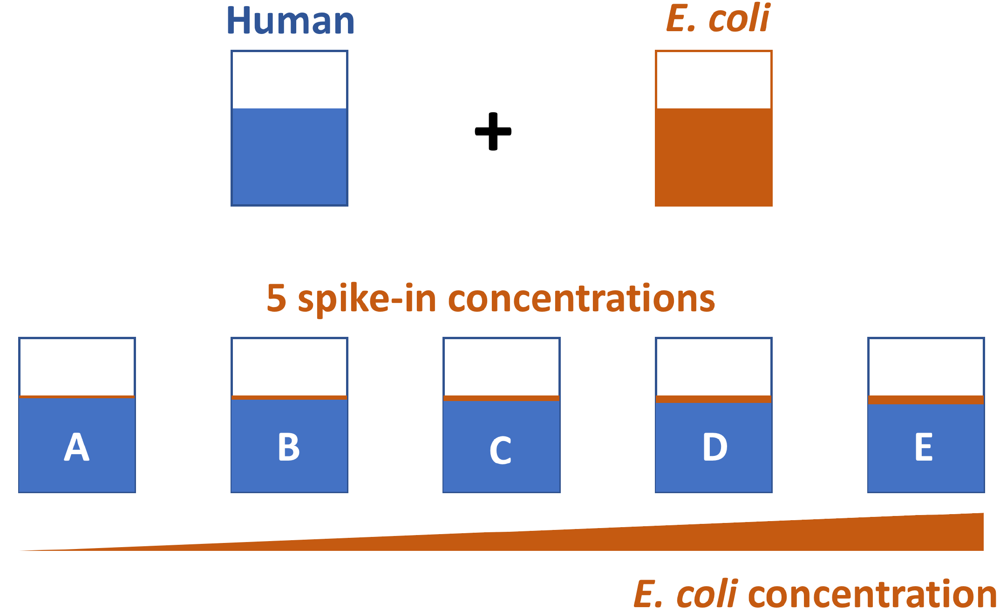
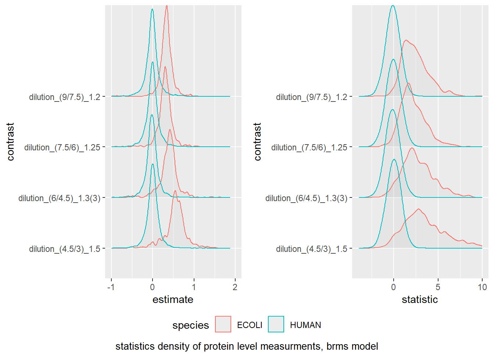
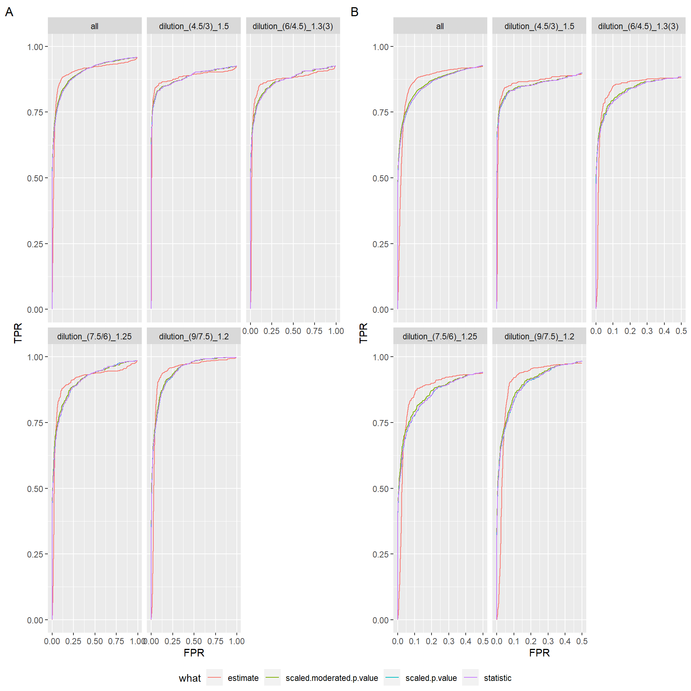
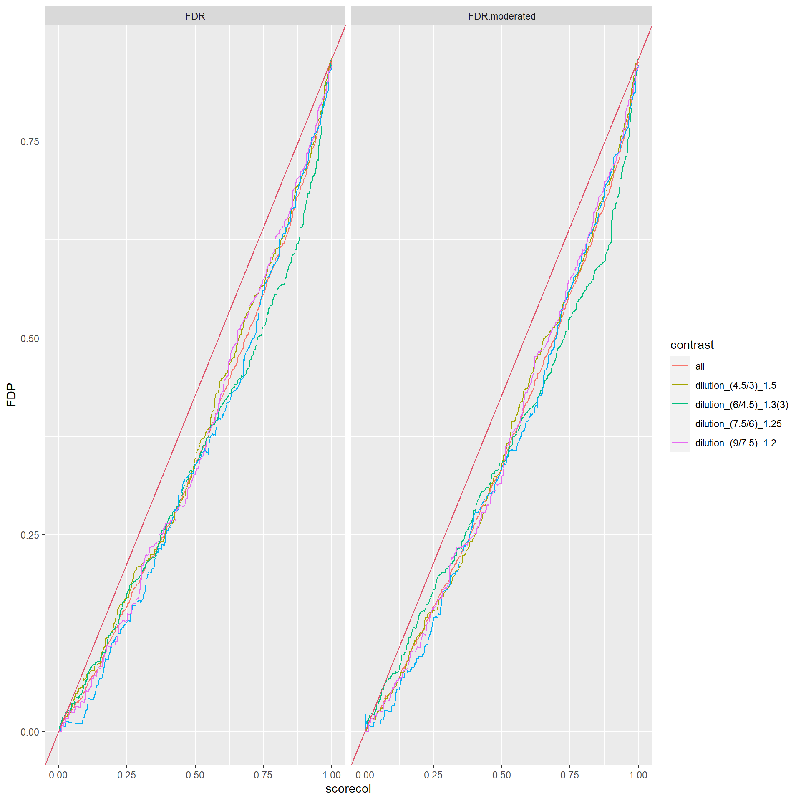

class: fullscreen, inverse, top, center, text-black
background-image: url("../inst/images/Linear_chair.jpg")

.font150[**linear models (lm)**]

```{r setup, include=FALSE}
rm(list = ls())
knitr::opts_chunk$set(
  fig.width = 4.25,
  fig.height = 3.5,
  fig.retina = 3,
  message = FALSE,
  warning = FALSE,
  cache = TRUE,
  autodep = TRUE,
  hiline = TRUE
)
knitr::opts_hooks$set(fig.callout = function(options) {
  if (options$fig.callout) {
    options$echo <- FALSE
    options$out.height <- "99%"
    options$fig.width <- 16
    options$fig.height <- 8
  }
  options
})
hook_source <- knitr::knit_hooks$get('source')
knitr::knit_hooks$set(source = function(x, options) {
  if (!is.null(options$hiline) && options$hiline) {
    x <- stringr::str_replace(x, "^ ?(.+)\\s?#<<", "*\\1")
  }
  hook_source(x, options)
})
options(htmltools.dir.version = FALSE, width = 90)
as_table <- function(...) knitr::kable(..., format = 'html', digits = 3)

library(tidyverse)
```


---
# Overview

- What is a linear model
- How to estimate coefficients
- What are contrasts
- How to determine the error of the coefficients, test statistics and p-values
- What are interactions in linear models
- Example: Yeast data with batches
- limma - Empirical Bayes
- Benchmarking
- Conclusions

---
# lm intro

.left-code[
```{r loadData}
dat <- read.csv("femaleMiceWeights.csv")
head(dat)
table(dat$Diet)
```

```{r stripchart1, echo=TRUE, eval=FALSE}
stripchart(Bodyweight ~ Diet, # < formula interface
           data= dat, 
           vertical=TRUE, 
           method="jitter",
           main="Bodyweight over Diet")
```
]

.right-plot[
```{r stripchart1-out, ref.label="stripchart1", echo=FALSE, fig.width=6, fig.height=6}
```
]

---
# lm intro

.left-code[
```{r lmintroleft}
# summarize data
meansum <- 
  dat %>%
  group_by(Diet) %>%
  summarise(mean = mean(Bodyweight))
# linear model
lm1 <- lm(Bodyweight ~ Diet, #<<
          data = dat) #<< 
coefs <- coef(lm1)
```

$$y = b_0X_0 + b_1 X_1 + \epsilon$$

```{r, fig.height=2, fig.width=4, echo=FALSE}
par(mar = c(2,4,1,2))
plot(model.matrix(lm1), col=c("black","white"))
```
]

.pull-right[
```{r lmintroright,  results='asis', echo=FALSE}
knitr::kable(meansum, format ="html", caption = "group means")
knitr::kable(coefs, format ="html", caption = "coefficients")
```
]

---

# lm intro - examin the coefficients

.left-code[
```{r parameterEstimates, echo=TRUE , eval=FALSE}
stripchart(Bodyweight ~ Diet, #<<
           data = dat , vertical=TRUE,
           method="jitter",
           main="Bodyweight over Diet",
           ylim=c(0,40), xlim=c(0,3))
a <- -0.25; lgth <- .1
abline(h=0)
arrows(1+a,0,1+a,coefs[1],lwd=3,
       col="green",length=lgth)
abline(h=coefs[1],col="green")
arrows(2+a,coefs[1],2+a,coefs[1]+coefs[2],
       lwd=3,col="orange",length=lgth)
abline(h=coefs[1]+coefs[2],col="orange")
legend("right",names(coefs),
       fill=c("green","orange"),
       cex=.75,bg="white")
```
]

.right-plot[
```{r parameterEstimates-out, ref.label="parameterEstimates", echo=FALSE, fig.width=6, fig.height=6}
```
]

---

# lm intro - determining the coefficients


.left-code[
```{r echo=FALSE}
pmar <- par()$mar
library('plot.matrix')
```
```{r, fig.width=3, fig.height=2}
Y <- dat$Bodyweight
X <- model.matrix(lm1)
par(mar = c(2,2,1,1))
plot(X, col=c("black", "white"), main="")
beta <- solve(t(X) %*% X) %*% (t(X) %*% Y)
epsilon <- Y - t(beta) %*% t(X)
beta


```

```{r echo=FALSE}
par(mar = pmar)
```

]

.pull-right[
$$
\beta= (X^TX)^{−1} (X^TY)
$$

$\beta$ minimizes $$\sum(Y - \beta X)^2 = (Y-\beta X)(Y-\beta X)^T$$. 

predicting Y
$$\hat{Y} = X \beta = b_0X_0 + b_1X_1$$

residues
$$e = Y - X\beta$$ 

]

---

# lm intro - contrasts

.left-code[
```{r}
linfct <- rbind(
  chow = c(1, 0),
  hf = c(1, 1 )
  )
linfct %*% coef(lm1)
```
$$
\begin{aligned}
Y_{chow} = b_0\cdot1 + b_1\cdot0\\
Y_{hf} = b_0\cdot1 + b_1\cdot1\\
\end{aligned}
$$
]

.right-plot[
```{r parameterEstimates2-out, ref.label="parameterEstimates", echo=FALSE, fig.width=6, fig.height=6}
```
]


---

# lm intro - contrasts

A contrast is a linear combination of variables (parameters or statistics) whose coefficients add up to zero, allowing comparison of different treatments.

.left-code[

$$
Y_{chow - hf} = (1) \cdot Y_c + (-1) \cdot Y_h
$$


```{r}
contrasts <- rbind(
  "chow - hf" = 
    1 * linfct["chow",] + -1 * linfct["hf",] #<<
)
contrasts
contrasts %*% coef(lm1)

```


]

.right-plot[
```{r parameterEstimates3-out, ref.label="parameterEstimates", echo=FALSE, fig.width=6, fig.height=6}
```
]

.footnote

---

# lm intro -  LSE standard error

.left-code[

```{r}
epsilon  <- resid(lm1)
sigma <- 
  sqrt(sum(epsilon ^2)/
         (length(epsilon ) -
            length(coef(lm1))) )

X <- model.matrix(lm1)
solve(t(X) %*% X) * sigma^2 #<<
vcov(lm1) #<<
```
]
.footnote[LSE = least square estimate]

.pull-left[
$$
\begin{aligned}
var(\hat{\beta}) &= var((X^\top X)^{-1}X^\top Y)\\
&= \cdots\\
&= \sigma^2 (X^\top X)^{-1}\\
with~~~ \sigma^2 &= \sum e^2 / (n-p)
\end{aligned}
$$
]

---

# lm intro - computing the test statistic

.left-code[
```{r}
std.error <- sqrt(diag(
  linfct %*% #<<
  vcov(lm1) %*% #<<
  t(linfct))) #<<
t.statistic <- 
  linfct%*%coef(lm1)/std.error #<<
t.statistic

std.error <- sqrt(diag(
  contrasts %*%
    vcov(lm1) %*%
    t(contrasts)))
t.statistic <- 
  contrasts %*% coef(lm1) / std.error
t.statistic

```
]

.pull-right[
```{r}
head(linfct)
head(contrasts)
```

$$
t_i = \frac{\beta_i}{se(\beta_i)}
$$
]

---

# lm intro - getting the p-values

.left-code[
```{r lmintropValleft}
lfq <- 
  prolfqua::my_contrast( lm1, #<<
  rbind(linfct, contrasts)) %>% #<<
  dplyr::select(lhs, estimate,
                std.error, 
                statistic, p.value) %>%
  mutate(p.value =
           round(p.value,digits=3))

```
]


.pull-left[
```{r lmintropValright, results="asis", echo=FALSE}
knitr::kable(lfq, format = "html" , caption ="prolfqua",digits = 2)
```
]

---

# lm intro - getting the p-values (adjusted)

.left-code[
```{r}
library(multcomp)
multcomp <- summary(
  glht(lm1, rbind(linfct, contrasts))) %>% #<<
  broom::tidy() %>%
  dplyr::select(contrast, estimate,
                std.error, statistic ,
                adj.p.value)
```
]
  
  
.pull-left[
```{r results="asis", echo=FALSE}
knitr::kable(multcomp,
             format = "html",
             caption = "multcomp",
             digits = 2 )
```
]

---

# lm intro - interactions


.left-code[
## Model without interaction
```{r lminteractionleft, eval=TRUE}
spider <- read.csv("spider_wolff_gorb_2013.csv"
                   , skip = 1)
table(spider$leg, spider$type)
noI <- lm(friction ~ type + leg, data = spider)
coef(noI)
```
]

.img-right[

]

.footnote[[genomicsclass interactions](http://genomicsclass.github.io/book/pages/interactions_and_contrasts.html)]

---

# lm intro - interactions


.left-code[
## Model with interaction
```{r eval = TRUE}
withI <- lm(friction ~ type + leg + type:leg,
            data = spider)
an <- anova(withI)
broom::tidy(an)[1:3,c("term", "p.value")]
coef(withI)

```
]

.img-right[

]


---

# Yeast analysis - batches

- Condition : enthanol and glucose
- Batch: p2691 (12 to 16 March 2018) and p2370 (March 2017)

R linear model:

`lm(normalizedIntensity ~ Condition + Batch + Condition:Batch, data = proteinData)`

And we are going to compute the following contrasts ( $\log_2(FC)$ ):

$$
\begin{aligned}
\textrm{fc}_{glucose - ethanol}\\
\textrm{fc}_{p2370- p2691}\\
\textrm{fc}_{glucose:p2370 - ethanol:p2370}\\
\textrm{fc}_{glucose:p2691 - ethanol:p2691}\\
\textrm{fc}_{interaction} &= \textrm{fc}_{glucose:p2370 - ethanol:p2370} - \textrm{fc}_{glucose:p2691 - ethanol:p2691}\\
\end{aligned}
$$


---
exclude: true

# Yeast analysis - both batches - model 1

linear model:

$$
\begin{aligned}
y_{ijkl} &= \alpha_i + \beta_j + \gamma_{ij} + \epsilon_{ijk}
\end{aligned}
$$

with  $i \in \{ethanol, glucose\}$, $j \in \{p2370, p2691\}$,<br/>
$\gamma_{ij}$ i.e. $ij = \{$ ethanol:p2370, ethanol:p2691, glucose:p2370, glucose:p2691 $\}$ ,
$k \in {1:t}$ (replicate).

and where: 
$$\epsilon_{ijk} \propto N(0, s_e)$$


---
exclude: true

# Yeast analysis - both batches - mixed linear model

mixed effects linear model
- fixed effects : Condition 
- random effects : Batch


$$y_{ijkl} = \alpha_i +  a_j + \epsilon_{ijk}$$
where  $i \in \{ethanol, glucose\}$,  $j \in \{p2370, p2691\}$ and $k \in {1:t}$ (replicate)

$$a_j \propto N(0, s_a);  ~ \epsilon_{ijk} \propto N(0, s_e)$$


The protein fold change can be estmated from:

$$\textrm{fc}_{glucose - ethanol} = \alpha_{glucose} - \alpha_{ethanol}$$
R formula `lmer(normalizedIntensity ~ Condition + (1|Batch), data = proteinData)`

---

# limma - Empricial Bayes

- In a mass spectrometric LFQ experiment, we measure hundreds of proteins in parallel. 
- Hence, these measurements are correlated. 
- Also, the analysis has a parallel structure, and we fit the same linear model to all protein.


- Potentially we can transfer information from the measurement of one peptide/protein to the other. 
- The empirical Bayes approach is used to improve the test statistic to test the null hypothesis $H_0$ : $\beta_{pj} = 0$.

.footnote["Linear models and empirical bayes methods for assessing differential expression in microarray experiments" Gordon K. Smyth]

---
class: my-one-page-font

# limma - Empirical Bayes


Define the moderated t-statistic by:


$$
\begin{aligned}
\tilde{t}_{pj} = \frac{\hat{\beta}_{pj}}{\tilde{s}_p \sqrt{ v_{pj}}}
\end{aligned}
$$
with $p$ protein index $j$ parameter index, $v$ element of the variance covariance matrix, $\hat\beta$ model parameter, $\tilde s$ posterior standard error.

The posterior values shrink the observed variances towards the prior values with the degree of shrinkage depending on the relative sizes of the observed and prior degrees of freedom.

$$
\begin{aligned}
\tilde{s}^2_p = E(\sigma^2|s_p^2) = \frac{d_0s^2_0 + d_ps^2_p}{d_0+d_p} 
\end{aligned}
$$
where $d$ are the degrees of freedom.

This statistic represents a hybrid classical/Bayes approach in which the posterior variance $\$ has been substituted into the classical t-statistic in place of the usual sample variance.

---

# limma - Empirical bayes

.pull-left[
$$
\begin{aligned}
\tilde{s}^2_p = E(\sigma^2|s_p^2) = \frac{d_0s^2_0 + d_ps^2_p}{d_0+d_p} 
\end{aligned}
$$
For $d_p << d_0$, $\tilde s \rightarrow s_0$</br>
For $d_p >> d_0$, $\tilde s \rightarrow s_p$</br>

$s_0$ is the same for all proteins in and experiment.

What happens with the $correlation(T, d)$ for $d_p \rightarrow 0$ sample sizes?
Where $T$ is the t-statistics and $d$ is the difference between samples.

Hint: $T \propto d/\tilde{s}$


]

.right-code[
```{r}
d_0 = 4; s2_0 = 2;
s2_p = 6;
d_p = 4;
(d_0*s2_0 + d_p*s2_p)/(d_0 + d_p)
d_p = 8
(d_0*s2_0 + d_p*s2_p)/(d_0 + d_p)
d_p = 12
(d_0*s2_0 + d_p*s2_p)/(d_0 + d_p)
d_p = 1
(d_0*s2_0 + d_p*s2_p)/(d_0 + d_p)
```
]


---

# Benchmarking

The Ionstar dataset.

.left-code[
```{r echo = FALSE}
library(tidyverse)
x <- c(3,4.5,6,7.5,9)
x <- data.frame(t(combn(x, 2)))
colnames(x) <- c("c1","c2")
x <- x %>% mutate(fc = round(c2/c1,digits=2)) %>% arrange(fc)

prolfqua::table_facade(x, caption = "All possible pairs of E. coli concentrations with the expected fold-changes.")

```
]

.img-right[



]

.footnote[https://www.pnas.org/content/115/21/E4767]

---

# Benchmarking

```{r confusionMatrix, echo=FALSE}
table <- data.frame( c("beta != 0", "beta == 0", "Total"), matrix(c("TP","FP","R","FN","TN","","P","N","m"), ncol = 3, byrow = T))
colnames(table) <- c("Prediction \\ Truth","E.coli", "H.sapiens", "Total")
prolfqua::table_facade(table, caption = "Confusion matrix, TP - true positive, FP - false positive, FN - false negative, P - all positive cases (all E. coli proteins), N - all negative cases (all H. sapiens proteins), m- all proteins.")
```

$$
\begin{aligned}
TPR &= \frac{TP}{TP+FN} = \frac{TP}{P}\\
FPR &= \frac{FP}{FP+TN} = \frac{FP}{N}\\
FDP &= \frac{FP}{TP + FP} = \frac{FP}{R}\\
\end{aligned}
$$

---

# Benchmarking


.img-left[


]


```{r iluFDR, eval=FALSE, echo=FALSE}

x <- seq(0,10,by = 0.1)
y1 <- dnorm(x,mean = 3, sd = 1)
y2 <- dnorm(x,mean = 5, sd = 1)
plot(x, y1, type = "l", xlab = 'score', col="blue")
lines(x, y2, col = "red")
abline(v = 3.5, col = 1)
text(c(2,4.2) , y = c(.2,.2), labels = c("TN","FP"), col = "blue")
text(c(3,7) , y = c(.1,.1), labels = c("FN","TP"), col = "red")
legend("topright", legend = c("H.Sapiens", "E.Coli"), lty = c(1,1), col = c("red","blue"))

```


.img-right[
```{r iluFDR-out, ref.label="iluFDR", echo=FALSE,  out.width="100%"}
```
]

.footnote[Compute the confusion matrix for each value of the score.]
---


# Benchmarking

- By plotting the $TPR$ versus the $FPR$ we obtain the receiver operator characteristic curve (ROC curve). The area under the curve (AUC) or partial areas under the curve (pAUC), at various values of the $FPR$, are further measures of performance.

- A further question we can examine using the benchmark data is, how well the false discovery estimate (FDR) obtained to from the statistical model matches the false discovery proportion (FDP). The FDR is the expected value of the false discovery proportion. Ideally, the FDR should be an unbiased estimate of the $FDP$. By plotting the FDR gainst the FDP we can asses visually if these assumptions are met. 


---

# Benchmarking

.img-left[

ROC curves]

.img-right[

FDR vs FDP curves]


---

# Conclusions

- Linear models allow to
  - estimate fold changes between condition using contrasts
  - but also test differences of fold changes (interactions).
  - run ANOVA analysis
- If you model more than two conditions
  - Problems because of missing data are more prominent <br/>
   (no observations in one of the conditions.)
- p-value moderation improves the protein/peptide variance estimates, the t-statistics and p-values
- Benchmark data is used to test analysis pipelines

---

# Other Software

Other software for modelling fold changes used in Proteomics:

Using linear models
- __limma__ - Ritchie, Smyth at al. 2015 PMID: 25605792
- __MSStats__ https://www.bioconductor.org/packages/release/bioc/html/MSstats.html 
- __ROPECA__ Suomi and Elo 2017 PMID: 28724900
- __MSqRob__ - Geomine, Gevaert and Clement 2016 PMID: 26566788

Other models
- __mapDIA__ - Teo, Kim et al. 2016 PMID: PMID: 26381204
- __tirqler__ - https://github.com/statisticalbiotechnology/triqler


---

exclude: true

# Yeast Dataset 2 batches analysis - peptide level models

Linear Mixed Effect Models

$$
y = X\beta + Zu + \epsilon
$$

Where $y$ is a column vector, the outcome variable; $X$ the matrix of predictor variables (design matrix); $b$ is a column vector of the fixed-effects regression coefficients,
$Z$ is the design matrix for the random effects (describes the covariance structure of the data) and $u$ is a column vector of the random effect coefficients, $\epsilon$ is the column vector of the residuals.

.footnote[For more details see e.g.: [UCLA IDRE](https://stats.idre.ucla.edu/other/mult-pkg/introduction-to-linear-mixed-models/)]

---
exclude: true

# Yeast analysis - peptide level models

mixed effects linear model for batch $p2370$ and $p2691$
- fixed effects : condition
- random effects : peptides

$$y_{ijk} = \alpha_i + a_j + \epsilon_{ijk}$$
with  $i \in \{ethanol, glucose\}$,  $k \in {1:t}$ (nr replicates),  and $j$ iterates over all peptides of a protein.

and where: $$a_j \propto N(0, s_a); ~ \epsilon_{ijk} \propto N(0, s_e)$$

The protein fold change can be computed by:

$$\textrm{fc}_{glucose - ethanol} = \alpha_{glucose} - \alpha_{ethanol}$$

.footnote[model specification adapted from Geomine, Gevaert and Clement 2016 PMID: 26566788]


