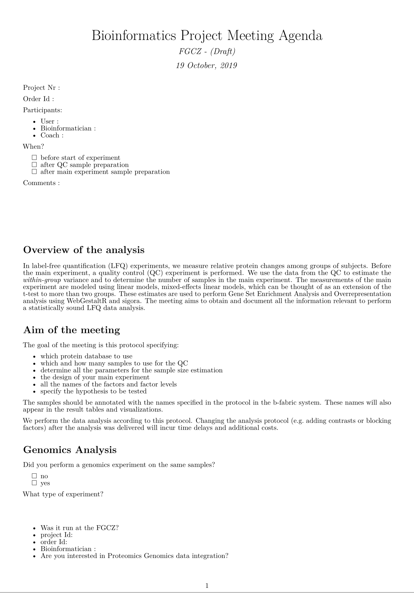
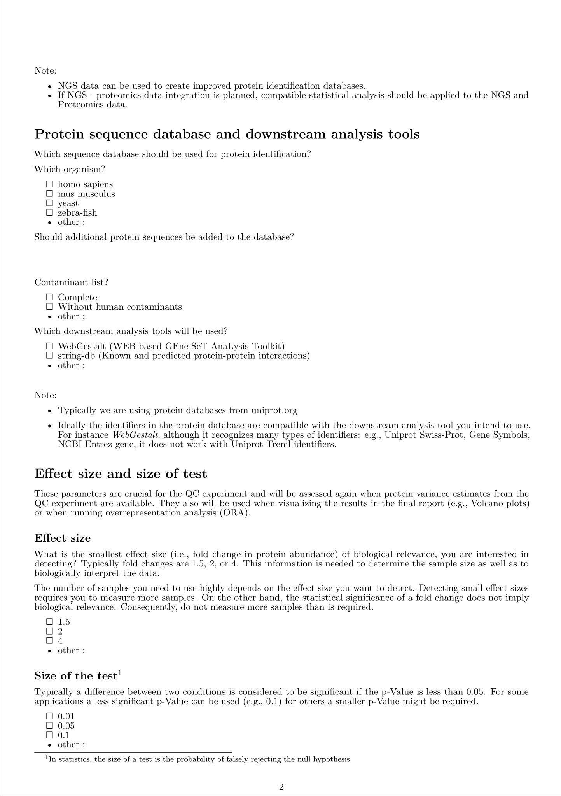
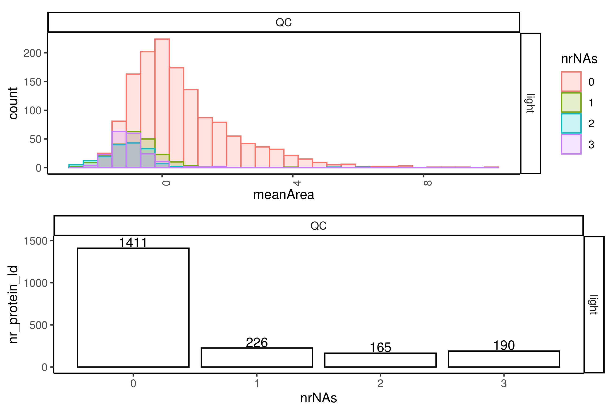
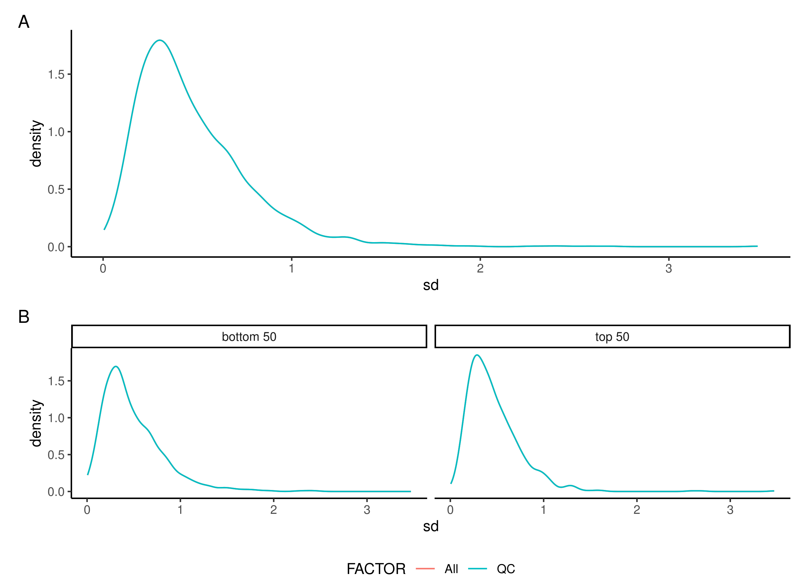
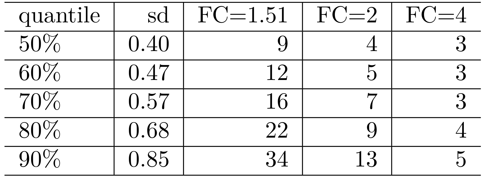

class: fullscreen, inverse, top, center, text-black
background-image: url("../inst/images/Comfortable_Chair.jpg")

.font150[**Service**]

```{r setup, include=FALSE}
knitr::opts_chunk$set(fig.width=4.25, fig.height=3.5, fig.retina=3,
                      message=FALSE, warning=FALSE, cache = TRUE,
                      autodep = TRUE, hiline=TRUE)
knitr::opts_hooks$set(fig.callout = function(options) {
  if (options$fig.callout) {
    options$echo <- FALSE
    options$out.height <- "99%"
    options$fig.width <- 16
    options$fig.height <- 8
  }
  options
})
hook_source <- knitr::knit_hooks$get('source')
knitr::knit_hooks$set(source = function(x, options) {
  if (!is.null(options$hiline) && options$hiline) {
    x <- stringr::str_replace(x, "^ ?(.+)\\s?#<<", "*\\1")
  }
  hook_source(x, options)
})
options(htmltools.dir.version = FALSE, width = 90)
as_table <- function(...) knitr::kable(..., format='html', digits = 3)

library(tidyverse)
```

---

# The workflow - bioinformatics part

- __kickoff meeting__ - bioinformatics part
  - _protocol_
- __QC experiment__
  - to determine within group variability
  - _Sample size qc report_
  - Fix sample sizes
- __Main experiment__
  - Data Analysis and _result delivery_ including linear modelling and ORA and GSEA analysis.
  - meeting to discuss results
  
  

---

# Kickoff meeting - bioinformatics

- Keep it short (15-30 minutes) by following an __agenda__
- Give _statistical_ guidance
- Get all the information we need to perform an analysis

## Use of an Agenda

- helps to prepare for the meeting
- focuses on points relevant to the data analysis <br/>__blinding__ (minimize __bias__)
- streamlines discussion and saves time 
- Improve quality of services
- Ensures reproducibility


## Motivation

- Incomplete information causes that analysis is delayed or has to be redone.

.img-right[

]

---
layout: false
# Kickoff meeting - bioinformatics

## Document

- which protein database to use
- which condition and how many samples to use for the QC
- collect all the parameters for sample size estimation
- specify the hypothesis to be tested
- specify the design of the main experiment
- document all the names of the factors and factor levels

## Conclusion

- Tested on a few projects
- Agenda is still evolving


.img-right[

]

.footnote[
Handouts_services/ExDesignSurvey.pdf</br>
Work by Witek Wolski and Paolo Nanni]

---
layout: false
# Sample size estimation report

- Hand in 4 samples of the same condition 
  - ideally of condition with highest variability
  - estimate the variance of each protein.

- Samples are being measured
- Run through MaxQuant software to extract </br> precursor and peptide intensities
- An evidence.txt file based report is being generated <br/>
 

.footnote[
 Handouts_services/p2370_Analysis/samplesize_qc_report/evidence_QC_sample_Size.html <br/>
 Handouts_services/p2691_Analysis/samplesize_qc_report/evidence_QC_sample_Size.html <br/>
 Work by Celia Detrez and Witek Wolski]


---
# Sample size estimation report

- There is an equivalance between linear models and the t.test </br>
  Therefore, we use the sample size estimation method `power.t.test`.

---

# Sample size estimation report

What __biologically relevant difference__ can be detected with a two-sample t-test using 
a significance level of $0.05$ and a power of 0.8 given a standard deviation of $0.5$ and group size of $10$?


```{r}
power.t.test(n=10,sd=0.5,power=0.8,sig.level=0.05)
```


---

# Sample size estimation report


What is __the power__ of the two-sample t-test using 
a significance level of $0.05$ if we want to detect a biologically relevant difference of $0.59$
given a standard deviation of $0.5$ and group size of $10$ samples?

__Power is the probability of rejecting the null hypothesis when, in fact, it is false.__


```{r}
power.t.test(d = 0.59,n=10,sd=0.5,sig.level=0.05)
```


---

# Sample size estimation report

What is the error of the sample size estimate?

---

# Sample size estimation report

.left-code[
```{r sampleSize_error, eval=FALSE}
sd <- sapply(1:1000,
             function(x){
               sd(rnorm(4,0,1))
               })
tmp <- sapply(sd,
              function(x){
                power.t.test(d = 0.59, #<<
                             sd=x, #<<
                             sig.level=0.05,
                             power=0.8)$n})
par(mfrow=c(2,1))
hist(sd)
plot(table(ceiling(tmp)), ylab="#", xlab="sample size estimate")
```
]

.right-plot[
```{r sampleSize_error-out , ref.label="sampleSize_error", echo=FALSE, fig.width=6, fig.height=6}
```
]

---

# Sample size estimation report

In the LFQ experiment you have measured 1000 of proteins, so the error of the median standard deviation should be small and the sample size estimate OK.

--

You run a test and you have the estimates of the $sd$, $p.value$ and fold change $d$.
We could compute the power by taking the _estimates_ obtained by the test.

How good might this power estimate be?

--

[Calculating Observed Power Is Just Transforming Noise](https://lesslikely.com/statistics/observed-power-magic/)

---


# Data preprocessing

- log2 transform the data
- apply robust z-transformation
$$I^n_i = \frac{I^t_i - med(I^t_i)}{mad(I^t_i)} \cdot \sum_{i=1}^N mad(I^t_i)/N$$
All samples have the same deviation $$mad(I^t_1) = mad(I^t_2)$$ equal to the average original variance of all samples.

.footnote[[Benchmarking of normalziation methods - Elo _et al._](https://www.ncbi.nlm.nih.gov/pmc/articles/PMC5862339/)]

---

# Data preprocessing

Since we want the sample size estimates on _protein level_ we need to infer the protein intensity

There are many methods to infer the protein intensity
- aggregate all peptides
- aggregate not more than the top n peptides (e.g. top 3).
- tukey median polish - a two-way decomposition of a 2D matrix.

$$y_{ij} = b_0 + c_i + d_j + \epsilon_{ij}$$
where $b_0$ - global intercept, $c_i, d_j$ denote the column and row effects, $\epsilon_{ij}$ - error.

It is also used in the [MSstats](http://msstats.org/) package.

---

# Data preprocessing - Tukey Median Polish

.left-code[
```{r echo=FALSE}
peptides_hemo <- rbind(c(14,15,14),
                  c( 7, 4, 7),
                  c( 8, 2,10),
                  c(15, 9,10),
                  c( 0, 2, 0))
dimnames(peptides_hemo) <-
  list(c("MVLSPADK", "TNVK",
         "AAWGK", "VGAHAGEYGAEALER",
         "MFLSFPTTK"),
       c("S1", "S2" ,"S3"))
```

```{r}
peptides_hemo
```
]

.pull-left[
```{r}
med.d <- medpolish(peptides_hemo,trace.iter = FALSE)
med.d$overall + med.d$col
as.matrix(med.d$overall + med.d$row)
```
]

---
layout: false

# Sample size estimation report


- check if there are no technical problems
.img-right[

]
--

- visualize standard deviation of proteins
.img-right[

]

--

.img-right[

]

--

- give sample size estimates for parameters</br> specified in protocol<br/>
  power 0.8<br/>
  significance level 0.05<br/>
  standard deviation taken from proteins<br/>

--

- ignores multiple testing probles
- we will be updating it with FDR controlled power/sample size estimation
    
.img-right[

]


---
# Sample size estimation report

Have a look at the sample size reports
- peptide
- protein

.footnote[
Handouts_services/p2691_Analysis/samplesize_qc_report<br/>
Handouts_services/p2370_Analysis/samplesize_qc_report<br/>

Work by Witek Wolski and Lucas Kook
]


---

# Sample size estimation report - Conclusion

- Sample size __estimate__
- take a sample size a bit larger than estimated
- try to understand the sources of variance 
  - technical (check QC)
  - biochemical
  - biological

