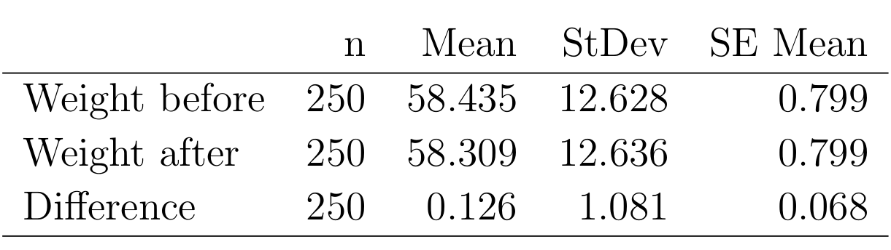
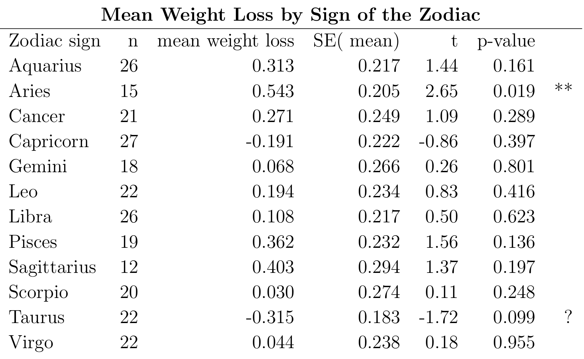
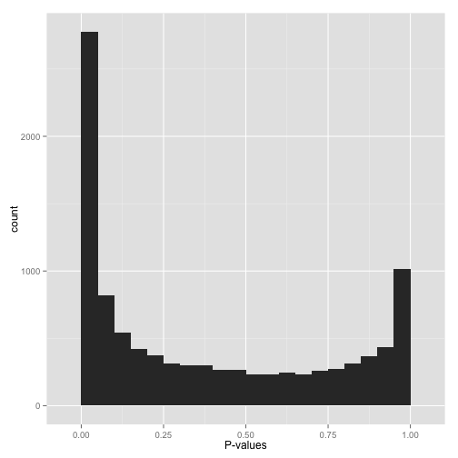

class: fullscreen, inverse, top, center, text-white
background-image: url("../inst/images/many-black-chair-backs.jpg")

.font150[**Multiplicity**]

```{r setup, include=FALSE}
knitr::opts_chunk$set(fig.width=4.25, fig.height=3.5, fig.retina=3,
                      message=FALSE, warning=FALSE, cache = TRUE,
                      autodep = TRUE, hiline=TRUE)
knitr::opts_hooks$set(fig.callout = function(options) {
  if (options$fig.callout) {
    options$echo <- FALSE
    options$out.height <- "99%"
    options$fig.width <- 16
    options$fig.height <- 8
  }
  options
})
hook_source <- knitr::knit_hooks$get('source')
knitr::knit_hooks$set(source = function(x, options) {
  if (!is.null(options$hiline) && options$hiline) {
    x <- stringr::str_replace(x, "^ ?(.+)\\s?#<<", "*\\1")
  }
  hook_source(x, options)
})
options(htmltools.dir.version = FALSE, width = 90)
as_table <- function(...) knitr::kable(..., format='html', digits = 3)

library(tidyverse)
```

---
# Overview

- Traditional vs OMICS hypothesis testing

- Where does multiplicity arise
- What is Family Wise Error Rate (FWER)

- What is FDR

---

# Traditional vs OMICS hypothesis testing

## Testing hypothesis for a single observation

- Does diet impact weight of person
- Is treatment preventing infection with COVID?
- Does treatment changes the abundance of protein XYZ?

## OMICS experiments

- Which of the many proteins are differentially expressed because of treatment?
- Which of groups of proteins (geneset) are differentially expressed because of treatment?

---
layout: false

# Weight loss example

Experiment:
- 250 subjects chosen "randomly".
- Diet for 1 week.
- Repeated Measurement (Data in kg.):
   - Weight at the start of the week
   - Weight at the end of week. 

Average weight loss is $0.13$kg. <br/>
Paired t-test for weight loss gives a <br/>
t-statistic of $t=0.126/0.068=1.84$,</br>
giving a p-value of $0.067$ (using a two-sided test).</br>
Not significant at the $5\%$ level!


.img-right[

]

.footnote[Example from  Andersen (1990) ]

---

# Weight loss example

.left-code[

```{r computingPvals}
2*(1 - pt(1.84, df = 250 - 1))
# Asymptotic test
2*(1 - pnorm(1.84, 0,1)) #<<
# one sided tests
(1 - pt(1.84, df = 250 - 1)) #<<
```
]


.right-plot[

]

.footnote[
Assymptotic test - does not "help" (and is biased); smaller sample size larger bias.<br/>
]


---
layout: false

# Weight loss example

You use a one-tailed test to improve the test's ability to learn whether the new diet is better. 

## Why is the 1-sided test not acceptable?

You risk missing valuable information by testing in only one direction.
Test cannot determine whether diet leads to weight gain.

---

# Weight loss example

Can anything be done to get a significant result<br/>
out of this study?<br/>
--

- Look at subgroups of the data <br/> by their sign of the zodiac.<br/> (additional factor)
- *12* instead of *1* test
--


.img-right[

]

--

- Conclusion: Those born under the sign of Aries<br/> are particularly suited to this new dietary control.

---

# Weight loss example

What is the problem of this approach?

- By increasing the number of tests you increase the chance of false positive results (type I error).
- Hypothesis that Arieans are good dieters was suggested by the fact that it gave an *apparently* significant result.

--


Requests for subgroup analysis common for clinical studies.

- Compare control vs treatment given sex (F, M) and age group (young, old). 


---
exclude: true

- Data vs. Hypothesis driven research. 
  - Data driven use exploratory and descriptive tools to generate hypothesis.
  - Hypothesis driven uses tests.
  - Large differences how you would report those results.


---

# Where does multiplicity arise

- __Multiple endpoints__
  - many outcome measures to asses an intervention. <br/>
  In mass spectrometry: _MS1 intensity and MS2 intensity (DIA)_.
  - Solution : choose primary outcome, adjust p-values,  multivariate analysis.
--

- __Interim Analysis__
  - analyse the data from a trial _periodically_ as it becomes available
  - Solution: adjust p-values
--

- __Multiple Regression__
  - regression analysis involving many explanatory variables
  - Solution: Use background knowledge to suggest possible models, , adjust p-values. 

---

# Where does multiplicity arise

- __Repeated measures__
  - e.g. protein abundance at intervals of 1, 3, 6, 12 and 24 hours after ingestion of a drug. <br/>
  - Solution: 
      - two-sample t-tests at each time point in sequence, e.g (3 vs 1, 6 vs 3 etc.) then  adjust p.value
      - use summary measure (e.g. fit line and test line coefficients)
--
- __Subgroup comparison__
  - Samples are subdivided on baseline factors : gender, age-groups, sign of zodiac
  - Solution : 
      - adjust p-values 
      - ANOVA analysis to test factors
  
.footnote[Example : 50 Control samples, 50 Treatment, no significant result. Split data into female and male, and young and old group. Four tests, instead of one and maybe one is significant.]


---

# Types of error when testing hypothesis

A __type I error__ (false positive) occurs when <br/> the null hypothesis (H0) is true, but is rejected.<br/> 
The _type I error rate_ or __significance level__ (p-Value)<br/> is the probability of rejecting the<br/> 
null hypothesis given that it is true.


A __type II error__ (false negative) occurs when <br/> the null hypothesis
is false,<br/> but erroneously fails to be rejected. <br/>
The _the type II error rate_ is denoted by the Greek letter $\beta$<br/>
and is related to the __power of a test__ (which equals $1−\beta$).

For a given test, the only way to reduce both error rates<br/> 
is to __increase the sample size__, and this may not be feasible.

.img-right[

]

---

# Family-wise error rate (FWER)

In statistics, family-wise error rate (FWER) is the probability of making one or more false discoveries, or __type I errors__ when performing multiple hypotheses tests.


If multiple hypotheses are tested, the chance of a rare event increases, and therefore, the likelihood of incorrectly rejecting a null hypothesis (making a type I error) increases.

---

# P-value adjustment - Bonferroni correction

The Bonferroni correction compensates for that increase by testing each individual hypothesis at a _significance level_ of $\epsilon = \alpha /k$, $\alpha$ is the desired overall _size of test_ and $k$ is the number of hypotheses.

$$k=20;~ \alpha = 0.05;~~~~~~~\epsilon = 0.05/20 = 0.0025$$

Bonferroni adjustments are typically very conservative (assumes that the tests are independent - however they are frequently correlated) and more complex methods are usually used (e.g. [multcomp](https://CRAN.R-project.org/package=multcomp)).

- R function `p.adjust` transforms the p-values (makes them larger) instead transforming the threshold.

.footnote[wikipedia, Medical Statistics - Sheffield University 2018] 

---

# P-value adjustment - Bonferroni correction

Family Wise Error Rate (FWER) - control the probability of at least one Type I error.

$$
\begin{align}
Pr(\textrm{at least one Type I error}|H_0) = \epsilon &=  1 - Pr(\textrm{no rejections}|H_0)\\
&= 1- \prod^k Pr(p_i > \alpha)\\
&= 1- \prod^k (1-\alpha)\\
&= 1-(1-\alpha)^k
\end{align}
$$
Solving for $\alpha$ gives $$\epsilon \approx \alpha/k$$ or exact $$\epsilon = 1 - \exp(1/k\log(1-\alpha))$$.


.footnote[http://genomicsclass.github.io/book/pages/multiple_testing.html]

---
exclude: true

# FWER control using package `multcomp`

.left-code[
Model with NO interactions.

```{r fittingswiss}
#help(swiss) #<<
lmod <- lm(Fertility ~ ., #<<
           data = swiss)
lmtable <- broom::tidy(lmod)
K <- diag(length(coef(lmod)))[-1,] #<<
rownames(K) <- names(coef(lmod))[-1] #<<
adjusted <- broom::tidy(summary( 
  multcomp::glht(lmod, linfct = K))) #<<
comp <- inner_join(lmtable[-1,-c(2,3,4)],
                   adjusted[-c(2,3,4,5)],
                   by = c("term" = "contrast"))
colnames(comp)[c(2,3)] <-
  c("p.value","p.adjusted")
```
]


.pull-right[
```{r comparepVals ,results='asis', echo=FALSE}
knitr::kable(comp, format = "html", caption = "compare p.value and adjusted p.value")
```
]

.footnote[multcomp: Simultaneous Inference in General Parametric Models by _Torsten Hothorn_, <br/>Mathematics and theory complex, uses **asymptotic** properties for to make it tractable. ]

---

# FWER - Conclusion

Controlling the FWER, will demand a *unrealistically
small p-value*. 

- Limit the number of tests.
- Summarize your measurements e.g. fit time courses
- Use package `multcomp` to correct p-values
  - takes correlation among observations into account
  - uses asymptotic properties, not suited if sample sizes are small.

---
exclude: true


- In the discovery phase use _False Discovery Rate_ instead of _Family Wise Error Rates_.
- If you want to examine many factors, subgroups then:
  - use exploratory or descriptive data analysis : tabulating, dimensionality reduction, clustering.
  - Use GSEA or ORA analysis when contrasting subgroups.
  - Do not report unadjusted p-values for proteins.

---

# False Discovery Rate - Motivation

.footnote[Simulating p-values Figure A) 1000 p-values where H0 true, B) 600 p-values where H0 true and 400 HA true. C) closup]

.left-code[
```{r pValScenarios, echo=TRUE, eval=TRUE}
m <- 1000
simulate.p.values <- function(
  i, delta = 2, fraction = 0.1){
  control <- rnorm(6,0,1)
  treatment <- rnorm(6,0,1)
  if (runif(1) < fraction)
   treatment <- treatment + delta
  return(t.test(treatment,control)$p.value)
}
pvals00 <- sapply(1:m, simulate.p.values,
                  delta = 0,fraction = 0 )
pvals24 <- sapply(1:m, simulate.p.values,
                  delta = 2, fraction = 0.4 )
```

```{r pValScenariosHist, echo=FALSE, eval=FALSE}

par(mfrow=c(1,3))
hist(pvals00, breaks=20, ylim=c(0,300), main="A")
abline(h=1000/20, col=3)
abline(v = 0.05, col=2)
text(x = c(0.02,0.02,0.2,0.2),y=c(20,100,20,100), labels=c("FP","TP","TN","FN"))
hist(pvals24, breaks=20, ylim=c(0,300), main="B")
abline(h=(1000-400)/20, col=3)
abline(v = 0.05, col=2)
text(x = c(0.02, 0.02, 0.2, 0.2),y=c(20,100,20,100), labels=c("FP","TP","TN","FN"))

hist(pvals24, breaks=20, ylim=c(0,300), xlim=c(0,0.2), main="C")
abline(h=(1000-400)/20, col=3)
abline(v = 0.05, col=2)
text(x = c(0.02,0.02,0.1,0.1),y=c(20,100,20,100), labels=c("FP","TP","TN","FN"))

```
]

.right-plot[
```{r pValScenariosHist-out, ref.label="pValScenariosHist", echo=FALSE, fig.width=6, fig.height=6}
```
]


---
# False Discovery Rate (FDR)

- Figure A (previous slide) shows that even if only H0 true we have some p-values which are below the significance threshold. These are false positives (FP).
- In Figure B and C we have p-values less than significance threshold where H0 is true (FP) and a proportion of those where HA is true (TP).

- FDR-controlling procedures are designed to control the expected __proportion of "discoveries"__ (rejected null hypotheses) __that are false__ (incorrect rejections).

$$FDR = \frac{FP}{FP + TP}$$

- Particularly useful in the discovery fase where even FDR's of up to 50% are feasible.

---
layout: false

# FDR and p-value distribution

.pull-left[
- TP true positives (H0 rejected if HA true)
- FP false positives (H0 rejected if H0 true)
- FN false negatives (H0 accepted if HA true)
- TN true negatives (H0 accepted if H0 true)

$$FDR = \frac{FP}{FP + TP}$$
]

.right-plot[
```{r pValScenariosHist-closup, echo=FALSE, fig.width=6, fig.height=6}
hist(pvals24, breaks = 20, ylim = c(0,300), xlim = c(0,0.2), main = "D")
abline(h = (1000 - 400)/20, col = 3)
abline(v = 0.05, col = 2)
text(x = c(0.02, 0.02, 0.1, 0.1), y = c(20,100,20,100),
     labels = c("FP","TP","TN","FN"))
```

]

.footnote[John D.Storey 2002; Storey and Tibshirani 2003; Prummer 2012]

---
# FDR - Benjamini Hochberg - procedure

Definition of FDR as given in the Benjamini and Hochberg paper 1995.

```{r BHTable, results='asis', echo=FALSE}
table <- data.frame( c("Reject H0","Accept H0", "Total"), matrix(c("V (FP)","S (TP)","R","U (TN)","T (FN)","m-R","m_0","m-m_0","m"), ncol=3, byrow=T))
colnames(table) <- c("R/C","H0 TRUE", "HA", "Total")
knitr::kable(table, format="html")
```

the proportion of false discoveries among the discoveries (rejections of the null hypothesis)

$Q=V/R=V/(V+S); ~~~ where ~~~ Q=0 ~~if~~R=0$<br/>
$FDR = Q_e = E[Q]$ (expected value of $Q$).


.footnote[https://en.wikipedia.org/wiki/False_discovery_rate, Benjamini-Hochberg (1995)]
---


# FDR - Benjamini Hochberg - procedure

For any given FDR level $\alpha$,
the Benjamini-Hochberg (1995) procedure is very practical<br/>
because it simply requires that we are able to compute p-values for each of the individual tests and this permits a procedure to be defined.


- List these p-values in ascending order and denote them by $P_{(1)} \ldots P_{(m)}$.
- For a given FDR level $\alpha$, find the largest $k$ such that $P_{(k)} \le \frac{k}{m}\alpha$.
- Reject the null hypothesis (i.e., declare discoveries) for all $H_{(i)}$ for $i = 1, \ldots, k$.


---

# FDR - Benjamini Hochberg - procedure

.footnote[Highlighted code illustrates the Benjmini Hochberge procedure (top line) and how you would compute the FDR in R using the method `p.adjust`.]
.left-code[

```{r BHprocedure, eval=FALSE, echo=TRUE}
alpha <- 0.05
i = seq(along=pvals24)
k <- max(which(sort(pvals24) < i/m*alpha)) #<<
padj <- p.adjust(pvals24,method="BH") #<<

# both return same number 
stopifnot(k == sum(padj < 0.05)) #<< 

par(mfrow=c(2,2))
hist(pvals24, breaks=20)
hist(padj , breaks = 20)
plot(i,sort(pvals24))
abline(0,i/m*alpha, col=2)
plot(i[1:k],sort(pvals24)[1:k],type="b",
     main="Close-up")
abline(0,i/m*alpha, col=2)

```
]


.right-plot[
```{r BHprocedure-out, ref.label="BHprocedure", echo=FALSE, fig.width=6, fig.height=6}
```
]


---
exclude: true


# FDR - Benjamini Hochberg - procedure

.right-code[
```{r BHRcode}
p.adjust.BH <- function (p,  n = length(p))
{
  nm <- names(p)
  p <- as.numeric(p)
  p0 <- setNames(p, nm)
  if (all(nna <- !is.na(p)))
    nna <- TRUE
  p <- p[nna]
  lp <- length(p)
  stopifnot(n >= lp)
  if (n <= 1) return(p0)
  i <- lp:1L
  o <- order(p, decreasing = TRUE)
  ro <- order(o)
  p0[nna] <-  pmin(1, cummin(n/i * p[o]))[ro]
  return(p0)
}
```
]

.footnote[Do not use this but run p.adjust]

---

# FDR - Conclusion

- $FDR \le 0.05$ is a much more lenient requirement then $FWER \le 0.05$.

Although we will end up with more false positives, FDR gives us much more power. This makes it particularly appropriate for discovery phase experiments where we may accept FDR levels much higher than 0.05.

The FDR has an interpretation in a Multiple testing setting, while an unadjusted p-value in a hight throughput setting has __NO__ explanation.

The BH procedure is valid when the $m$ tests are independent, and also in various scenarios of dependence, but is __not universally valid__. (e.g. gene sets.)


.footnote[@JG do not report p-values for OMICS data, just use a higher FDR threshold.]

---
layout: false

# Possible p-value distributions

In practice we can observe various shapes of p-value distributions.


[How to interpret a p-value histogram](http://varianceexplained.org/statistics/interpreting-pvalue-histogram/)

This blog post discusses what types of p-value<br/>
distrubutions you might encounter when analysing <br/>
data and how to treat them.

.img-right[
]


---

# Conclusions

- In case of multiplicity do not report unadjusted p-value.
- _Family Wise Error Rates (FWER)_  
  - used to adjust for number of tests for a single outcome.
  - Typical threshold for FWER are $0.05$.
- _False Discovery Rate (FDR)_ 
  - controls error rates when selecting proteins for follow up (OMICS experiments)
  - FDR's of $0.1$, $0.25$ or even $0.5$ are acceptable.
- Limit the number of hypothesis you test. 


---

# Conclusions

If you do subgroup analysis use<br/> __exploratory__ or __descriptive__ data analysis:   
  - tabulating (e.g. Venn diagrams) 
  - dimensionality reduction (e.g, PCA)
  - clustering of samples and proteins
  (e.g, time series clustering)
  - Use GSEA or ORA analysis to contrast subgroups.
  - Do not over-interpret your findings.
  
  

---

# Thank you

.img-small[

]

.footnote[https://xkcd.com/882/]


