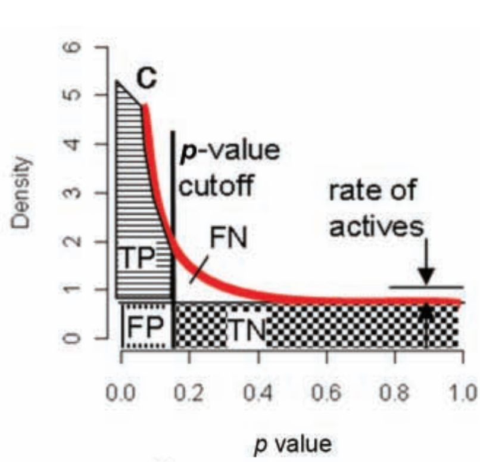

class: fullscreen, inverse, top, center, text-white
background-image: url("../inst/images/many-black-chair-backs.jpg")

.font150[**Multiplicity**]

```{r setup, include=FALSE}
knitr::opts_chunk$set(fig.width=4.25, fig.height=3.5, fig.retina=3,
                      message=FALSE, warning=FALSE, cache = TRUE,
                      autodep = TRUE, hiline=TRUE)
knitr::opts_hooks$set(fig.callout = function(options) {
  if (options$fig.callout) {
    options$echo <- FALSE
    options$out.height <- "99%"
    options$fig.width <- 16
    options$fig.height <- 8
  }
  options
})
hook_source <- knitr::knit_hooks$get('source')
knitr::knit_hooks$set(source = function(x, options) {
  if (!is.null(options$hiline) && options$hiline) {
    x <- stringr::str_replace(x, "^ ?(.+)\\s?#<<", "*\\1")
  }
  hook_source(x, options)
})
options(htmltools.dir.version = FALSE, width = 90)
as_table <- function(...) knitr::kable(..., format='html', digits = 3)

library(tidyverse)
```

---
# Overview


- Where does multiplicity arise
- What is Family Wise Error Rate (RWER)
- What is FDR
- How to control FWER and FDR

---
layout: false

# Weight loss example

Experiment:
- 250 subjects chosen "randomly".
- Diet for 1 week.
- Repeated Measurement (Data in kg.):
   - Weight at the start of the week
   - Weight at the end of week. 

Average weight loss is $0.13$kg. Paired t-test for weight <br/>
loss gives a t-statistic of $t=0.126/0.068=1.84$,</br>
giving a p-value of $0.067$ (using a two-sided test).</br>
Not quite significant at the $5%$ level!


.img-right[

]

.footnote[Example from  Andersen (1990) ]

---

# Weight loss example

.left-code[

```{r}
2*(1- pt(1.84, df = 250-1))
2*(1- pnorm(1.84, 0,1))#<<
(1 - pt(1.84, df = 250-1)) #<<
```
]


.right-plot[

]

.footnote[Example from  Andersen (1990)</br> 
assymptotic tests - does not "help" (and is biased).<br/>
1-sided test is not acceptable! Why?
]
---
layout: false

# Weight loss example

Can anything be done to get a significant result</br>
out of this study?</br>
--

_How about introducing additional factor?_</br>
--

Look at subgroups of the data by their sign of the Zodiac.</br>
--


.img-right[

]

--

- __Conclusions:__ those born under the sign of Aries</br> are particularly suited to this new dietary control.

---

# Weight loss example


What is the problem of this approach?

--

Hypothesis that Aireans are good dieters
was only suggested by the data and the fact that it gave an apparently significant
result.


- What difference would it make if you designed your experiment with that hypothesis in mind?
--

  - Plausibility - possible biological mechanism which suggest the hypothesis.
  - You would test this hypothesis by having two groups Aries and Control group.
  - Larger sample sizes per group.
  

---

# Where does multiplicity arise

- __Multiple endpoints__
  - many outcome measures to asses an intervention. <br/>
  In mass spectrometry: _MS1 intensity and MS2 intensity (DIA)_.
  - Solution : ajdust p-values, choose primary outcome, multivariate analysis.
--

- __Interim Analysis__
  - analyze the data from a trial _periodically_ as it becomes available
  - Solution: adjust p-values

---

# Where does multiplicity arise


- __Subgroup comparison__
  - sample is subdivided on baseline factors : gender, age-groups, sign of zodiac
  - Solution : adjust p-values, Anova
- __Repeated measures__
  - e.g. blood concentration of some metabolite at baseline and then at intervals of 1, 3, 6, 12 and 24 hours after ingestion of a drug. <br/>
  Use two-sample t-tests on the measures at each time point in sequence.
  - Solution: adjust p.value, use summary measure (e.g. fit line and test line coefficients), Multivariate analysis  
- __Multiple Regression__
  - regression analyses involving many explanatory variables
  - Solution: Use background knowledge to suggest possible models, include only few interaction terms, adjust p-values. 

---

# P-value adjustment - Bonferroni correction

If multiple hypotheses are tested, the chance of a rare event increases, and therefore, the likelihood of incorrectly rejecting a null hypothesis (i.e., making a Type I error) increases.

The Bonferroni correction compensates for that increase by testing each individual hypothesis at a significance level of $\epsilon = \alpha /k$, $\alpha$  is the desired overall alpha level and $k$ is the number of hypotheses.

$$k=20; \alpha = 0.05,\epsilon = 0.05/20 = 0.0025$$


Bonferroni adjustments are typically very conservative (because in many situations the tests are highly correlated) and more complex methods are usually used.
In R use `p.adjust` which transforms the p-values instead transforming the threshold.

.footnote[wikipedia, Medical Statistics - Sheffield University 2018] 

---

# P-value adjustment - Bonferroni correction

Family Wise Error Rate (FWER) - control the probability of at least one Type I error
Maths for Bonferroni
$$
\begin{align}
Pr(at~least~one~Type~I~error|H_0) = \epsilon &=  1 - Pr(no~rejections|H_0)\\
&= 1- \prod^k Pr(p_i > \alpha)\\
&= 1- \prod^k (1-\alpha)\\
&= 1-(1-\alpha)^k
\end{align}
$$
Solving for $\alpha$ gives approx $$\epsilon = \alpha/k$$ or exact result $$\epsilon = 1- \exp(1/k\log(1-\alpha))$$.


.footnote[http://genomicsclass.github.io/book/pages/multiple_testing.html]
---

# P-value adjustment - package `multcomp`

.left-code[
Model with NO interactions
```{r}
lmod <- lm(Fertility ~ ., #<<
           data = swiss)
lmtable <- broom::tidy(summary(lmod))
K <- diag(length(coef(lmod)))[-1,] #<<
rownames(K) <- names(coef(lmod))[-1] #<<
adjusted <- broom::tidy(summary( 
  multcomp::glht(lmod, linfct = K))) #<<
comp <- inner_join(lmtable[-1,-c(2,3,4)],
                   adjusted[-c(2,3,4,5)],
                   by=c("term"="lhs"))
colnames(comp)[c(2,3)] <-
  c("p.value","p.adjusted")
```
]


.pull-right[
```{r  results='asis', echo=FALSE}
knitr::kable(comp, format="html", caption="compare p.value and adjusted p.value")
```
]

.footnote[multcomp: Simultaneous Inference in General Parametric Models by _Torsten Hothorn_, <br/>Mathematics and theory complex, uses assymptotic properties for some types of linear models to make it tractable. ]

---
# Multiplicity conclusion (FWER)

Multiplicity adjustment will demand a unrealistically
small p-value. 

In practice there are better ways of overcoming the problem
of multiplicity, 
- by limiting the number of tests (Test only 1 maximum 2 hypothesis)
- by concentrating on the more important objectives
- using a more sophisticated analysis (e.g. fitting time courses)
- in the discovery fase using _False Discovery Rate_ instead of _Family Wise Error Rates_.

---

# FDR Motivation

.footnote[Simulating pvalues Figure A) 1000 p-values where H0 true, B) 900 p-values where H0 true and 100 HA true, C) 800 p-values where H0 true and 200 HA true
D) 700 p-values where H0 true and 300 HA true.]

.left-code[
```{r pValScenarios, echo=TRUE, eval=TRUE}
m <- 1000
simulate.p.values <- function(
  i, delta=2,fraction = 0.1){
  control <- rnorm(6,0,1)
  treatment <- rnorm(6,0,1)
  if(runif(1) < fraction)
   treatment <- treatment + delta
  return(t.test(treatment,control)$p.value)
}
pvals00 <- sapply(1:m, simulate.p.values,
                  delta = 0,fraction = 0 )
pvals21 <- sapply(1:m, simulate.p.values,
                  delta = 2,fraction = 0.1 )
pvals22 <- sapply(1:m, simulate.p.values,
                  delta = 2, fraction = 0.2 )
pvals24 <- sapply(1:m, simulate.p.values,
                  delta = 2, fraction = 0.4 )
```

```{r pValScenariosHist, echo=FALSE, eval=FALSE}
par(mfrow=c(2,2))
hist(pvals00,breaks=50, ylim=c(0,300), main="A")
hist(pvals21,breaks=50,ylim=c(0,300) ,main ="B")
hist(pvals22,breaks=50,ylim=c(0,300), main="C")
hist(pvals42,breaks=50,ylim=c(0,300) , main="D")

```
]

.right-plot[
```{r pValScenariosHist-out, ref.label="pValScenariosHist", echo=FALSE, fig.width=6, fig.height=6}
```
]


---
# False Discovery Rate (FDR)

- Figrue A (previous slide) shows that even if only H0 true we have some p-values which are below the significance threshold. These are false postives (FP).
- In Figure B-C we have p-values less than significance threshold where H0 is true (FP) and an increasing proportion of those where HA is true (TP).

- FDR-controlling procedures are designed to control the expected __proportion of "discoveries"__ (rejected null hypotheses) __that are false__ (incorrect rejections).

$$FDR = \frac{FP}{FP + TP}$$

- Particularily usefull in the discovery fase where even FDR's of up to 50% are feasible.

---
layout: false

# FDR and p-value distribution

.pull-left[
- TP true positives (H0 rejected if HA true)
- FP false positives (H0 rejected if H0 true)
- FN false negatives (H0 accepted if HA true)
- TN true negatives (H0 accepted if H0 true)

$$FDR = \frac{FP}{FP + TP}$$
]

.img-right[

]

.footnote[John D.Storey 2002; Storey and Tibshirani 2003; Prummer 2012]

---
# FDR - Benjamini Hochberg - procedure

Definition of FDR as given in the Benjamini and Hochberg paper 1995.

```{r results='asis', echo=FALSE}
table <- data.frame( c("Reject H0","Accept H0", "Total"), matrix(c("V (FP)","S (TP)","R","U (TN)","T (FN)","m-R","m_0","m-m_0","m"), ncol=3, byrow=T))
colnames(table) <- c("R/C","H0 TRUE", "HA", "Total")
knitr::kable(table, format="html")
```

the proportion of false discoveries among the discoveries (rejections of the null hypothesis)

$Q=V/R=V/(V+S); ~~~ where ~~~ Q=0 ~~if~~R=0$<br/>
$FDR = Q_e = E[Q]$ (expected value of $Q$).


.footnote[https://en.wikipedia.org/wiki/False_discovery_rate, Benjamini-Hochberg (1995)]
---


# FDR - Benjamini Hochberg - procedure

For any given FDR level $\alpha$,
the Benjamini-Hochberg (1995) procedure is very practical<br/> because it simply requires that we are able to compute p-values for each of the individual tests and this permits a procedure to be defined.


We list these p-values in ascending order and denote them by $P_{(1)} \ldots P_{(m)}$.

For a given FDR level $\alpha$, find the largest $k$ such that $P_{(k)} \le \frac{k}{m}\alpha$.

Reject the null hypothesis (i.e., declare discoveries) for all $H_{(i)}$ for $i = 1, \ldots, k$.


---

# FDR - Benjamini Hochberg - procedure

.footnote[Highlighted code illustrates the Benjmini Hochberge procedure (top line) and how you would compute the FDR in R using the method `p.adjust`.]
.left-code[

```{r BHprocedure, eval=FALSE, echo=TRUE}
alpha <- 0.05
i = seq(along=pvals24)
k <- max(which(sort(pvals24) < i/m*alpha)) #<<
padj <- p.adjust(pvals24,method="BH") #<<

par(mfrow=c(2,2))
hist(pvals24, breaks=20)
hist(padj , breaks = 20)
plot(i,sort(pvals24))
abline(0,i/m*alpha, col=2)
plot(i[1:k],sort(pvals24)[1:k],type="b",
     main="Close-up")
abline(0,i/m*alpha, col=2)

```
]


.right-plot[
```{r BHprocedure-out, ref.label="BHprocedure", echo=FALSE, fig.width=6, fig.height=6}
```
]


---
# FDR - Benjamini Hochberg - procedure
.right-code[
```{r}
p.adjust.BH <- function (p,  n = length(p))
{
  nm <- names(p)
  p <- as.numeric(p)
  p0 <- setNames(p, nm)
  if (all(nna <- !is.na(p)))
    nna <- TRUE
  p <- p[nna]
  lp <- length(p)
  stopifnot(n >= lp)
  if (n <= 1) return(p0)
  i <- lp:1L
  o <- order(p, decreasing = TRUE)
  ro <- order(o)
  p0[nna] <-  pmin(1, cummin(n/i * p[o]))[ro]
  return(p0)
}
```
]

---

# FDR - Conclusion

- $FDR \le 0.05$ is a much more lenient requirement then $FWER \le 0.05$.

Although we will end up with more false positives, FDR gives us much more power. This makes it particularly appropriate for discovery phase experiments where we may accept FDR levels much higher than 0.05.

The BH procedure is valid when the m tests are independent, and also in various scenarios of dependence, but is __not universally valid__. (e.g. gene sets.)

---
layout: false

# Possible p-value distributions

In practice we can observe various shapes of p-value distributions.


[How to interpret a p-value histogram](http://varianceexplained.org/statistics/interpreting-pvalue-histogram/)

This blog post discusses what types of p-value<br/>
distrubutions you might encounter when analysing <br/>
data and how to treat them.

.img-right[

]
---

# Conclusions

- Limit the number of hypothesis you test with the data
- _Family Wise Error Rates (FWER)_  
  - use to adjust for number of tests for single protein
  - Typical threshold for FWER are $0.05$ or $0.01$
- _False Discovery Rate (FDR)_ 
  - controls error rates when selecting proteins for follow up in discovery phase
  - FDR's of $0.1$ or even $0.5$ are acceptable.


