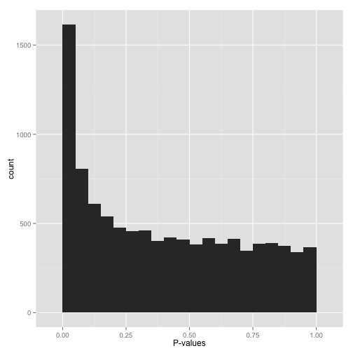

```{r setup, include=FALSE}
options(htmltools.dir.version = FALSE)
knitr::opts_chunk$set(fig.dim=c(4.8, 4.5), fig.retina=2, out.width="100%")
knitr::opts_hooks$set(fig.callout = function(options) {
  if (options$fig.callout) {
    options$echo <- FALSE
    options$out.height <- "99%"
    options$fig.width <- 16
    options$fig.height <- 8
  }
  options
})
```


# Simulate some data


Do some slides illustrating this.
Idea is to simulate some data and than fit various models to obtain those distribution shown and discussed here:

(interpreting-pvalue-histogram)[http://varianceexplained.org/statistics/interpreting-pvalue-histogram/]


---

# Scenario A: Anti-conservative p-values (“Hooray!”)


```{r reg_pvalues, out.width=400, out.height=400, echo=FALSE}

```

