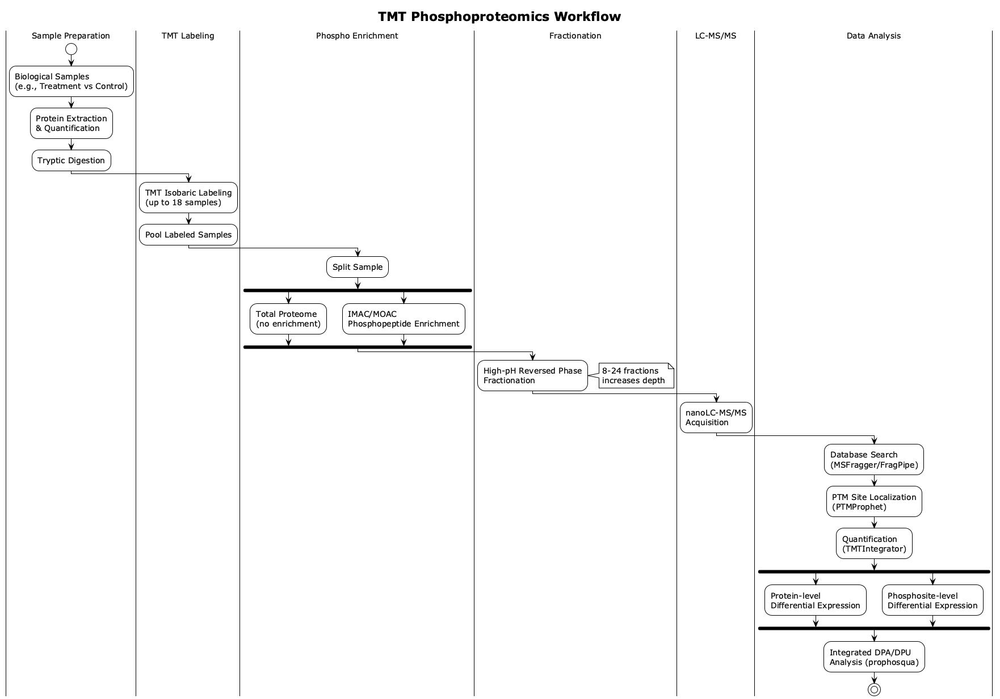
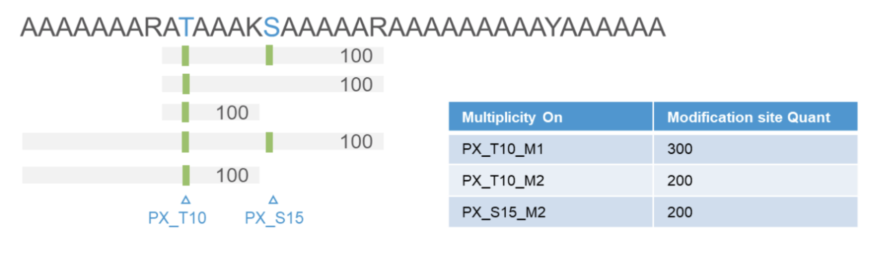
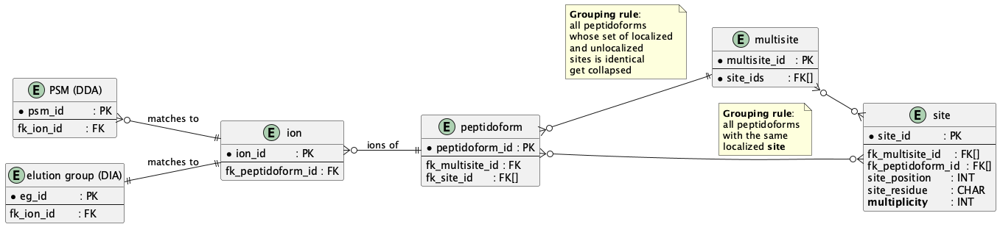
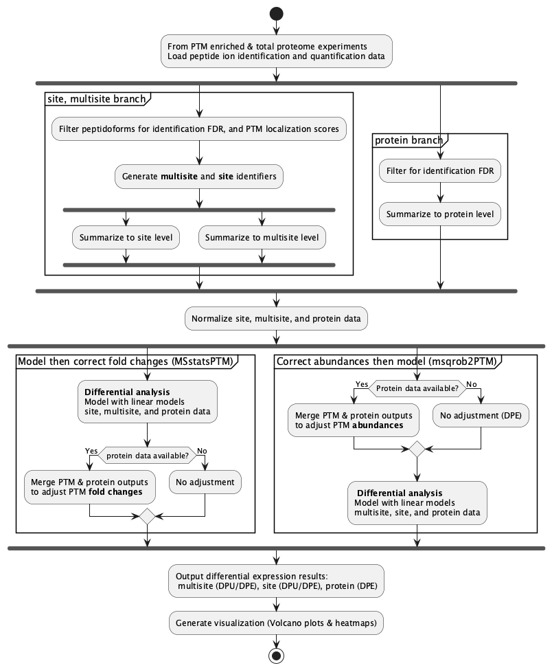
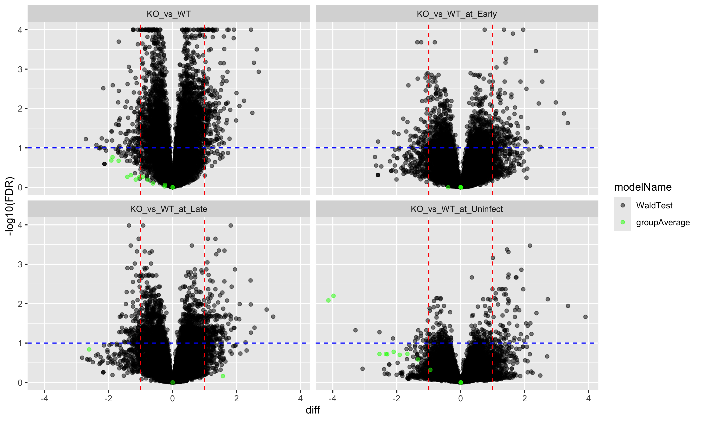
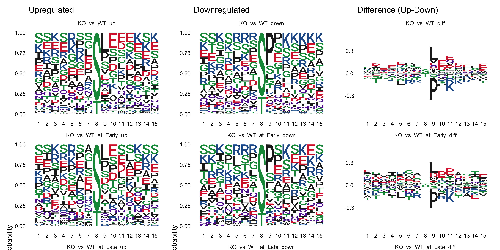
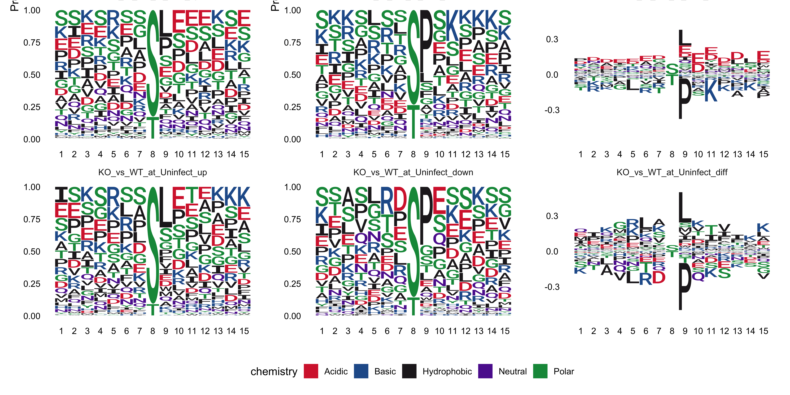
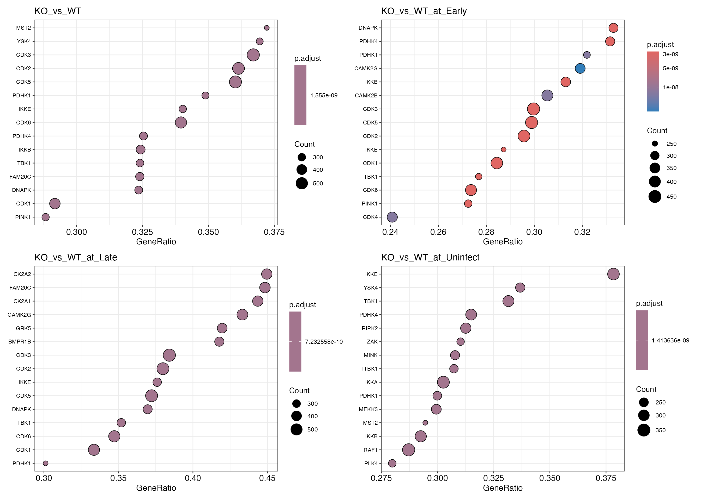

class: fullscreen, inverse, top, center, text-black
background-image: url("images/phosphoVis_16x9.png")

<div style="color: #00aa00;">.huge[Phosphoproteomics]</div>

<div style="color: #00aa00;">.small-text[Distinguishing Signaling from Protein-Level Effects]</div>

```{r setup, include=FALSE}
knitr::opts_chunk$set(fig.width = 4.25,
                      fig.height = 3.5,
                      fig.retina = 3,
                      message = FALSE,
                      warning = FALSE,
                      cache = TRUE,
                      autodep = TRUE,
                      hiline = TRUE)

knitr::opts_hooks$set(fig.callout = function(options) {
  if (options$fig.callout) {
    options$echo <- FALSE
    options$out.height <- "99%"
    options$fig.width <- 16
    options$fig.height <- 8
  }
  options
})
hook_source <- knitr::knit_hooks$get('source')
knitr::knit_hooks$set(source = function(x, options) {
  if (!is.null(options$hiline) && options$hiline) {
    x <- stringr::str_replace(x, "^ ?(.+)\\s?#<<", "*\\1")
  }
  hook_source(x, options)
})
options(htmltools.dir.version = FALSE, width = 90)
as_table <- function(...) knitr::kable(..., format='html', digits = 3)
library(tidyverse)
```

---

# Overview

**Part 1: Biology & Motivation** — Why study phosphorylation?

**Part 2: Experimental Workflow** — How do we measure phosphosites?

**Part 3: Data Analysis Levels** — Peptidoforms, multisites, sites

**Part 4: DPA vs DPU** — Is it signaling or just more protein?

**Part 5: Visualization & Kinase Inference** — From sites to biology

---
class: inverse, center, middle

# Part 1: Biology & Motivation

*Why study phosphorylation? What questions are we trying to answer?*

---

# What is Protein Phosphorylation?

.pull-left[
**A reversible PTM that modulates protein function**

- Addition of phosphate group to Ser/Thr/Tyr
- Catalyzed by **kinases** (~500 in human genome)
- Removed by **phosphatases**
- Acts as a molecular switch

**Effects on protein:**
- Conformational changes
- Enzymatic activity modulation
- Subcellular localization
- Protein-protein interactions
]

.pull-right[
```{r echo=FALSE, fig.width=5, fig.height=4}
# Simple kinase/phosphatase cycle diagram
library(ggplot2)
df <- data.frame(
  x = c(1, 3, 3, 1),
  y = c(2, 2, 1, 1),
  label = c("Protein", "Protein-P", "", "")
)
arrows_df <- data.frame(
  x = c(1.3, 2.7),
  xend = c(2.7, 1.3),
  y = c(2.1, 1.9),
  yend = c(2.1, 1.9),
  label = c("Kinase + ATP", "Phosphatase")
)
ggplot() +
  geom_rect(aes(xmin = 0.5, xmax = 1.5, ymin = 1.7, ymax = 2.3),
            fill = "steelblue", alpha = 0.7) +
  geom_rect(aes(xmin = 2.5, xmax = 3.5, ymin = 1.7, ymax = 2.3),
            fill = "coral", alpha = 0.7) +
  geom_text(aes(x = 1, y = 2, label = "Protein"), color = "white", size = 5) +
  geom_text(aes(x = 3, y = 2, label = "Protein-P"), color = "white", size = 5) +
  geom_curve(aes(x = 1.5, xend = 2.5, y = 2.2, yend = 2.2),
             arrow = arrow(length = unit(0.3, "cm")), curvature = -0.3) +
  geom_curve(aes(x = 2.5, xend = 1.5, y = 1.8, yend = 1.8),
             arrow = arrow(length = unit(0.3, "cm")), curvature = -0.3) +
  annotate("text", x = 2, y = 2.5, label = "Kinase + ATP", size = 4) +
  annotate("text", x = 2, y = 1.5, label = "Phosphatase", size = 4) +
  theme_void() +
  coord_cartesian(xlim = c(0, 4), ylim = c(1, 3))
```
]

---

# Why Study Phosphorylation?

**Phosphorylation enables rapid cellular responses without new protein synthesis**

.pull-left[
**Signal transduction cascades**
- MAPK, PI3K/AKT, JAK/STAT
- Milliseconds to minutes timescale

**Cell cycle regulation**
- CDKs control progression
- Checkpoint activation
]

.pull-right[
**Metabolic control**
- Glycogen synthesis/breakdown
- Lipid metabolism

**Gene expression**
- Transcription factor activation
- Chromatin remodeling
]

---

# Questions We Want to Answer

**When we perturb a system (drug, knockout, disease), we ask:**

1. **Which kinases are activated?**
   - If a kinase is activated → its substrates become more phosphorylated
   - Expect: .hl[increased proportion] of substrate sites phosphorylated

2. **Which signaling pathways are affected?**
   - Pathways = chains of kinases activating each other (e.g., RAF → MEK → ERK)
   - If pathway activated → multiple kinases in chain show increased activity
   - Expect: .hl[multiple related kinase substrates] changing together

3. **Is this a direct signaling change or just more protein?**
   - This determines what biology is happening!

---

# Why Distinguish Signaling from Abundance?

**The answer changes our biological interpretation:**

| Observation | If signaling change | If abundance change |
|-------------|--------------------|--------------------|
| More pS473-AKT | AKT kinase activated | More AKT protein made |
| Biological cause | Upstream signal (PI3K) | Transcription/translation |
| Therapeutic target | Inhibit upstream kinase | Target gene expression |

**Example:** Cancer shows increased phospho-AKT signal

- If kinase activation → PI3K inhibitor may help
- If just more AKT protein → need different strategy

.hl[Same measurement, completely different biology and treatment!]

---

# The Scale of the Phosphoproteome

| Metric | Estimate |
|--------|----------|
| Human proteins | ~20,000 |
| Estimated phosphosites | >100,000 |
| Typical experiment detection | 10,000-30,000 sites |
| Fraction modified | 1-5% of protein molecules |


**Key implication:** Phosphorylation is .hl[substoichiometric]

- Only a small fraction of protein molecules carry the modification
- Enrichment is **required** for detection by mass spectrometry

---

# Why are Phosphopeptides Hard to Detect?

**Three challenges for MS detection:**

| Challenge | Cause | Consequence |
|-----------|-------|-------------|
| **Low abundance** | Only 1-5% of protein molecules modified | Signal below detection limit |
| **Ionization suppression** | Phosphate group is negatively charged | Reduced signal in positive ion mode |
| **Competition** | Overwhelmed by non-phosphopeptides | Masked by abundant peptides |


**Result:** Without enrichment, most phosphopeptides are invisible!

---

# Phosphopeptide Enrichment

**Solution: Selectively capture phosphopeptides before MS**

.pull-left[
**IMAC** (Immobilized Metal Affinity Chromatography)
- Fe³⁺ or Ti⁴⁺ ions chelate phosphate groups
- Most common approach
- Works well for pSer/pThr

**MOAC** (Metal Oxide Affinity Chromatography)
- TiO₂ or ZrO₂ beads
- Alternative approach
]

.pull-right[
**MS Detection Characteristics**
- Neutral loss of H₃PO₄ (-98 Da) during fragmentation
- Characteristic fragmentation pattern
- Requires site localization algorithms

**Enrichment target:**
- >90% phosphopeptides in enriched sample
]

---

# Biological Expectations: What Do We Expect to See?

**Before analyzing data, formulate hypotheses:**

| Biological Event | Expected Observation |
|-----------------|---------------------|
| **Kinase activation** | Larger proportion of substrate sites phosphorylated |
| **Protein upregulation** | Higher total abundance, same proportion phosphorylated |
| **Kinase upregulation** | Both abundance AND proportion may increase |
| **Phosphatase inhibition** | Higher proportion phosphorylated |


**Key insight:** The same increase in phosphosite signal can have different causes!

---

# The Interpretation Challenge

.pull-left[
**Scenario A: True Signaling**

Protein level: unchanged
Kinase activity: increased
Stoichiometry: 10% → 30%

Signal increase: **3-fold**

*Interpretation: Kinase activated*
]

.pull-right[
**Scenario B: Abundance Effect**

Protein level: 3-fold up
Kinase activity: unchanged
Stoichiometry: 10% → 10%

Signal increase: **3-fold**

*Interpretation: More substrate available*
]


.center[
**Same signal change, completely different biology!**
]

This is why we need .hl[both phospho AND total proteome] measurements.

---

# Case Study: Macrophage Infection × Autophagy

**Dataset:** Maculins et al. (eLife 2020)

.pull-left[
**Background:**
- **Autophagy** = degrades pathogens & damaged proteins
- **Atg16l1 KO** = autophagy blocked
- **SQSTM1/p62** = accumulates when autophagy blocked
]

.pull-right[
**Experimental design:**
- WT vs autophagy-deficient (Atg16l1 KO)
- Uninfected / Early / Late infection
- **6 conditions**, TMT-11-plex
- Phospho + total proteome
]

---

# What Do We Expect to See?

| Factor | Expected effect |
|--------|----------------|
| **Infection** | Immune signaling activated (NF-κB, MAPK) |
| **Autophagy KO** | Cannot clear pathogen → prolonged response |
| **Interaction** | KO may show different signaling dynamics |

**Key question:** Are observed phosphorylation changes due to signaling or just more protein?

---

# Formulating Hypotheses: SQSTM1

**Focusing on one contrast:** KO vs WT (uninfected)

**We observe:** SQSTM1 protein is ~7-fold upregulated in Atg16l1 KO

**We also see:** Many SQSTM1 phosphosites show increased signal

**The question:** Are the kinases phosphorylating SQSTM1 more active in KO, or is it just more protein?

| Hypothesis | Prediction | Biological meaning |
|------------|------------|-------------------|
| **H₀** | Phosphosite ↑ = Protein ↑ | No kinase change, just more substrate |
| **H₁** | Phosphosite ↑ > Protein ↑ | Kinase activated in KO |
| **H₂** | Phosphosite ↑ < Protein ↑ | Kinase inhibited in KO |

We will return to this example after introducing DPA/DPU methods.

---
class: inverse, center, middle

# Part 2: Experimental Workflow

*TMT labeling, enrichment, fractionation, site localization*

---

# Why TMT for Phosphoproteomics?

**Tandem Mass Tags enable multiplexing up to 18 samples**

.pull-left[
**How TMT works:**

1. Isobaric tags have same mass
2. Co-elute and co-fragment
3. Reporter ions differ by 1 Da
4. Quantification at MS2/MS3 level
]

.pull-right[
**Advantages for phospho:**

- All samples in each LC-MS run
- Reduced missing values
- Better for low-abundance peptides
- Pool before enrichment → less variability
]

---

# TMT Phosphoproteomics Workflow

.center[
.image-70[]
]

---

# Workflow Details: Label → Pool → Split

**Step 1-3: Prepare and label**
- Digest proteins → peptides
- TMT-label each sample separately
- Pool all labeled samples together

**Step 4: Split the pool**

| Aliquot | Purpose | Next step |
|---------|---------|-----------|
| ~5% | Total proteome | LC-MS/MS |
| ~95% | Phosphoproteome | IMAC enrichment → Fractionation → LC-MS/MS |

.hl[Same starting material for both] → direct comparison possible

---

# Fractionation of Phosphopeptides

**Problem:** Too many phosphopeptides for single LC-MS run

**Solution:** High-pH reversed phase fractionation

.pull-left[
| Fractions | Sites detected |
|-----------|---------------|
| 4-8 | 15,000-25,000 |
| 12-24 | 30,000-50,000 |
| 48+ | 50,000+ |
]

.pull-right[
**Why fractionate phospho?**
- Increases depth of coverage
- Detects low-abundance sites
- Each fraction = separate LC-MS run

**Trade-off:** More depth but more MS time
]

---

# Identification vs Localization

**From database search we know:**
- Peptide sequence (e.g., `ASSTK`)
- Number of phosphorylations (1× +80 Da)

**But we may NOT know:** Which serine is phosphorylated!

```
ASSTK + 80 Da  →  Is it A[pS]STK (Ser2) or AS[pS]TK (Ser3)?
```

**Why?** Precursor mass is identical for both possibilities


---

# Why Localization is Hard: Similar Spectra

**Same peptide, different site → nearly identical MS2 spectra!**

**Example:** `ASSTK` with one phospho — two possibilities

```
Option 1: A-[pS]-S-T-K     Option 2: A-S-[pS]-T-K

b1: A       (same)         b1: A       (same)
b2: A-pS   ← DIFFERENT     b2: A-S    ← DIFFERENT
b3: A-pS-S  (same mass)    b3: A-S-pS  (same mass)
b4: A-pS-S-T (same mass)   b4: A-S-pS-T (same mass)
```

**Only b2 differs!** All other fragments have same mass.

**Key insight:**
- Peptide identification can use many fragments → robust
- Site localization depends on .hl[1 ion] → fragile!

→ If that one ion is weak or missing, we cannot distinguish the sites

---

# Two Independent Steps, Two Error Metrics

| Step | Question | Error metric |
|------|----------|--------------|
| **Identification** | Is this peptide ASSTK with 1 phospho? | PEP, FDR |
| **Localization** | Which S is phosphorylated? | Probability (0-1) |

**They are treated as if independent:**
- A peptidoform can be confidently identified (low FDR)
- But localization may still be uncertain (probability ~0.5)

**Consequence:** Report .hl[both] identification FDR and localization probability!

---

# Localization Algorithm: Ascore

**Ascore intuition:**

- From sequence we know exactly how many site-determining ions exist
- Question: Did we observe them? How intense are they?
- Site-determining ions .hl[present and intense] → high confidence
- Site-determining ions .hl[weak or missing] → low confidence

**Output:** One score per peptidoform comparing best vs second-best site

| Ascore | Meaning |
|--------|---------|
| ≥19 | Best site significantly better (p < 0.01) |
| ≥13 | Moderate confidence (p < 0.05) |
| <13 | Cannot distinguish best from second-best |

Used by: MaxQuant

---

# Localization Algorithm: PTMProphet

**PTMProphet intuition:**

- Compares best site vs next-best site: How much better is the winner?
- Learns from .hl[entire dataset] what good vs bad localizations look like
- If best site is much better than alternatives → high probability
- If best and second-best are similar → low probability for both

**Key property:** Probabilities sum to number of modifications!

```
ASSTK (2 sites, 1 phospho):  P(S2) + P(S3) = 1.0
  Confident:   P(S2)=0.95, P(S3)=0.05
  Ambiguous:   P(S2)=0.55, P(S3)=0.45

ASSTSK (3 sites, 2 phosphos): P(S2) + P(S3) + P(S5) = 2.0
  Confident:   P(S2)=0.98, P(S3)=0.02, P(S5)=1.00
  Ambiguous:   P(S2)=0.70, P(S3)=0.65, P(S5)=0.65
```

Used by: FragPipe

---

# Ascore vs PTMProphet: Key Differences

| | Ascore | PTMProphet |
|--|--------|------------|
| **Output** | One score per peptidoform | Probability per site |
| **Measures** | Best vs second-best site | Confidence for each site |
| **Sums to** | N/A | Number of modifications |
| **Threshold** | ≥13 or ≥19 | ≥0.75 |

**Example:** ASSTK with 1 phospho, S2 is correct

- Ascore: "S2 beats S3 with score 25" → confident
- PTMProphet: P(S2)=0.95, P(S3)=0.05 → S2 confident

---

# Search Engine Output: Precursor Ions

**Primary output:** Precursor ions = modified sequence + charge state

| Ion | Charge | PEP | Loc. Prob. | Intensity |
|-----|--------|-----|------------|-----------|
| AAS[Phospho]STK | 2+ | 0.001 | 0.95 | 125000 |
| AAS[Phospho]STK | 3+ | 0.003 | 0.92 | 45000 |
| AASS[Phospho]TK | 2+ | 0.002 | 0.88 | 89000 |

- **PEP** = Posterior Error Probability (identification confidence)
- **Loc. Prob.** = Localization probability (site assignment confidence)

---

# From Ions to Analysis Levels

.pull-left[
**PTM Analysis Path:**
```
**Precursor Ions**
  ↓ group by peptidoform
**Peptidoforms**
  ↓ localization
**Peptidoforms (localized)**
  ↓ create multisite IDs
  ↓ group by ID
**Multisites**
  ↓ group by position and multiplicity
**Sites** (with multiplicity)
```
]

.pull-right[
**Protein Analysis Path:**
```
**Precursor Ions**
  ↓ group by peptidoform
**Peptidoforms**
  ↓ strip modifications
**Peptides**
  ↓ aggregate
**Proteins**
```
]

---

# FragPipe: Multi-Site Output

File: `abundance_multi-site_None.tsv`

| Index | Peptide |
|-------|---------|
| A0A087WQ44_573_589_1_0 | DDERSEVDGGSGPPTPGPTTTLGPK;SEVDGGSGPPTPGPTTTLGPK |
| A0A087WQ44_573_589_1_1_T583 | DDERSEVDGGSGPPtPGPTTTLGPK;SEVDGGSGPPtPGPTTTLGPK |
| A0A087WQ44_573_589_2_2_S579T583 | DDERSEVDGGsGPPtPGPTTTLGPK |

Format: `ProteinID_start_end_numPTM_numLocalized[_Sites]`

- `1_0` = 1 phospho, ambiguous — .hl[2 peptides] (missed cleavage variants)
- `1_1_T583` = 1 phospho at T583 — .hl[2 peptides]
- `2_2_S579T583` = 2 phosphos, both localized

---

# FragPipe: Single-Site Output

File: `abundance_single-site_None.tsv`

| Index | Peptide |
|-------|---------|
| A0A087WQ44_S579 | DDERSEVDGGsGPPtPGPTTTLGPK |
| A0A087WQ44_T583 | DDERSEVDGGSGPPtPGPTTTLGPK;SEVDGGSGPPtPGPTTTLGPK |

Format: `ProteinID_ResidueSitePosition`

- T583 has .hl[2 peptides] (missed cleavage variants)
- Di-phospho `DDERSEVDGGsGPPtPGPTTTLGPK` contributes to .hl[both] S579 AND T583

---

# Spectronaut: Multiplicity Reporting

Spectronaut groups sites by .hl[multiplicity] (M1, M2, M3...)

.center[

]

- **M1** = site from mono-phosphorylated peptide
- **M2** = site from di-phosphorylated peptide


---

#Why multiplicity matters

It is a quantitative bookkeeping problem.

When you have a di-phosphorylated peptide (T10 + S15) with intensity 100,
that single measurement must be attributed to two sites. You can either:

- Assign 100 to both sites → inflation/double-counting when summing
- Split 50/50 → arbitrary assumption about stoichiometry
- Keep M1/M2 separate → avoids the problem by not aggregating

"We can't cleanly assign one peptide's intensity to multiple sites, so we track multiplicity to let users decide how to handle it."

---

# FragPipe vs Spectronaut: Summary

| | FragPipe | Spectronaut |
|--|----------|-------------|
| Multi-site | ✓ `abundance_multi-site_*.tsv` | ✓ |
| Single-site | ✓ `abundance_single-site_*.tsv` | ✓ |
| Multiplicity | ✗ not reported | ✓ M1, M2, M3... |

---

# PTM Data Hierarchy: From Peptidoforms to Sites

.center[
[]
]

.footnote[
Peptidoforms → grouped by modification pattern → Multisites → grouped by position & multiplicity → Sites
]

---

Kinases recognize .hl[sequence motifs] → single-site data is what matters

| Kinase | Motif | Type |
|--------|-------|------|
| PKA | R-R-X-**S**/T | Basophilic |
| CK2 | **S**/T-X-X-E/D | Acidophilic |
| MAPK/CDK | **S**/T-P | Proline-directed |

Databases (PhosphoSitePlus, PTMsigDB) and tools (PTM-SEA, PhosR) are built around **single sites**

---

# Why Multisite Features? — A Critical Look

**Claimed advantages:**

- Preserve ambiguous localization
- Study priming-dependent kinases (GSK-3, CK1)
- Keep "co-regulated" sites together

**The reality:**

- Tryptic digestion already destroys cross-peptide associations
- Multisite only captures co-occurrence within one peptide (~10-25 aa) — an arbitrary window
- Co-regulation is equally visible in single-site data (both sites go up)
- Priming dependencies show up temporally, not from peptide grouping

.hl[Multisite is a bookkeeping choice, not a biological insight]

---

# Multisite vs Site-Level: Conclusion

| | Site-Level | Multisite |
|--|------------|-----------|
| Tool/database support | ✓ Full | ✗ Limited |
| Kinase inference | ✓ Direct | ✗ Requires unpacking |
| Statistical power | ✓ Aggregated | ✗ Fragmented |
| Biological advantage | — | Negligible |

**Bottom line:** Multisite solves a quantification ambiguity problem, not a biological one

.hl[→ We use single-site quantification throughout this course]

---
class: inverse, center, middle

# Part 4: DPA vs DPU - The Core Problem

*Now we address the interpretation challenge with statistics*

---

# DPA vs DPU: The Key Distinction

.pull-left[
### DPA
**Differential PTM-feature Abundance**

- Tests raw phosphosite signal
- Includes protein-level effects
- Question: *Do we observe more phosphorylated sites?*
- Biological question: *Is there more phosphorylated protein?*

$$\Delta_{DPA} = \log_2 FC_{PTM}$$
]

.pull-right[
### DPU
**Differential PTM-feature Usage**

- Tests protein-normalized change
- Isolates stoichiometry changes
- Question: *Does the fraction of modified sites change?*
- Biological question: *Did kinase activity change?*

$$\Delta_{DPU} = \log_2 FC_{PTM} - \log_2 FC_{Protein}$$
]


---

# Statistical Analysis Pipeline DPU and DPA

.center[
.image-40[]
]


---

# DPA and DPU as Factorial Design

**2 × 2 Factorial: Condition × Measurement Type**

|  | Control | Treatment | Comparison |
|--|:-------:|:---------:|------------|
| **Protein** | Prot_C | Prot_T | T vs C in Protein |
| **PTM** | PTM_C | PTM_T | T vs C in PTM |

**Three questions from one design:**

- **DPA:** T vs C in PTM row → Does PTM signal change?
- **Protein effect:** T vs C in Protein row → Does protein change?
- **DPU:** .hl[Interaction] → Does PTM change .hl[differently] than protein?

$$DPU = (PTM_T - PTM_C) - (Prot_T - Prot_C)$$

---

# Interpreting DPA and DPU


| DPA | DPU | Interaction type | Interpretation |
|:---:|:---:|------------------|----------------|
| + | 0 | No interaction | PTM ↑ same as protein ↑ (parallel lines) |
| ++ | + | Quantitative | PTM ↑ more than protein ↑ |
| - | + | Qualitative | PTM ↓ but stoichiometry ↑ (lines cross!) |
| + | - | Quantitative | PTM ↑ less than protein ↑ (lines cross!) |

**Key insight:** DPA and DPU answer .hl[different questions] — both are informative!

---

# When DPU Analysis is Not Possible

| Analysis | Statistical question | Biological question |
|----------|---------------------|---------------------|
| **DPA** | Main effect of condition on PTM | Does PTM signal change? |
| **DPU** | .hl[Interaction] condition × measurement | Does PTM change .hl[beyond] protein change? |


**Scenarios where DPA-only is appropriate:**

- Short time-course experiments (protein assumed stable)
- Budget constraints prevent dual measurements


---

# Three Approaches to DPU

| Approach | Description | Key assumption |
|----------|-------------|----------------|
| **Model-First** | Separate models, combine post-hoc | PTM and protein independent |
| **Single-Model** | Joint model with interaction | Flexible covariance |
| **Correct-First** | Normalize PTM by protein first | PTM and protein correlated |

All estimate the same quantity: **change in stoichiometry**

---

# Data Structure: Model-First vs Correct-First

.pull-left[
**Model-First input:** (contrast-level)

| site_id | contrast | diff.PTM | diff.Prot |
|---------|----------|----------|-----------|
| S100 | KO_vs_WT | 2.1 | 1.8 |
| S104 | KO_vs_WT | 1.5 | 1.8 |

Combine after modeling: $\Delta_{DPU} = diff.PTM - diff.Prot$
]

.pull-right[
**Correct-First input:** (sample-level)

| site_id | sample | abund.PTM | abund.Prot |
|---------|--------|-----------|------------|
| S100 | WT_1 | 12.3 | 18.5 |
| S100 | KO_1 | 14.4 | 20.3 |

Correct before modeling: $Y_i = abund.PTM_i - abund.Prot_i$
]

---

# Model-First Approach (MSstatsPTM)

.pull-left[
**Steps:**

1. Fit linear model to **PTM data**
2. Fit linear model to **protein data**
3. Calculate adjusted fold change:

$$\Delta_I = \Delta_{PTM} - \Delta_{Protein}$$
]

.pull-right[
**Variance (assuming independence):**

$$Var(\Delta_I) = Var(PTM) + Var(Prot)$$

No covariance term → ignores sample-level pairing!
]

- Assumes no correlation between PTM and protein within samples.
- **Power implications:** Error propagation means $SE_{DPU} > SE_{PTM}$ → need more replicates for DPU than DPA; FDR thresholds may need relaxation; biological validation essential.

---

# Correct-First Approach (msQrob)

.pull-left[
**Steps:**

1. For each sample, subtract protein log-intensity from PTM log-intensity
2. This creates a **corrected PTM value** per sample
3. Fit linear model to corrected values

$$Y_{corrected,i} = \log_2(PTM_i) - \log_2(Protein_i)$$

Then fit linear model: $Y_{corrected} \sim Group$
]

.pull-right[
**Key insight:**

Correction happens .hl[before] modeling

- Exploits sample-level pairing
- PTM and protein from **same aliquot**
- Reduces variance if correlated

**Variance of corrected values:**

$$Var(Y_{corrected}) = Var(PTM) + Var(Prot)$$
$$- 2 \cdot Cov(PTM, Prot)$$

When PTM and protein are positively correlated → variance reduced!
]

---

# Why TMT Calls for Paired Analysis

**Recall the TMT workflow:**

1. Digest proteins → peptides
2. TMT-label each sample separately
3. **Pool all labeled samples together**
4. **Split the pool** → ~5% total proteome, ~95% for enrichment

.center[
.hl[Same physical sample → both PTM and protein measurements!]
]

**This creates natural pairing:**

| Sample | PTM aliquot | Protein aliquot | Paired? |
|--------|-------------|-----------------|---------|
| TMT-126 | From pool split | From pool split | ✓ Same material |
| TMT-127 | From pool split | From pool split | ✓ Same material |

→ Technical variation (labeling, mixing) affects **both** measurements equally

---

# Paired Analysis: TMT vs LFQ

.pull-left[
**TMT: Strong pairing**

- PTM and protein from **identical aliquot**
- Same labeling efficiency
- Same injection variability
- Correlation typically **high**

→ **Correct-First** gains substantial power
]

.pull-right[
**LFQ: Weaker but still useful**

- PTM and protein from **same sample**
- Different LC-MS runs
- Run-to-run variation not shared
- Correlation typically **moderate**

→ **Correct-First** still beneficial!
]

**Why even LFQ benefits:**

- Biological variation (sample-to-sample) affects both PTM and protein

---

# Model-First vs Correct-First: Comparison

| Aspect | Model-First (MSstatsPTM) | Correct-First (msQrob) |
|--------|--------------------------|------------------------|
| **Correlation assumed** | None (independent) | Positive correlation |
| **When optimal** | PTM and protein uncorrelated | PTM and protein correlated |
| **Variance formula** | $SVar(PTM) + Var(Prot)$ | $- 2 \cdot Cov(PTM, Prot)$ |
| **Power** | Lower (conservative) | Higher when correlation exists |
| **TMT data** | Suboptimal | .hl[Recommended] |
| **LFQ data** | Reasonable | Often better |

**Practical recommendation:**

- **TMT experiments:** Use Correct-First (strong pairing from split)
- **LFQ experiments:** Test both; Correct-First often wins
- **When unsure:** Correct-First is generally safer


---
class: inverse, center, middle

# Part 5: Visualization

*N-to-C plots, volcano plots, scatter plots*

---

# N-to-C Expression Plots

**Map PTM changes along the protein sequence**

- X-axis: Amino acid position (N-terminus to C-terminus)
- Y-axis: Log2 fold change
- Vertical lines: Individual phosphosites
- Background: Protein fold change


**Enables:**
- Spatial distribution of modifications
- Multiple contrasts side-by-side
- Identification of hotspots

---

# N-to-C Multicontrast Plot: DPA (SQSTM1)

.center[
*SQSTM1 (Q64337) - All contrasts shown simultaneously*

.image-50[]
]

.footnote[
Each panel = one contrast. Yellow bar = protein FC; vertical lines = phosphosites.
Most sites follow protein trend (~7-fold up) - as expected if upstream kinase activity unchanged.
]

---

# N-to-C Multicontrast Plot: DPU (SQSTM1)

.center[
*Same protein, protein-normalized (DPU) - All contrasts*

.image-50[]
]

.footnote[
Each panel = one contrast. After protein normalization, most sites cluster around 0.
Confirms H₀: changes were protein-driven, not signaling.
]

---

# Volcano Plots for DPU Results

**Correct-First approach: Volcano plot of protein-corrected PTM changes**

.center[
.image-70[]
]

.footnote[
Each panel = one contrast. X-axis = log2 fold change (DPU); Y-axis = -log10(FDR).
Red points = significant sites after protein correction.
]

---

class: inverse, center, middle

# Part 6: Kinase Inference

*From individual sites to kinase activities*

---

# From Sites to Kinases

**Individual phosphosites are hard to interpret**


**Kinases recognize sequence motifs**

- Specific amino acid patterns around the phosphorylation site
- Example: PKA recognizes R-R-X-S/T


**Question:** Can we infer kinase activity from phosphosite changes?


**Answer:** Yes! Using:
- Sequence motif analysis
- Kinase-substrate databases
- Enrichment approaches (PTM-SEA)

---

# Sequence Logo: Contrasts 1-3

**Maculins et al. dataset: Ser/Thr phosphosites**

.center[
.image-80[]
]

.footnote[
Left = upregulated sites; Center = downregulated; Right = difference. Position 8 = phosphosite.
]

---

# Sequence Logo: Contrasts 4-6

**Maculins et al. dataset: Ser/Thr phosphosites**

.center[
.image-80[]
]

.footnote[
Proline at +1 in several contrasts suggests MAPK/CDK family activity.
]

---

# Known Kinase Motifs

| Kinase Family | Motif | Key Residues |
|---------------|-------|--------------|
| PKA/PKG | R-R-X-S/T | Arg at -3, -2 |
| PKC | R-X-S/T-X-R | Arg at -3, +2 |
| CK2 | S/T-X-X-E/D | Acidic at +3 |
| MAPK (ERK) | P-X-S/T-P | Pro at -2, +1 |
| CDK | S/T-P-X-K/R | Pro at +1, basic at +3 |
| GSK3 | S-X-X-X-pS | Primed by upstream phospho |

---

# PTMsigDB & Kinase Library

.pull-left[
**PTMsigDB: Curated Signatures**

| Feature | Value |
|---------|-------|
| Human sites | ~20,000 |
| Mouse sites | ~2,000 |
| Kinases | ~300 |
| Evidence | Experimental |

Limitation: High-confidence but incomplete
]

.pull-right[
**The Kinase Library**

| Feature | Value |
|---------|-------|
| Ser/Thr kinases | 303 |
| Coverage | >84% of kinome |
| Method | PSSM scoring |
| Source | Synthetic peptides |

Johnson et al., Nature 2023
]

---

# PTM-SEA Methodology

**Gene Set Enrichment Analysis adapted for phosphoproteomics**

**How it works:**

- Sites identified by .hl[15-mer flanking sequence] (±7 aa around phosphosite)
- Signature sets = groups of sites with shared regulation (e.g., "AKT substrates", "EGF-responsive")
- Rank your sites by fold change or t-statistic
- Test: Are sites in a signature enriched at top/bottom of your ranked list?

**Output:**


- Normalized Enrichment Score (NES)
- Positive NES = signature sites upregulated
- Negative NES = signature sites downregulated

---
# PTM-SEA: Running Enrichment Score

.center[
.image-55[]
]

.footnote[
CDK_Consensus substrates enriched at bottom of ranked list (NES=-2.619).
Black bars = substrate positions; green curve = running enrichment score.
]

---

# Interpreting Kinase Activity: DPA vs DPU

**NES = Normalized Enrichment Score** from PTM-SEA

| Analysis | NES+ Interpretation | NES- Interpretation |
|----------|---------------------|---------------------|
| **DPA** | Kinase substrates more abundant | Kinase substrates less abundant |
| **DPU** | Kinase truly activated (higher proportion) | Kinase truly inhibited |


**Critical comparison:**

- DPA+ only → May be more substrate protein available
- DPA+ AND DPU+ → True kinase activation
- DPA+ but DPU=0 → Protein-driven effect


---
class: inverse, center, middle

# Part 7: Practical Considerations

*Tools, pitfalls, best practices*

---

# Complete Workflow Summary

1. **Acquire data:** TMT phospho + total proteome (matched samples)

2. **Database search:** FragPipe with PTMProphet site localization

3. **Differential expression:** prolfquapp for both datasets

4. **Integration:** prophosqua for DPA/DPU statistics

5. **Visualization:** N-to-C plots, volcano plots, scatter plots

6. **Kinase inference:** PTM-SEA with PTMsigDB or Kinase Library

7. **Validation:** Orthogonal methods for key findings

---

# Software Tools

| Tool | Purpose | Link |
|------|---------|------|
| FragPipe | MS search + site localization | [nesvilab.org/fragpipe](https://nesvilab.org/fragpipe) |
| prolfqua | Statistical framework | [github.com/prolfqua](https://github.com/prolfqua) |
| prolfquapp | DEA pipeline | [github.com/prolfqua/prolfquapp](https://github.com/prolfqua/prolfquapp) |
| prophosqua | PTM-protein integration | [github.com/prolfqua/prophosqua](https://github.com/prolfqua/prophosqua) |
| PTMsigDB | PTM signature database | [broadinstitute/ssGSEA2.0](https://github.com/broadinstitute/ssGSEA2.0) |
| Kinase Library | Kinase-substrate specificity | [kinase-library.phosphosite.org](https://kinase-library.phosphosite.org) |
| clusterProfiler | GSEA/enrichment | [Bioconductor](https://bioconductor.org/packages/clusterProfiler) |
| ggseqlogo | Sequence motifs | [CRAN](https://cran.r-project.org/package=ggseqlogo) |

---

# Best Practices & Pitfalls

.pull-left[
**Do:**
- Always measure total proteome alongside PTM
- Use same FASTA database for both analyses
- Report both DPA and DPU results
- Consider effect size, not just FDR
- Validate key findings orthogonally
- Check localization probability (≥0.75)
- Document statistical approach used
]

.pull-right[
**Avoid:**
- Over-interpreting DPA as "signaling change"
- Ignoring localization probability scores
- Using wrong background for ORA
- Mixing M1/M2 sites without consideration
- Insufficient replicates for DPU analysis
- Ignoring match rates between PTM and protein
]


---

# Single vs Multi: Pick Your Level!

.pull-left[
.huge[**Single**-site]

For phosphoproteomics:

→ Use .hl[single sites], not multisites

→ Kinase motifs need individual positions

→ Tools expect site-level data
]

.pull-right[
.huge[**Multi**-omics]

For biological insight:

→ Use .hl[multiple modalities]!

- Genomics (RNA-seq, scRNA, ATAC-seq)
- Proteomics (total, phospho, LiP-MS)
- Metabolomics
]

.center[
**Single** sites, **Multi** omics — don't mix it up!
]

---
# Practical Session: Questions to Explore

**For the SQSTM1/p62 case study:**

1. How many phosphosites are significant in DPA vs DPU?
2. Which sites (if any) show true stoichiometry changes?
3. What upstream kinases might be affected?

**For your own analysis:**

4. What is the match rate between your PTM and protein data?
5. Do your significant DPA hits survive DPU correction?
6. Which kinase signatures are enriched in DPU results?
7. Are there proteins where DPA and DPU tell different stories?

.hl[Hint:] Look for cases where DPA+ but DPU≈0 — these are protein-driven!

---

# Beyond Phospho: LiP-MS — The Two Factors

.pull-left[
**Factor 1: Biological Condition**
- Treated vs. Control

**Factor 2: Proteolytic Workflow**
- Tryptic only (Reference/Abundance)
- LiP + Tryptic (Structure + Abundance)
]

.pull-right[
**2 × 2 Factorial Design:**

|  | Tryptic | LiP + Tryptic |
|--|:-------:|:-------------:|
| **Control** | C_Tryp | C_LiP |
| **Treated** | T_Tryp | T_LiP |

**Key insight:** LiP-MS is a .hl[double-digestion] protocol — both arms get tryptic digest!
]


---

# LiP-MS: The Interaction Model

.pull-left[
**"Structure" is the Difference**

Since both arms undergo tryptic digestion, we model the difference in peptide intensity.

**Interpreting the Interaction Term:**

- **Zero:** Peptide changes identically in both arms → Abundance only
- **Significant:** Peptide changes differently in LiP vs Reference → .hl[Structure]
]

.pull-right[
**Same logic as phospho DPU!**

- Reference arm = "protein abundance"
- LiP arm = "PTM signal"
- Interaction = structural change beyond abundance

**prophosqua** automatically constructs this contrast, treating structure as the "residual" not explained by abundance.
]

.small-text[
**Factorial designs everywhere!** If you learned one thing: the answer is often "it depends" — but as a polite scientist, don't just say that. .hl[Show on what it depends!]
]
---
class: fullscreen, inverse, center, middle

# Thank You

**Questions?**

.font150[
**Resources:**

github.com/prolfqua/prophosqua

FGCZ Protein Informatics Training
]

.footnote[
Acknowledgments: FGCZ, SIB, ETH Zurich, University of Zurich
]


---

# Match Rate: PTM Sites to Proteins

**Target:** >80% of PTM sites should match to proteins

| Match Rate | Interpretation |
|------------|----------------|
| >80% | Good consistency |
| 60-80% | Check protein inference |
| <60% | Likely database/ID mismatch |

**Why not 100%?**

- Protein inference assigns peptides to "leading" protein ID
- This assignment can .hl[differ] between PTM and total proteome runs
- Same peptide → isoform A (PTM run) vs isoform B (total run) → no match!

**Solution:** Sequence-based matching (bypass protein IDs entirely)


---


# The Protein Assignment Problem

**Challenge:** Same peptide may map to different protein IDs

- Total proteome: Protein A (isoform 1)
- Phosphoproteome: Protein A (isoform 2)


**Result:** >20% of PTM sites may lose protein match!
**Solution:** .hl[Match by sequence, not protein ID]

