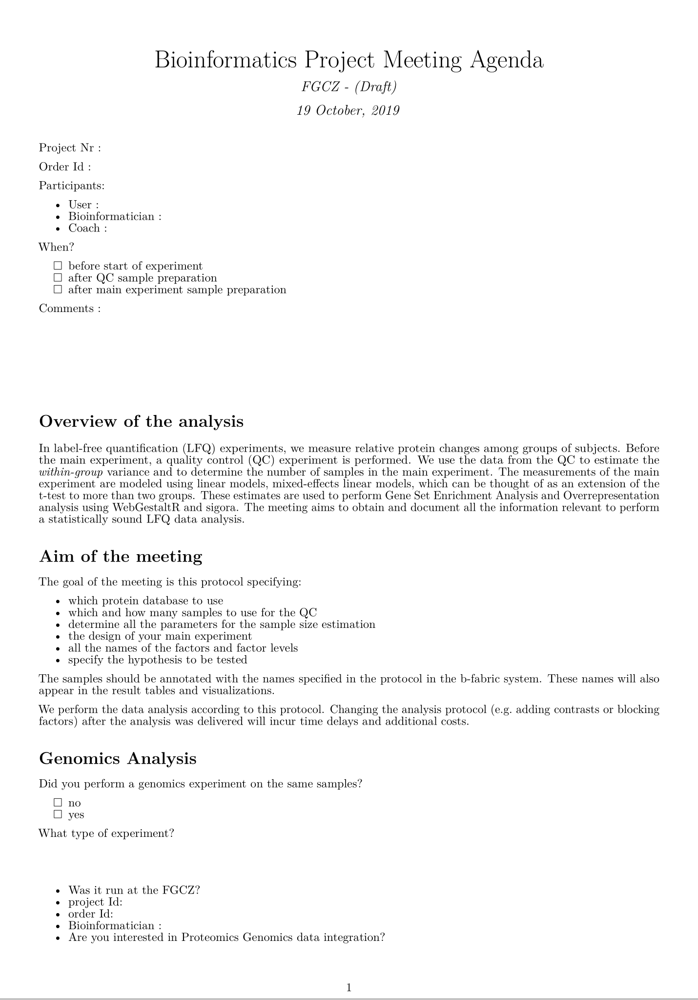
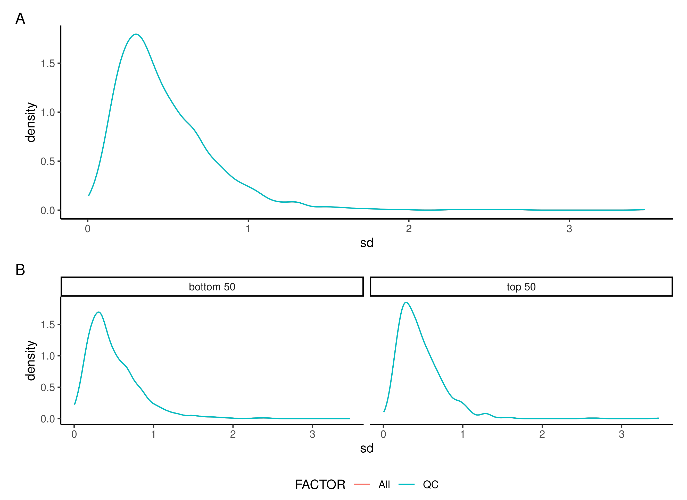
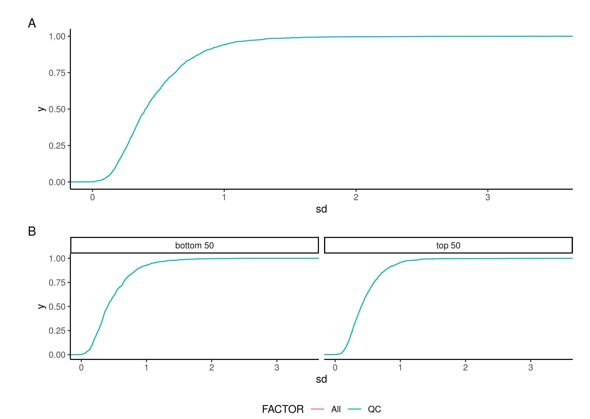
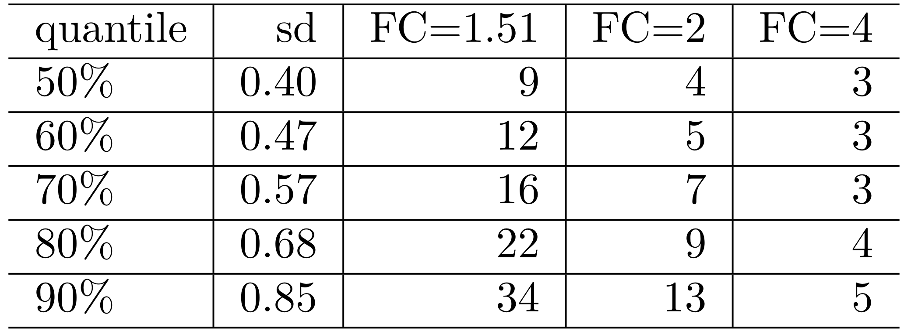
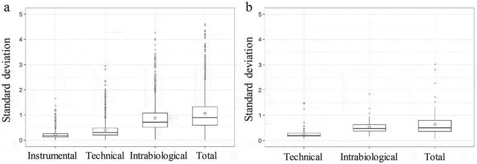

class: fullscreen, inverse, top, center, text-black
background-image: url("../inst/images/Comfortable_Chair.jpg")

.font150[**Sample size estimation**]

```{r setup, include=FALSE}
knitr::opts_chunk$set(
  fig.width = 4.25,
  fig.height = 3.5,
  fig.retina = 3,
  message = FALSE,
  warning = FALSE,
  cache = TRUE,
  autodep = TRUE,
  hiline = TRUE
)
knitr::opts_hooks$set(fig.callout = function(options) {
  if (options$fig.callout) {
    options$echo <- FALSE
    options$out.height <- "99%"
    options$fig.width <- 16
    options$fig.height <- 8
  }
  options
})
hook_source <- knitr::knit_hooks$get('source')
knitr::knit_hooks$set(source = function(x, options) {
  if (!is.null(options$hiline) && options$hiline) {
    x <- stringr::str_replace(x, "^ ?(.+)\\s?#<<", "*\\1")
  }
  hook_source(x, options)
})
options(htmltools.dir.version = FALSE, width = 90)
as_table <- function(...) knitr::kable(..., format = 'html', digits = 3)

library(tidyverse)
```

---
# Overview

- Sample size estimation 
  - the `power.t.test` function
  - error of sample size estimation
  - reporting power
  - data preprocessing

- LFQ analysis at the FGCZ
  - Kickoff meeting
  - QC experiment
  - Main experiment


---

# Types of error when testing hypothesis

A __type I error__ (false positive) occurs when <br/> the null hypothesis (H0) is true, but is rejected.<br/> 
The _type I error rate_ or __significance level__ (p-Value)<br/> is the probability of rejecting the<br/> 
null hypothesis given that it is true.


A __type II error__ (false negative) occurs when <br/> the null hypothesis
is false,<br/> but erroneously fails to be rejected. <br/>
The _the type II error rate_ is denoted by the Greek letter $\beta$<br/>
and is related to the __power of a test__ (which equals $1−\beta$).

For a given test, the only way to reduce both error rates<br/> 
is to __increase the sample size__, and this may not be feasible.

.img-right[

]

---
class: my-one-page-font

# Two sample t-test

Test statistic $$T = \frac{\bar{X} - \mu}{\sigma/\sqrt{n}}$$
Null distribution $$T|H_{null} \sim T(0,1,df = N-1)$$

where delta = $\bar{X}_2 - \bar{X}_1$, sd - standard deviation, df - depends on sample size


---
# `power.t.test` - estimating power

Compute the power of the one- or two- sample t-test, or determine parameters to obtain a target power.

```{r, eval = FALSE}
power.t.test(n = NULL, delta = NULL, sd = 1, sig.level = 0.05,
             power = NULL,
             type = c("two.sample", "one.sample", "paired"),
             alternative = c("two.sided", "one.sided"),
             strict = FALSE, tol = .Machine$double.eps^0.25)
```

Relates the type-2 error (power) to the other variables: type-1 error (sig.level), standard deviation (sd), effect size (delta), sample size (n)

---

# `power.t.test` - estimating power


What is __the power__ of the two-sample t-test using 
a significance level of $0.05$ if we want to detect a biologically relevant difference of $50\%$
given a standard deviation of $0.5$ and group size of $10$ samples?


.remark-code[
```{r}
power.t.test(delta = 0.59, n = 10, sd = 0.5, sig.level = 0.05)
```
]

.footnote[ Why `delta = 0.59`? $50%$ difference, means FC of $1.5$ or greater, and $log2(1.5) = 0.59$]


---
layout: false

# `power.t.test` - esitmating difference $d$


What __biologically relevant difference__ (or greater)
 can be detected with a two-sample t-test using 
a significance level of $0.05$ and a power of $0.8$ 
given a standard deviation of $0.5$ and group size of $10$?

.remark-code[
```{r}
res <- power.t.test(n = 10, sd = 0.5, power = 0.8, sig.level = 0.05)
res$delta
2^res$delta
```
]

$$
\begin{aligned}
log_2(x) = y&~~~\textrm{exactly if} ~~~ 2^y = x\\
2^d &= I_1/I_2\\
log_2(I_1/I_2) &= log2(I_1) - log2(I_2) = d\\
\end{aligned}
$$


---

# `power.t.test` - Sample size estimation

What __sample size__ do we need, given 
a significance level of $0.05$ if we want to detect a biologically relevant difference of $50\%$
given a standard deviation of $0.5$ and a power of $0.8$?

.remark-code[
```{r}
res <- power.t.test(delta = 0.59, sd = 0.5, sig.level = 0.05, power = 0.8)
res$n
ceiling(res$n)
```

n - number of observations (per group)


]


---

# `power.t.test` - summary

.footnote[Top - greater standard deviation requires larger sample sizes, Bottom - smaller effect size requires larger sample sizes]

.pull-left[
For each statistical test,<br/> 
there exists a unique relation between:

- desired smallest detectable effect size $\mu$
- sample variance $\sigma^2$
- sample size $N$
- critical p-value $p_0$
- statistical power

]

.right-plot[
```{r echo=FALSE}
sd <- seq(0.5, 2, by = .001)
dd <- power.t.test(delta = 2, sd = 1, sig.level = 0.05, power = 0.8)
powersd <- function(sd, delta = 1, sig.level = 0.05, power = 0.8){
  ceiling(power.t.test(delta = 2, sd = sd, sig.level = sig.level, power = power)$n)
}

ressd <- sapply(sd, powersd)
power_delta <- function(delta, sd = 1, sig.level = 0.05, power = 0.8){
  ceiling(power.t.test(delta = delta, sd = sd, sig.level = sig.level, power = power)$n)
}

delta <- seq(0.5,6, by = 0.001)
resdelta <- sapply(delta, power_delta)
plot(sd, ressd, ylab = "N", type = "l", main = "mu=1, p=0.05, power = 0.8")
plot(delta, resdelta, xlab = "mu", ylab = "N", type = "l", log = "xy", main = "sd=1, p = 0.05, power = 0.8")

```
]

---

# Sample size estimation - error of


.footnote[We simulate 1000 samples of size 4 from normal distribution and determine the standard deviation of each sample. For each standard deviation we computed the sample size using the `power.t.test` function.]


.left-code[
```{r sampleSize_error, eval=FALSE}
sd <- sapply(1:1000,
             function(x){
               sd(rnorm(4,mean = 0, sd = 0.5))
               })
tmp <- sapply(sd,
              function(x){
                power.t.test(d = 0.59, #<<
                             sd = x, #<<
                             sig.level = 0.05,
                             power = 0.8)$n})
par(mfrow = c(2,1))
hist(sd)
plot(table(ceiling(tmp)),
     ylab="#", xlab="sample size estimate")
```
]

.right-plot[
```{r sampleSize_error-out , ref.label="sampleSize_error", echo=FALSE, fig.width=6, fig.height=6}
```
]


---

# Sample size estimation - error of

For a protein your uncertainty of the standard deviation and the required sample size is large when you measure 4 samples to estimate the $sd$.


In high throughput setting you measure __thousands__ of proteins and determine their variances.
Assuming that most of the proteins have a similar variance, the error of the median standard deviation will be small.

```{r}
power.t.test(sd = median(sd), d = 0.59, sig.level = 0.05, power = 0.8)$n
```


Proteins will have __different__ unknown underlying variances.


---

exclude: true
# Sample size estimation - standard error of median

The standard error of the median is:

$$
SE(median) = (\pi/2) \cdot SE(\bar{y})
$$ 

for normal $y$, with $SE(\bar{y})$ is the standard error of the mean, i.e.  

$$
SE(\bar{y}) = \sqrt{\frac{var(y)}{n}}
$$
.footnote[more details about the [median](https://en.wikipedia.org/wiki/Median)]

---

# Calculating Observed Power

You run a test and you have the __estimates__ of the $sd$, $p.value$ and fold change $delta$.<br/>
We could compute the power by taking the _estimates_ obtained by the test.

.remark-code[
```{r, eval = FALSE}
power.t.test(delta = estimated_fc, n = nr_samples_per_group,
             sd = esitmated_sd,  sig.level = p.value)
```
]

Some proteomics software is doing it (e.g. Progenesis).<br/>
How good might this power __estimate__ be? <br/>
--
[Calculating Observed Power Is Just Transforming Noise](https://lesslikely.com/statistics/observed-power-magic/)<br/>


--
How you report the power of your test?</br> 
--
State the parameters of the sample size estimation for your experiment (which includes power).

--
You can use the standard deviation estimates from the main experiment to determine the power or sample size for a verification experiment.
 
---

# Sample size estimation in practice.

- Data preprocessing
- Checking assumptions
- Sample size estimation

.footnote[https://wolski.github.io/prolfqua/articles/QualityControlAndSampleSizeEstimation.html]


---
layout: false

# Data preprocessing - Normalizing Intensities

The coefficient of variation is the slope of the line <br/> 
we when plotting $sd$ against the $\mu$ of raw MS data.<br/>

$CV = \frac{sd(x)}{mean(x)}$.

The $sd$ is proportional to $\mu$.<br/>

For testing we need $iid$ data (identically distributed).<br/>

We can obtain constant (identical) standard deviation<br/>
for all measurements by $log_2$ transforming the data.


Note:<br/> $\frac{d}{dx} \ln(x) =\frac{1}{x}$.

.img-right[

]


---

# Data preprocessing - Normalizing Intensities

.footnote[More methods fo data normalization are discussed here: [Elo _et al._](https://www.ncbi.nlm.nih.gov/pmc/articles/PMC5862339/)]


.left-code[
To remove systematic differences among samples:
- apply robust z-transformation
$$I^n_i = \frac{I^t_i - med(I^t_i)}{mad(I^t_i)} \cdot \sum_{i=1}^N mad(I^t_i)/N$$
After z-transform samples have the same deviation $$mad(I^t_1) = mad(I^t_2)$$ equal to the average __original variance__ of all samples.
]

.img-right[

]


---
exclude: true

# Data preprocessing - Protein Intensities

Since we want the sample size estimates on _protein level_ we need to infer the protein intensity from peptide intensities.

There are many methods to infer the protein intensity
- aggregate all peptides (e.g. MaxQuant proteinGroups.txt)
- aggregate not more than the top n peptides (e.g. top 3).
- tukey median polish - a two-way decomposition of a 2D matrix.

$$y_{ij} = b_0 + c_i + d_j + \epsilon_{ij}$$
where $b_0$ - global intercept, $c_i, d_j$ denote the column and row effects, $\epsilon_{ij}$ - error.

.footnote[Tukeys median polish used by [MSstats](http://msstats.org/) package ]

---
exclude: true

# Data preprocessing -  Protein Intensities

.footnote[Tukey median polish example]

.left-code[
```{r echo=FALSE}
peptides_hemo <- rbind(c(14,15,14),
                  c( 7, 4, 7),
                  c( 8, 2,10),
                  c(15, 9,10),
                  c( 0, 2, 0))
dimnames(peptides_hemo) <-
  list(c("MVLSPADK", "TNVK",
         "AAWGK", "VGAHAGEYGAEALER",
         "MFLSFPTTK"),
       c("S1", "S2" ,"S3"))
```

```{r}
peptides_hemo
med.d <- medpolish(peptides_hemo, #<<
                   trace.iter = FALSE)

prot <- med.d$overall + med.d$col
prot
```
]

.right-code[
```{r}
matplot( t(peptides_hemo) , type="l")
lines(1:3, prot, col = 2, lwd = 3, lty = 2)
```
]

---

# The LFQ workflow at the FGCZ - bioinformatics part

- __kickoff meeting__ - bioinformatics part
  - [Agenda](https://wolski.github.io/prolfqua/articles/Auxiliary_ExDesignSurvey.html)
- __QC experiment__
  
  - to determine biological and biochemical variability:
      - nr of peptides and proteins ...
      - within group variability ...
  - Quality Control and _Sample size_ estimation
- __Main experiment__
  - Data Analysis and _result delivery_ including linear modelling and GSEA analysis.
  - meeting to discuss results


---

# Kickoff meeting - bioinformatics

- Aim
  - Improve quality of services
  - Get all the information we need to perform analysis
  - Give _statistical_ guidance
  - Ensure reproducibility
- Use of an Agenda
  - helps to prepare for the meeting
  - streamlines discussion 
  - focuses on points relevant to the data analysis
  - Keep meeting short (15-30 minutes)
  - Ensure reproducibility

.img-right[

]

.footnote[https://wolski.github.io/prolfqua/articles/Auxiliary_ExDesignSurvey.html]

---
layout: false

# Kickoff meeting - bioinformatics

## Document

- which protein database to use
- which and how many samples to use for the QC
- collect all the parameters for sample size estimation
- specify the design of the main experiment <br/>
and the hypothesis to be tested
- document all the names of the factors and factor levels


.img-right[

]

.footnote[https://wolski.github.io/prolfqua/articles/Auxiliary_ExDesignSurvey.html]

---
layout: false

# Sample size estimation

- Hand in 4 __Bio-replicates__ of the same condition (ideally of condition with highest variability).
- Estimate the variance of all measured protein.
- Compute sample sizes for main experiment given:
  - biologically relevant effect size
  - power of the test
  - observed variance
  - size of test


---
layout: false

# Sample size estimation report

- check if there are no technical problems
- check if assumptions for data normalization are met.

.img-right[

]
--

Visualize the distribution of standard deviation</br> of all proteins
using the density function and<br/> the empirical cumulative density function (ecdf)
  
.img-right[

]

--

.img-right[

]

--

Sample size estimates for parameters<br/> specified in protocol
  - _power_ 0.8
  - _significance level_ 0.05
  - _delta_ $0.59, 1, 2$
  - and standard deviation taken from QC experiment.

--


.img-right[

]

---
exclude: true
layout: false

# prolfqua

Works with data in long format.

```{r LoadDataAndConfigure, include = FALSE}
datadir <- file.path(find.package("prolfquaData") , "quantdata")
inputMQfile <-  file.path(datadir, "MAXQuant_ComboCourse_p2691_March_2018_WU183012.zip")
inputAnnotation <- file.path(datadir, "annotation_ComboCourse_p2691_March_2018_WU183012.xlsx")

startdata <- prolfqua::tidyMQ_ProteinGroups(inputMQfile)
head(startdata)
annotation <- readxl::read_xlsx(inputAnnotation)
annotation$experiment = "p2691"
head(annotation)

startdata <- dplyr::inner_join(annotation, startdata, by= "raw.file")
startdata <- startdata %>%
  dplyr::select(c("raw.file", "Run_ID",
                  "condition", "majority.protein.ids",
                  "mq.protein.intensity" )) %>%
  head(n = 4)

```

.left-code[
Hierarchy of the MS data:
- protein "majority.protein.ids"
- peptide
- modified peptide
- precursor

Factors of analysis (explanatory variables):
- condition
- Run_ID

Response:
- Intensity "mq.protein.intensity" 
]

.right-code[
```{r}
str(startdata)
```
]

.footnote[https://wolski.github.io/prolfqua, https://github.com/wolski/prolfqua]

---

# Sources of variation

.footnote[https://www.ncbi.nlm.nih.gov/pmc/articles/PMC6807909/]


.left-code[
- (a) the instrumental variation 
- (b) the total technical variation 
- (c) the intrabiological variation
- (d) the interbiological variation 
]

.img-right[


]


---

# Conclusion

- Works if __biological variability__ __>>__ _biochemical + technical variability_
- How can you know?
  - To understand sources of variance measure:  
    - technical and biochemical and biological replicates and determine:
    - _technical CV_, _biochemical CV_, or _biological CV_.
- Sample size calculation is based on the standard deviation estimate.
  - $sd$ estimate for single protein have a large error
  - small error for the median $sd$ of all proteins
- Calculating Observed Power Is Just Transforming Noise
- Sample size calculation using `power.t.test` function ignores multiple testing problems.
- Observations need to be _independent and identically distributed_ __iid__.

